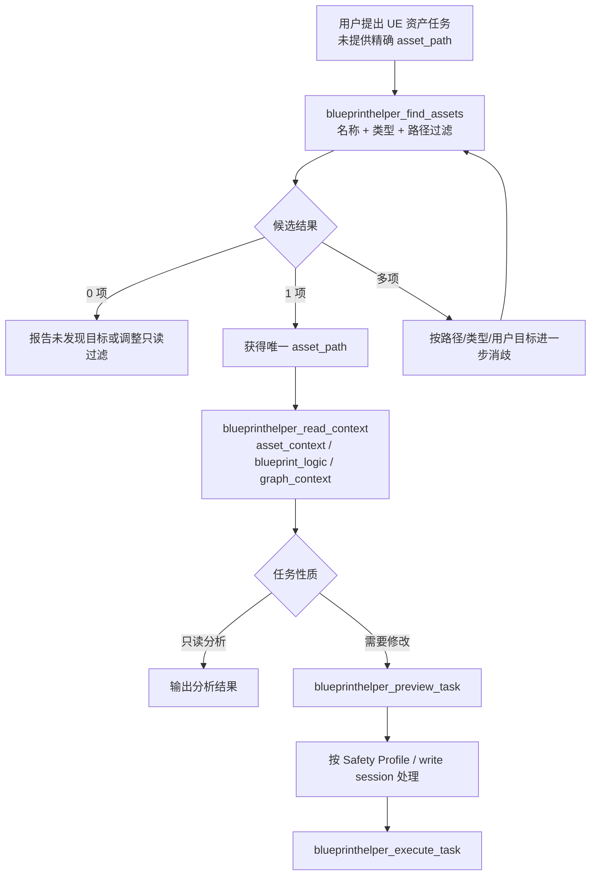

# BlueprintHelper AssetDiscovery Agent-facing 能力决策与实施计划

> 文档类型：架构决策 + 能力补齐实施计划
> 日期：2026-05-31
> 适用范围：BlueprintHelper 当前 `TaskSpec / TaskPlan / ReadContext` 主架构
> 当前路径：`BlueprintHelper/Develop/Gap/BlueprintHelper_AssetDiscovery_AgentFacingCapability_DecisionAndImplementationPlan_20260531_CN.md`

---

## 0. 信息源边界

### 0.1 本文使用的有效信息源

本文以当前仓库源码和非版本归档开发目录为依据：

- `BlueprintHelper/Source/BlueprintHelper/...`
- `AgentFaceService/task-core/src/...`
- `AgentFaceService/mcp/src/...`
- `AgentFaceService/cli/src/...`
- `BlueprintHelper/Develop/Design/...`
- `BlueprintHelper/Develop/Gap/...`
- `BlueprintHelper/Develop/Plan/...`
- `BlueprintHelper/Develop/Evidence/...`

### 0.2 明确不作为当前结论依据的信息源

按项目文档管理约束，以下目录仅作为归档信息，不用于判定当前能力状态：

```text
BlueprintHelper/Develop/v*/
BlueprintHelper/Develop/ArchivedReference/*
```

---

## 1. 问题定义

当前 Agent 在用户只提供语义名称而未提供精确 Unreal 资产路径时，例如：

```text
“修改名字包含 Door 的 Actor Blueprint”
“找到 UI/HUD 下的 Widget Blueprint”
“检查项目中所有 DataTable”
```

需要先完成资产定位，再读取上下文、预览并执行 TaskSpec。

若 Agent 直接扫描磁盘上的 `.uasset` 文件，虽然可能找到同名文件，但无法稳定获得 Unreal 编辑器侧所需的：

- UE object asset path；
- Asset class / semantic asset type；
- Blueprint parent class 等 AssetRegistry tags；
- 可用于 ReadContext 与 TaskSpec 的明确目标身份；
- 内容路径、插件挂载路径、Redirector 等 Unreal 语义过滤。

本次决策需要回答：

1. 是否有必要新建一个 `AssetBrowser` 能力；
2. 当前仓库是否已有可复用实现；
3. 应以何种 Agent-facing 形式补齐当前 TaskSpec 主流程中的资产发现缺口；
4. P0/P1/P2 应实施哪些改造与验收。

---

## 2. 执行摘要

### 2.1 决策结论

**不新增第二套底层 `AssetBrowser` 实现。**

当前 UE 插件侧已经存在基于 `AssetRegistry` 的资产列表/搜索能力，也已经存在尚未完整接入主工具面的 `AssetDiscovery` 结果类型定义。当前缺口不是查询逻辑不存在，而是：

> **默认 Agent-facing 工具面缺少“在未知 `asset_path` 前提下发现资产”的正式只读入口。**

因此应提取已有查询逻辑中的架构中立部分，建立正式、独立的
`AssetDiscoveryService`，并新增默认 Agent 可用的：

```text
blueprinthelper_find_assets
```

其能力簇名称应为：

```text
AssetDiscovery
```

而不是继续将“搜索、打开、保存、资产详情”混合暴露为 `AssetBrowser`。
新 `blueprinthelper_find_assets` 不得直接委托旧
`FBlueprintHelperAssetBrowseService::SearchAssets`。当前引用核对未发现
`list_assets` / `search_assets` 的主流程消费者，因此 P0 直接移除旧搜索入口，不为
frozen direct 工具保留兼容适配。

### 2.2 决策表

| 决策项 | 结论 |
|---|---|
| UE 端是否已有按名称/类型/目录查询资产的底层实现 | 已有 |
| 是否应让 Agent 依赖磁盘 `.uasset` 文件扫描定位目标资产 | 不应 |
| 是否需要再创建新的 AssetBrowser Service | 不需要 |
| 是否需要新增默认 Agent 可见能力 | 需要 |
| 推荐新增工具 | `blueprinthelper_find_assets` |
| 推荐工具簇 | `AssetDiscovery` |
| 是否属于 TaskSpec 写入 statement | 否，属于写入前只读目标解析 |
| 是否应复用 `blueprinthelper_read_context(asset_context)` | 不能替代；它要求目标 `asset_path` 已知 |
| 新工具是否可以直接调用旧 `AssetBrowseService::SearchAssets` | 不可以；必须落到独立 `AssetDiscoveryService` |
| 旧 `list_assets` / `search_assets` 是否保留兼容 | 不保留；当前无主流程消费者，P0 直接移除 |
| P0 是否需要实现 Bridge 并行 read lane | 不需要；P0 先建立受限只读闭环，P1 再优化并发 |

---

## 3. 当前源码证据

## 3.1 UE 插件已有资产查询服务

文件：

```text
BlueprintHelper/Source/BlueprintHelper/Public/Systems/Debug/BlueprintHelperAssetBrowseService.h
BlueprintHelper/Source/BlueprintHelper/Private/Systems/Debug/BlueprintHelperAssetBrowseService.cpp
```

头文件已声明：

| 能力 | 证据行 | 当前语义 |
|---|---:|---|
| 查询参数 `Path` | `.h:35-36` | Content 相对路径过滤 |
| 查询参数 `ClassFilter` | `.h:38-39` | 资产类型过滤 |
| 查询参数 `NameFilter` | `.h:41-42` | 名称子串过滤 |
| `bRecursive` / `MaxResults` | `.h:44-48` | 递归和返回数量约束 |
| `ListAssets` | `.h:76-77` | 按目录列出资产 |
| `SearchAssets` | `.h:79-80` | 按关键词搜索资产 |
| `OpenAsset` / `SaveAsset` / `GetAssetInfo` | `.h:82-89` | 导航、保存、摘要能力同处一个旧服务 |

核心实现已经基于 UE `AssetRegistry`：

```cpp
IAssetRegistry& Registry =
    FModuleManager::LoadModuleChecked<FAssetRegistryModule>(TEXT("AssetRegistry")).Get();

FARFilter Filter;
Filter.PackagePaths.Add(...);
Filter.bRecursivePaths = Request.bRecursive;
Filter.ClassPaths.Add(...);
Registry.GetAssets(Filter, AssetDataList);
```

证据位置：

```text
BlueprintHelperAssetBrowseService.cpp:53-112
```

具体已有行为：

| 行为 | 证据 |
|---|---|
| 默认路径为 `/Game` | `.cpp:56-63` |
| 可按 `ClassFilter` 设置 `ClassPaths` | `.cpp:66-72` |
| 使用 `Registry.GetAssets` 查询 | `.cpp:74-75` |
| 支持名称子串过滤 | `.cpp:81-87` |
| 支持 `MaxResults` 截断但继续计数 | `.cpp:88-93` |
| `SearchAssets` 强制递归，默认路径 `/Game` | `.cpp:102-112` |

`AssetDataToInfo` 也已经从 AssetRegistry 结果中生成 Unreal 资产信息：

| 返回信息 | 证据 |
|---|---|
| Object asset path | `.cpp:20` |
| Asset name | `.cpp:21` |
| Asset class | `.cpp:22` |
| Blueprint `ParentClassPath` tag | `.cpp:24-38` |

**判定：** 用户提出的“搜索名 + 资产类型等过滤搜索”能力，在 UE 底层不是空白项，而是已经存在的资产注册表查询逻辑。

---

## 3.2 UE Bridge 已接通旧 AssetBrowser 命令

文件：

```text
BlueprintHelper/Source/BlueprintHelper/Private/Entry/Bridge/BlueprintHelperBridgeRouter.cpp
```

Bridge 路由中已经包含：

```cpp
BLUEPRINTHELPER_ROUTE("open_asset", AssetBrowser, HandleOpenAsset)
BLUEPRINTHELPER_ROUTE("list_assets", AssetBrowser, HandleListAssets)
BLUEPRINTHELPER_ROUTE("search_assets", AssetBrowser, HandleSearchAssets)
BLUEPRINTHELPER_ROUTE("save_asset", AssetBrowser, HandleSaveAsset)
BLUEPRINTHELPER_ROUTE("get_asset_info", AssetBrowser, HandleGetAssetInfo)
```

证据位置：

```text
BlueprintHelperBridgeRouter.cpp:837-841
```

`HandleListAssets` / `HandleSearchAssets` 已调用现有 Service：

```text
HandleListAssets   : BlueprintHelperBridgeRouter.cpp:1460-1516
HandleSearchAssets : BlueprintHelperBridgeRouter.cpp:1520-1583
```

当前旧响应字段为：

```json
{
  "total_count": 1,
  "returned_count": 1,
  "assets": [
    {
      "path": "/Game/Blueprints/BP_Door.BP_Door",
      "name": "BP_Door",
      "class": "Blueprint",
      "parent_class": "Actor"
    }
  ]
}
```

证据位置：

```text
BlueprintHelperBridgeRouter.cpp:1495-1513
BlueprintHelperBridgeRouter.cpp:1562-1580
```

**判定：** Bridge 层也不是从零实现，后续只需新主工具面的协议收敛与正式接线，而非重写查询能力。

---

## 3.3 MCP 旧直接工具仍存在代码，但已不属于默认 Agent 主工具面

文件：

```text
AgentFaceService/mcp/src/mcp/tools/register-tools.ts
```

旧 MCP 注册包含：

| 工具 | 证据位置 | 参数 |
|---|---:|---|
| `blueprint_list_assets` | `register-tools.ts:1833-1865` | `path` / `class_filter` / `name_filter` / `recursive` / `max_results` |
| `blueprint_search_assets` | `register-tools.ts:1867-1894` | `query` / `path` / `class_filter` / `max_results` |

但这些工具描述由：

```ts
legacyDebugExpertDescription(...)
```

生成，且被加上：

```text
FROZEN / Expert-only / Normal agents must not call directly.
```

证据位置：

```text
AgentFaceService/mcp/src/mcp/tools/register-tools.ts:53-109
AgentFaceService/mcp/src/mcp/tools/register-tools.ts:1833-1894
```

同时，当前共享工具面契约测试显式将其列入 frozen：

```ts
'blueprint_list_assets',
'blueprint_search_assets',
```

证据位置：

```text
AgentFaceService/task-core/src/tests/tool-surface/tool-registry.contract.test.ts:34-83
```

测试又要求 shared registry 不暴露这些 frozen direct tools：

```text
tool-registry.contract.test.ts:96-103
```

**判定：** 旧能力虽然存在于 UE/Bridge/legacy MCP 代码路径，但不能视为当前默认 Agent 已具备的目标发现入口。

---

## 3.4 当前 ReadContext 只能读取已知资产，不能发现未知资产

文件：

```text
AgentFaceService/task-core/src/tool-surface/bridge/read-context/read-context-schemas.ts
AgentFaceService/task-core/src/tool-surface/bridge/read-context/read-context-route-builder.ts
```

`blueprinthelper_read_context` 的 `target` 强制要求：

```ts
target: z.object({
  asset_path: z.string(),
  ...
})
```

证据位置：

```text
read-context-schemas.ts:16-39
```

对于 `asset_context`，ReadContext 仅映射为：

```ts
case 'asset_context':
  return {
    ok: true,
    command: 'get_asset_info',
    payload,
    payloadSchema: 'AssetContext.v1'
  };
```

证据位置：

```text
read-context-route-builder.ts:98-107
```

因此当前主工具面可以完成：

```text
已知 /Game/Blueprints/BP_Door.BP_Door
→ 读取该资产摘要/蓝图逻辑
```

但不能完成：

```text
只知道名称关键词 Door 和资产类型 Blueprint
→ 查找候选资产并获取 asset_path
```

**判定：** 资产发现是 ReadContext 之前缺失的前置解析能力，不应勉强塞入要求精确目标的 `asset_context` 读取语义。

---

## 3.5 新式 `AssetDiscovery` 数据结构已存在，但未发现接线使用点

文件：

```text
BlueprintHelper/Source/BlueprintHelper/Public/Shared/Debug/BlueprintHelperAssetDiscoveryTypes.h
```

该文件已经定义：

```cpp
FBlueprintHelperAssetListItem
FBlueprintHelperAssetPageInfo
FBlueprintHelperFindAssetsResultData
```

其中：

```cpp
FString Schema = TEXT("FindAssets.v1");
```

证据位置：

```text
BlueprintHelperAssetDiscoveryTypes.h:43-90
```

其目标数据结构已经采用更适合当前 Agent-facing 协议的字段：

```json
{
  "schema": "FindAssets.v1",
  "assets": [
    {
      "asset_path": "...",
      "asset_type": "...",
      "asset_class": "..."
    }
  ],
  "page": {
    "limit": 20,
    "has_more": false,
    "next_cursor": "..."
  }
}
```

在排除 `Develop/v*` 与 `Develop/ArchivedReference` 后，对当前源码搜索：

```text
FBlueprintHelperFindAssetsResultData
FindAssets.v1
FBlueprintHelperAssetPageInfo
```

仅命中该定义头文件，未发现 Bridge Handler、TaskCore dispatcher 或默认注册表中的使用点。

**判定：** 仓库已经有“新协议方向”的类型准备，但正式主链路尚未完成接入。

---

## 4. 为什么禁止将 `.uasset` 文件扫描作为 Agent 默认资产定位方式

## 4.1 文件路径不是 Unreal 资产身份

磁盘搜索通常返回：

```text
<Project>/Content/Blueprints/BP_Door.uasset
```

而 BlueprintHelper 读取与执行链路所需的是 Unreal object asset path：

```text
/Game/Blueprints/BP_Door.BP_Door
```

通过磁盘文件名自行拼装对象路径会引入错误推断，尤其在以下场景中：

- 插件 Content mount point；
- 同名资产；
- 非 Blueprint 资产；
- Redirector；
- Editor-only / Engine 内容范围；
- object name 与 package 解析差异。

## 4.2 文件系统无法提供 Agent 写前消歧所需语义

| 所需信息 | 文件扫描 | AssetRegistry |
|---|---:|---:|
| 文件是否存在 | 支持 | 支持 |
| UE object asset path | 需猜测 | 直接返回 |
| Asset class | 不可靠 | 直接可得 |
| Blueprint parent class tag | 不支持 | 当前实现已读取 |
| PackagePath 过滤 | 仅磁盘路径近似 | UE 原生语义 |
| TaskSpec 目标路径复用 | 需转换 | 可直接使用 |

## 4.3 应新增 Agent 规则

应在 Agent Guide / Skill 中加入以下 MUST 规则：

```text
当用户目标指向 Unreal 资产但未提供精确 asset_path 时，
Agent MUST 先通过 AssetDiscovery 获取候选 UE 资产路径；
Agent MUST NOT 通过文件系统搜索 .uasset 文件并自行推导写入目标。
```

例外仅限普通文件调试，不用于 UE 资产写目标确定：

- 检查安装包内是否携带某文件；
- 定位源码、配置、日志、DebugBundle；
- 检查导出的非 `.uasset` 文档或报告。

---

## 5. 架构决策：对外使用 AssetDiscovery，而不是扩大 AssetBrowser

## 5.1 旧 `AssetBrowseService` 的职责混合问题

当前旧 Service 同时承担：

| 当前方法 | 实际职责 | 主架构归属建议 |
|---|---|---|
| `ListAssets` / `SearchAssets` | 只读资产发现 | `AssetDiscovery` |
| `GetAssetInfo` | 已知目标摘要读取 | `ReadContext(asset_context)` / `ReadAssetSummary` |
| `OpenAsset` | 编辑器导航 | `EditorNavigation` / preflight 辅助 |
| `SaveAsset` | 修改后保存 | Task Runtime 执行闭环 |

继续将其整体作为对外 `AssetBrowser` 会导致：

- 只读目标解析与写后操作混合；
- 默认 Agent 资产查找能力被误解为编辑器 UI 浏览能力；
- `OpenAsset` / `SaveAsset` 与 `find_assets` 被错误放在同一风险边界；
- 与 TaskSpec-first 设计中“读取/解析/执行”的分层相冲突。

## 5.2 推荐职责拆分

```text
AssetDiscovery                         ReadContext                         TaskRuntime / Navigation
┌────────────────────────┐            ┌──────────────────────┐             ┌──────────────────────┐
│ blueprinthelper_       │            │ blueprinthelper_     │             │ preview / execute    │
│ find_assets            │ ─asset──▶ │ read_context         │ ─TaskSpec─▶ │ save / compile       │
│                        │  path      │ asset_context / logic│             │                      │
└───────────┬────────────┘            └──────────────────────┘             └──────────────────────┘
            │
            ▼
┌────────────────────────┐
│ AssetDiscoveryService  │
│ AssetRegistry query    │
└────────────────────────┘

EditorNavigation 可独立保留 open_asset_in_editor，只用于用户显式打开或调试导航。
```

新服务边界必须满足：

1. `AssetDiscoveryService` 只负责只读资产发现，不提供打开、保存或修改方法。
2. P0 的 `find_assets` Bridge route 归入新 `AssetDiscovery` route cluster，不归入旧
   `AssetBrowser`。
3. 新 route 使用独立 `AssetDiscoveryBridgeRoutes` 适配器，不继续扩张旧 Router 内联 handler。
4. 旧 `list_assets` / `search_assets` 从 legacy MCP、task-core dead map、Bridge route、validator 和
   `AssetBrowseService` 中移除，不新增兼容适配。
5. `GetAssetInfo`、`OpenAsset`、`SaveAsset` 不进入新服务。

## 5.3 P0 与 P1 的线程模型边界

当前 Bridge 对 `ping` 之外的已知命令统一投递至 GameThread。UE 5.6 的
`IAssetRegistry::GetAssets` 默认还会枚举内存资产，而内存资产枚举明确要求在
GameThread 执行。因此不能仅凭 `AssetRegistry` 带锁就宣称当前搜索可安全并行。

P0 使用以下保守模型：

```text
CLI / Agent 并发请求
-> 当前 Bridge 串行调度
-> GameThread 上执行受限 AssetRegistry 查询
-> 最多收集 limit + 1 条，用于判断 has_more
-> 返回有限页
```

P1 再引入事件驱动快照和非 GameThread read lane：

```text
GameThread:
  AssetRegistry 事件
  -> 更新不可变 AssetDiscovery snapshot
  -> 原子发布 snapshot

Read lane:
  find_assets
  -> 读取 snapshot
  -> 并行过滤、排序、分页
  -> 不进入 UE GameThread
```

P1 快照更新必须由 `OnAssetAdded` / `OnAssetRemoved` / `OnAssetRenamed` 等事件驱动，
不得使用 timer 或轮询刷新。

## 5.4 为什么不把搜索加入 `blueprinthelper_read_context`

`ReadContext` 的语义是：

```text
对已经确定的目标读取上下文。
```

`AssetDiscovery` 的语义是：

```text
在目标尚未确定时发现候选对象。
```

二者输入不变量不同：

| 能力 | `asset_path` 是否已知 | 是否可返回多个候选 |
|---|---:|---:|
| `blueprinthelper_find_assets` | 否 | 是 |
| `blueprinthelper_read_context` | 是 | 通常针对明确目标 |

将搜索混入 ReadContext 会破坏目标明确性，并导致后续 Patch/Merge/Replace 锚点来源边界更难控制。

---

## 6. 推荐新增 Agent-facing 接口

## 6.1 工具名称与风险等级

```text
blueprinthelper_find_assets
```

| 字段 | 建议值 |
|---|---|
| capability cluster | `AssetDiscovery` |
| audience | `default` |
| risk | `low` 或 `none`；推荐 `low`，因为它读取实时 UE 项目资产状态 |
| requires write session | `false` |
| generates transaction / review | `false` |
| Bridge command | `find_assets` |
| Result schema | `FindAssets.v1` |

## 6.2 工具边界

### 允许

- 通过 AssetRegistry 搜索候选资产；
- 按名称、路径前缀、资产类型/资产类过滤；
- 返回可供后续 ReadContext/TaskSpec 使用的 `asset_path`；
- P0 返回有限条目和 `has_more`；P1 再提供稳定分页游标；
- 在没有结果或多结果时为 Agent 提供消歧基础。

### 不允许

- 打开编辑器标签页；
- 保存资产；
- 修改资产；
- 自动选择多个候选中的“最可能写入目标”并直接执行；
- 扫描磁盘并返回 `.uasset` 文件路径作为 TaskSpec 写入目标；
- 被纳入 TaskSpec 的写入 statements。

---

## 7. 协议草案

## 7.1 输入：`BlueprintHelper.FindAssetsRequest.v1`

```json
{
  "schema": "BlueprintHelper.FindAssetsRequest.v1",
  "query": "Door",
  "path_prefixes": ["/Game/Blueprints"],
  "asset_types": ["blueprint"],
  "asset_classes": ["/Script/Engine.Blueprint"],
  "recursive": true,
  "limit": 20,
  "include_plugin_content": false,
  "include_engine_content": false,
  "include_redirectors": false
}
```

### 字段定义

| 字段 | 必需 | 默认值 | 语义 |
|---|---:|---|---|
| `schema` | 是 | - | 输入协议版本 |
| `query` | 否 | 空 | 资产名称子串关键词；与类型/路径条件可组合 |
| `path_prefixes` | 否 | `["/Game"]` | UE PackagePath 前缀列表 |
| `asset_types` | 否 | 空 | 面向 Agent 的稳定语义类型 |
| `asset_classes` | 否 | 空 | UE 完整 ClassPath 精确过滤 |
| `recursive` | 否 | `true` | 是否递归路径 |
| `limit` | 否 | `20` | 单页上限，建议限制 `1..100` |
| `cursor` | 否 | 空 | P1 后续页游标；P0 不接受该字段 |
| `include_plugin_content` | 否 | `false` | 是否允许已挂载插件内容范围 |
| `include_engine_content` | 否 | `false` | 是否包含 `/Engine` |
| `include_redirectors` | 否 | `false` | 是否包含 redirector |

### 输入约束

1. `query`、`asset_types`、`asset_classes`、`path_prefixes` 可以组合过滤。
2. 若用户未给任何搜索限定，可允许列出 `/Game` 下前 `limit` 条，但 Agent Guide 应要求 Agent 尽量带至少一个过滤条件。
3. `asset_classes` 使用完整类路径，禁止继续仅依靠裸类名猜测所属模块。
4. `asset_types` 是语义映射便利层，UE 端应集中映射到明确 `asset_class` 约束。
5. P0 不接受 `cursor`；P1 增加稳定 cursor 后再扩展同一版本化请求协议。

## 7.2 输出：`FindAssets.v1`

复用当前已定义方向：

```json
{
  "schema": "FindAssets.v1",
  "assets": [
    {
      "asset_path": "/Game/Blueprints/BP_PhysicsDoor.BP_PhysicsDoor",
      "asset_type": "blueprint",
      "asset_class": "/Script/Engine.Blueprint"
    }
  ],
  "page": {
    "limit": 20,
    "has_more": false
  }
}
```

### 输出字段约束

| 字段 | 说明 |
|---|---|
| `asset_path` | UE object asset path；后续 ReadContext / TaskSpec 的唯一目标引用 |
| `asset_type` | Agent 稳定语义类型，如 `blueprint`、`widget_blueprint`、`data_table` |
| `asset_class` | 完整 UE class path，不返回模糊短名作为唯一分类依据 |
| `page.limit` | 本页最大返回数 |
| `page.has_more` | 是否仍有后续候选 |
| `page.next_cursor` | P1 增加 cursor 后，仅有后续页时存在 |

### 不默认返回

为保持 Agent 响应精简和职责边界，不默认返回：

- `disk_size`；
- 全量 AssetRegistry tags；
- 依赖/引用关系；
- 已加载对象详情；
- Editor 当前打开/选中状态；
- 文件系统 `.uasset` 路径。
- 精确 `total_count`。

若 Agent 已选定某个 `asset_path` 并需要详细信息，应继续调用 `blueprinthelper_read_context` 或专用只读上下文工具。

---

## 8. 与当前实现的复用和改造关系

## 8.1 可直接复用的现有实现

| 现有部件 | 复用内容 |
|---|---|
| `FBlueprintHelperAssetBrowseService::ListAssets` | 仅作为 AssetRegistry 查询主体、PackagePath 与名称过滤的抽取来源 |
| `FBlueprintHelperAssetBrowseService::SearchAssets` | 仅作为 query 搜索行为参考；新主线不得直接委托 |
| `AssetDataToInfo` | Object asset path 与基础 metadata 获取 |
| `BlueprintHelperAssetDiscoveryTypes.h` | `FindAssets.v1` 结果类型与分页 DTO 起点 |
| Bridge 当前 asset handler | Bridge 请求读取/响应序列化模式参考 |
| shared registry adapter | 默认 MCP 工具从 task-core 工具面暴露的现有通路 |

## 8.2 不应直接照搬的旧行为

| 旧行为 | 问题 | P0/P1 修正方向 |
|---|---|---|
| 对外名为 `AssetBrowser` | 混合读取、导航、保存职责 | 对 Agent 公开归类为 `AssetDiscovery` |
| `class_filter` 为短名，并尝试三个固定模块 | 扩展性与精确性不足 | 支持完整 `asset_classes` 路径；语义类型独立映射 |
| 返回 `path` / `name` / `class` | 与新 DTO 不一致，`class` 信息不足 | 返回 `asset_path` / `asset_type` / `asset_class` |
| `MaxResults` 只截断返回数组但继续遍历全部候选 | GameThread 压力与 Token 控制不足 | P0 使用 `limit + 1` 提前停止并返回 `has_more`；P1 再提供 cursor |
| Service 位于 `Systems/Debug` | 正式主能力与 Debug 分类不一致 | 提取/迁移只读查询核心到 Shared/AssetDiscovery；不复制查询代码 |
| `OpenAsset`/`SaveAsset` 与搜索同服务 | 风险职责混杂 | P0 仅暴露 `find_assets`，其他职责保持独立 |

---

## 9. 推荐工作流

## 9.1 未知资产路径的 Agent 读取/写入流程



## 9.2 流程规则

1. `find_assets` 只负责发现候选，不读取图表逻辑。
2. 资产唯一化后，才使用 `read_context` 获取逻辑与写入锚点。
3. 多候选时，Agent 不得静默选择并对不明确目标写入。
4. `find_assets` 不需要 write permission，不进入 Transaction Journal / Review。
5. 写入闭环仍保持 `preview_task → permission/safety gate → execute_task`。

---

## 10. 实施计划

## P0：补齐默认 Agent 资产发现入口

### P0-1 UE：建立正式独立 `AssetDiscoveryService`

**目标：** 抽取架构中立 AssetRegistry 查询核心，输出 `FindAssets.v1`，不保留
`AssetBrowser` 的打开/保存职责。

建议改动：

| 文件/模块 | 改动 |
|---|---|
| `BlueprintHelperAssetDiscoveryTypes.h` | 保留并完成输入 DTO、语义资产类型、有限页字段约束 |
| 新 `BlueprintHelperAssetDiscoveryService.*` | 独立只读服务；抽取 AssetRegistry 查询核心，禁止提供打开/保存方法 |
| `BlueprintHelperAssetBrowseService.*` | 删除旧 `ListAssets` / `SearchAssets` 与请求/结果 DTO；保留打开、保存、详情职责 |
| `BlueprintHelperBridgeRoutePlanner.*` | 新增独立 `AssetDiscovery` route cluster |
| 新 `BlueprintHelperAssetDiscoveryBridgeRoutes.*` | 独立 route 适配器；解析请求并序列化 `FindAssets.v1` |
| `BlueprintHelperBridgeRouter.*` | 注入并分发 `AssetDiscoveryBridgeRoutes`，不新增内联 `HandleFindAssets` |

实现要求：

- 新命令为只读命令；
- 默认搜索范围 `/Game`；
- 至少支持 `query`、单/多路径、资产类型/类过滤、`limit`；
- `asset_classes` 必须使用完整 class path；`asset_types` 由集中映射表转换；
- 使用 `limit + 1` 判定 `has_more`，命中后停止枚举；
- P0 不计算或返回精确 `total_count`，不接受 cursor；
- P0 可继续在当前 GameThread route 上运行，但查询必须保持有限；
- 返回 UE `asset_path`，不返回磁盘文件路径；
- 删除旧 `list_assets/search_assets` legacy MCP、task-core dead map、Bridge route、validator 和 service 方法；
- 不为 frozen direct 工具新增兼容适配。

### P0-2 Task Core：加入默认工具面

建议新增/修改：

```text
AgentFaceService/task-core/src/tool-surface/registry/tool-metas.ts
AgentFaceService/task-core/src/tool-surface/bridge/bridge-tool-schemas.ts
AgentFaceService/task-core/src/tool-surface/bridge/asset-discovery-schema.ts
AgentFaceService/task-core/src/tool-surface/bridge/bridge-tool-command-map.ts
AgentFaceService/task-core/src/tests/tool-surface/tool-registry.contract.test.ts
```

工具元数据建议：

```ts
{
  name: 'blueprinthelper_find_assets',
  description: 'Find Unreal assets through AssetRegistry before a target asset_path is known.',
  audience: 'default',
  risk: 'low'
}
```

契约要求：

- `expectedToolNames` 加入 `blueprinthelper_find_assets`；
- 不将其加入 `frozenToolNames`；
- 验证 Bridge command 映射至 `find_assets`；
- 复用现有 generic Bridge handler，不增加单工具 dispatcher 分支；
- 输出必须归一化为当前 `ToolResultBase` 的只读成功/失败结构；
- 不返回 transaction/review/safety 写入字段。

### P0-3 MCP：通过 shared registry 默认暴露

当前 `shared-registry-adapter.ts:17-52` 已按 `getBlueprintHelperToolRegistry()` 注册 `audience === 'default'` 工具。

因此新工具进入 task-core 默认 registry 后，MCP 主路径应通过 shared registry 暴露，无需新增另一套 legacy 直接注册实现。

约束：

- 不复制 `blueprint_search_assets` 旧工具注册代码形成第三条路径；
- 删除旧 `blueprint_list_assets` / `blueprint_search_assets` direct 注册，不保留冻结空壳；
- 新工具名只出现于共享主工具面和相应文档/测试中。

### P0-4 CLI：提供同名入口和帮助模板

建议新增：

```text
bh blueprinthelper_find_assets --file <find-assets.json> --select status,artifacts.full_result
```

修改点：

| 文件/目录 | 改动 |
|---|---|
| `AgentFaceService/cli/src/cli/help.ts` | 新增帮助文本 |
| CLI template 路径 | 新增最小查询、类型过滤、多候选示例 |
| CLI tests | 新工具桥接与 help surface 测试 |

### P0-5 Agent Guide / Skill：增加目标定位规则

在 Agent 指南工具选择规则中新增：

```text
Unknown asset path → blueprinthelper_find_assets
Known asset path → blueprinthelper_read_context
Write request → read/resolve target first, then preview_task, then execute_task
```

明确禁止：

```text
Do not scan .uasset files from the filesystem to infer BlueprintHelper write targets.
```

---

## P1：事件驱动快照、并行 read lane 与分页收敛

### P1-1 事件驱动不可变快照

在 GameThread 监听 AssetRegistry 生命周期事件：

```text
OnAssetAdded
OnAssetRemoved
OnAssetRenamed
```

将 Agent-facing 检索字段投影为不可变快照并原子发布。快照只保存有限 metadata：
`asset_path`、`asset_type`、`asset_class` 以及后续明确批准的过滤字段。

禁止：

- timer；
- polling；
- 在每次查询时扫描文件系统；
- 在 worker 线程读取 UObject。

### P1-2 非 GameThread read lane

Bridge route planner 增加明确执行 lane，不再使用“所有已知命令都进入 GameThread”的
单一布尔规则。仅 `find_assets` 快照查询可进入 read lane；其他 UE-bound route 保持现状。

read lane 只消费不可变快照，允许多个 Agent 并行过滤、排序和分页，不直接调用 UE 对象 API。

### P1-3 分页

利用已有：

```cpp
FBlueprintHelperAssetPageInfo
```

实现稳定分页。最低要求：

- 结果排序稳定，例如按 `asset_path` 排序；
- `cursor` 编码查询条件哈希与下一位置；
- 输入过滤改变后旧 cursor 返回 `cursor_invalid`；
- Agent 默认只读前 20 条候选。

### P1-4 搜索范围

默认策略：

| 内容范围 | 默认 |
|---|---|
| `/Game` | 包含 |
| 项目插件内容 | 不自动包含；按明确范围启用 |
| `/Engine` | 排除 |
| Redirector | 排除 |

注意：插件内容实际 mount path 应依据 UE AssetRegistry 可见路径处理，不得通过磁盘插件目录猜测对象路径。

---

## P2：增强检索能力，不影响 P0 主流程

| 能力 | 用途 | 边界 |
|---|---|---|
| `parent_class` 过滤 | 找所有 Actor/Widget 派生 Blueprint | 基于 AssetRegistry tag，只读 |
| 通用 tags 条件过滤 | 更复杂资产识别 | 控制返回体积，不返回全量 tags |
| `ReadAssetSummary.v1` 对齐 | 已知资产的轻量摘要 | 可继续由 `read_context(asset_context)` 承担 |
| Editor selection/open assets 辅助 | 用户明确要求处理已打开或选中资产时使用 | 不代替精确资产解析 |
| ReferenceContext 串联 | 修改前影响分析 | 保持独立只读工具，不混入发现结果 |

---

## 11. 文件级改造矩阵

| 层级 | 当前文件/模块 | 改造类型 | P级 | 说明 |
|---|---|---|---:|---|
| UE Types | `Public/Shared/AssetDiscovery/BlueprintHelperAssetDiscoveryTypes.h` | 迁移/完成 | P0 | 从 `Shared/Debug` 草案迁出，删除旧路径 |
| UE Query | 新 `Systems/ToolClusters/AssetDiscovery/BlueprintHelperAssetDiscoveryService.*` | 新增 | P0 | 独立只读服务，抽取 AssetRegistry 查询，不复制 legacy 算法 |
| UE Legacy Query | `Private/Systems/Debug/BlueprintHelperAssetBrowseService.*` | 删除旧搜索职责 | P0 | 移除 `ListAssets` / `SearchAssets` 与请求/结果 DTO，保留打开、保存、详情 |
| UE Bridge Plan | `Entry/Bridge/BlueprintHelperBridgeRoutePlanner.*` | 扩展 | P0/P1 | P0 新增 AssetDiscovery cluster；P1 新增非 GameThread read lane |
| UE Bridge Routes | `Entry/Bridge/Routes/BlueprintHelperAssetDiscoveryBridgeRoutes.*` | 新增适配器 | P0 | `find_assets` 解析与新 DTO 输出 |
| UE Bridge Router | `Private/Entry/Bridge/BlueprintHelperBridgeRouter.cpp` | 清理并扩展组合分发 | P0 | 移除旧 list/search route；注入 `AssetDiscoveryBridgeRoutes`，不新增内联 handler |
| Task Core Schema | `tool-surface/bridge/asset-discovery-schema.ts` | 新增 | P0 | 输入验证与 ToolResult 归一化 |
| Task Core Registry | `tool-surface/registry/tool-metas.ts` | 新增工具 | P0 | 默认只读 Agent 工具 |
| Task Core Bridge | `bridge-tool-command-map.ts` | 清理并新增映射 | P0 | 删除旧搜索 dead map；通过现有 generic Bridge handler 调用 Bridge |
| Task Core Tests | `tool-registry.contract.test.ts` 等 | 新增测试 | P0 | 证明新工具默认可见且旧搜索工具已移除 |
| MCP | `shared-registry-adapter.ts` | 无需复制实现 | P0 | 依靠 registry 自动暴露 |
| Legacy MCP | `register-tools.ts` | 删除旧搜索 direct 注册 | P0 | 不保留 `blueprint_list_assets` / `blueprint_search_assets` |
| CLI | `cli/help.ts` / templates / tests / `docs/CLI_Tools_API_Reference.md` | 新增命令说明 | P0 | 与默认工具面和模板同步 |
| Skill/Guide | tool selection / workflow 文档 | 增补规则 | P0 | 未知路径先发现，禁止 `.uasset` 推断 |
| UE Snapshot | `AssetDiscovery` snapshot coordinator | 新增 | P1 | AssetRegistry 事件驱动维护不可变快照 |
| UE Search Semantics | pagination / scope | 增强 | P1 | cursor、稳定排序与 mount 范围策略 |
| Advanced Filters | parent/tag/editor context | 增强 | P2 | 非主线必需 |

---

## 12. 测试与验收标准

## 12.1 P0 单元/契约测试

### UE / Bridge

| 用例 | 输入 | 预期 |
|---|---|---|
| 名称搜索 | `query="Door"` | 仅返回名称命中资产 |
| 目录过滤 | `path_prefixes=["/Game/UI"]` | 不返回路径外资产 |
| 类型过滤 | Blueprint 类条件 | 不返回 DataTable 等其他类 |
| 组合过滤 | `Door + Blueprint + /Game/Interactables` | 结果满足所有条件 |
| 空结果 | 不存在关键词 | 成功返回 `assets=[]` |
| 截断结果 | 结果大于 `limit` | 只枚举到 `limit + 1` 即停止，`has_more=true` |
| 资产路径格式 | 任一命中 | `asset_path` 为 UE object path，不是磁盘路径 |
| 输出精简 | 任一命中 | 不返回 `total_count`、磁盘路径或全量 tags |
| 服务边界 | 任一命中 | 新 route 只调用独立 `AssetDiscoveryService` |

### Task Core / MCP / CLI

| 用例 | 预期 |
|---|---|
| 默认 registry 含 `blueprinthelper_find_assets` | 通过 |
| 旧 `blueprint_search_assets` / `blueprint_list_assets` 已从 direct MCP 与 dead map 移除 | 通过 |
| 输入 schema 拒绝无效 limit / 无效 class path | 返回解析错误 |
| Handler 调用 `find_assets` Bridge command | 通过 |
| MCP shared registry 可调用新工具 | 通过 |
| MCP build 与 node tests | 通过 |
| CLI help 与模板存在 | 通过 |
| CLI API reference 与 help/tool-metas/templates 同步 | 通过 |

## 12.2 P0 架构验收

必须全部满足：

- [ ] 正常 Agent 在不知道资产路径时有唯一正式只读发现入口。
- [ ] 新入口由 AssetRegistry 驱动，不使用文件系统 `.uasset` 扫描。
- [ ] Agent 得到可直接用于 ReadContext/TaskSpec 的 `asset_path`。
- [ ] 旧 `blueprint_list_assets` / `blueprint_search_assets` 已从 legacy MCP、task-core dead map 和 UE Bridge 路由移除。
- [ ] `find_assets` 不需要 write session，不创建 transaction/review 数据。
- [ ] Search 与 ReadContext 不混合职责；`read_context` 继续要求明确目标。
- [ ] 新主线不直接调用 legacy `FBlueprintHelperAssetBrowseService::SearchAssets`。
- [ ] `find_assets` 通过独立 `AssetDiscoveryBridgeRoutes` 适配器接线，不新增 Router 内联 handler。
- [ ] P0 在 GameThread 上只做受限枚举，并在 `limit + 1` 后停止。
- [ ] `asset_classes` 使用完整 class path；`asset_types` 使用集中式精确语义映射，不在 service 内猜测 module。
- [ ] 文档明确排除 `Develop/v*` 归档内容作为当前能力依据。

## 12.3 P1 验收

- [ ] 结果排序稳定，分页 cursor 可复用且可检测失效。
- [ ] 默认排除 `/Engine` 与 Redirector。
- [ ] 插件内容查询必须通过明确配置或查询范围启用。
- [ ] 快照只由 AssetRegistry 事件驱动更新，不使用 timer 或轮询。
- [ ] `find_assets` 快照查询可以走非 GameThread read lane。
- [ ] read lane 不读取 UObject，不调用会触发内存资产枚举的 AssetRegistry 路径。

---

## 13. 风险与控制措施

| 风险 | 影响 | 控制措施 |
|---|---|---|
| 新增工具重复复制旧查询逻辑 | 后续过滤行为分叉 | 抽取/复用 AssetRegistry 查询核心，不复制算法 |
| 仍沿用裸 `class_filter` | 查询歧义，类型扩展困难 | P0 强制完整 ClassPath + semantic type mapping |
| 默认结果过多 | Agent token 占用、GameThread 占用和误选风险 | P0 `limit + 1` 提前停止；P1 cursor 与稳定排序 |
| Agent 多候选下自动选择 | 修改错误资产 | Guide 明确多候选必须消歧后写入 |
| 搜索工具被错误视为写入 | 权限模型混乱 | 明确定义 read-only，无 transaction/review |
| 搜索工具承担打开/保存 | 工具边界倒退 | 分离 AssetDiscovery / EditorNavigation / TaskRuntime |
| 误认为 AssetRegistry 查询天然可脱离 GameThread | worker 线程触发不安全 UObject 枚举 | P0 保持 GameThread 有限查询；P1 read lane 只读不可变快照 |

---

## 14. 明确不做事项

本能力补齐不应包含：

1. 基于 Content Browser UI 的拖拽、选中、右键菜单或交互自动化；
2. 通过磁盘路径直接修改 `.uasset`；
3. 在资产搜索阶段写入、保存、编译资产；
4. 自动把搜索命中结果转换为 TaskSpec 并越过目标确认/消歧；
5. 将旧 direct tools 全量重新暴露给正常 Agent；
6. 将 AssetDiscovery 塞进 GraphWrite statement 或 Review/Transaction 系统。

---

## 15. 最终决策记录

### ADR-AST-001：新增正式 Agent-facing AssetDiscovery，但不新增第二套 AssetBrowser

**状态：** 已采纳
**决策：**

```text
抽取现有 AssetRegistry 查询中的架构中立实现并建立独立 AssetDiscoveryService，
复用 FindAssets.v1 DTO 方向，
新增默认 Agent 只读工具 blueprinthelper_find_assets，
以补齐未知 asset_path 时的目标定位能力。
```

**理由：**

1. 当前 UE/Bridge 已具备搜索基础，重复保留两套查询算法会造成行为分叉。
2. 当前默认工具面已冻结旧 direct `list_assets/search_assets`，存在真实主流程缺口。
3. `blueprinthelper_read_context` 只适用于已知目标，不能负责发现。
4. AssetRegistry 能返回 UE 语义资产身份，明显优于磁盘 `.uasset` 扫描。
5. 单独的 `AssetDiscovery` 能保持 `ReadContext`、`TaskSpec`、`EditorNavigation` 和保存/编译职责清晰。

### 推荐首个实施任务

```text
P0：在 shared Agent tool surface 接通 blueprinthelper_find_assets，
Bridge 使用 find_assets + FindAssets.v1，
底层通过独立 AssetDiscoveryService 复用现有 AssetRegistry 查询逻辑，
移除无主流程消费者的旧 list_assets/search_assets 入口，
并同步 CLI / Agent Guide / 契约测试。
```

对应的 P0 实施计划：

```text
BlueprintHelper/Develop/Plan/BlueprintHelper_AssetDiscovery_P0_AgentFacingFindAssets_ImplementationPlan_20260531_CN.md
```

---

## 附录 A：关键证据索引

| 结论 | 文件 | 行范围 |
|---|---|---:|
| 查询参数和现有 Service 方法已定义 | `BlueprintHelperAssetBrowseService.h` | `32-60`, `76-89` |
| AssetRegistry 查询、路径/类/名称过滤已实现 | `BlueprintHelperAssetBrowseService.cpp` | `53-112` |
| Object path、class、ParentClass tag 已提取 | `BlueprintHelperAssetBrowseService.cpp` | `17-43` |
| Bridge 已注册旧 asset commands | `BlueprintHelperBridgeRouter.cpp` | `837-841` |
| Bridge 旧搜索响应结构 | `BlueprintHelperBridgeRouter.cpp` | `1460-1583` |
| MCP 旧 list/search direct tools 存在且标记 frozen/expert-only | `AgentFaceService/mcp/src/mcp/tools/register-tools.ts` | `53-109`, `1833-1894` |
| 当前默认 shared registry 冻结旧资产搜索工具 | `tool-registry.contract.test.ts` | `34-103` |
| `read_context` 输入必须提供 `asset_path` | `read-context-schemas.ts` | `3-68` |
| `asset_context` 仅路由至 `get_asset_info` | `read-context-route-builder.ts` | `98-107` |
| `FindAssets.v1` DTO/分页结构已经定义 | `BlueprintHelperAssetDiscoveryTypes.h` | `43-90` |
| 非 ping Bridge 调用统一投递到 GameThread | `BlueprintHelperBridgeServer.cpp` | `218-272` |
| 已知 Bridge 命令当前均要求 GameThread | `BlueprintHelperBridgeRoutePlannerUtils.cpp` | `114-123` |
| UE 内存资产枚举明确要求 GameThread | `E:/UE_5.6/Engine/Source/Runtime/AssetRegistry/Private/AssetRegistry.cpp` | `2388-2430`, `2572-2577` |
| 默认 MCP 工具来源于 shared registry | `shared-registry-adapter.ts` | `17-52` |
| Tool registry 由 `toolMetas` 生成 | `tool-registry-builder.ts` | `5-14` |
| 当前默认工具元数据入口 | `tool-metas.ts` | `11-30` |

---

## 附录 B：推荐命令调用样例

### 定位名为 Door 的 Blueprint

```json
{
  "schema": "BlueprintHelper.FindAssetsRequest.v1",
  "query": "Door",
  "path_prefixes": ["/Game"],
  "asset_types": ["blueprint"],
  "recursive": true,
  "limit": 20
}
```

### 定位 UI 路径下的 Widget Blueprint

```json
{
  "schema": "BlueprintHelper.FindAssetsRequest.v1",
  "query": "HUD",
  "path_prefixes": ["/Game/UI"],
  "asset_types": ["widget_blueprint"],
  "recursive": true,
  "limit": 20
}
```

### 搜索结果唯一后读取蓝图逻辑

```json
{
  "schema": "BlueprintHelper.ReadSpec.v1",
  "read_type": "blueprint_logic",
  "target": {
    "asset_path": "/Game/Blueprints/BP_PhysicsDoor.BP_PhysicsDoor",
    "target_type": "blueprint"
  },
  "view": {
    "format": "logic_md",
    "detail": "normal"
  }
}
```
