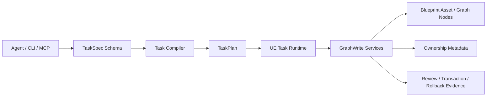
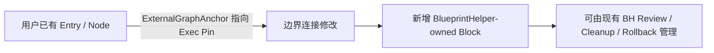
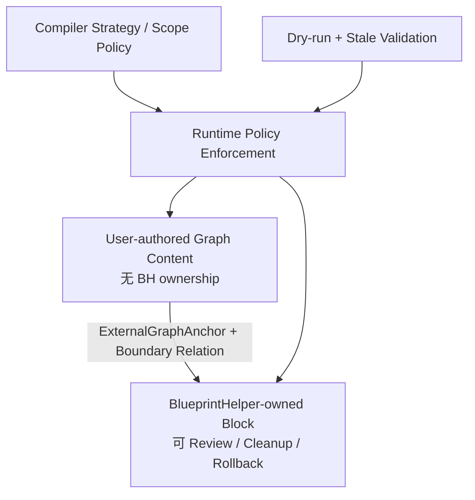

# BlueprintHelper GraphWrite 用户图写入能力与 ExternalGraphAnchor 架构评估

> 文档类型：当前实现审阅结论 / 能力扩展架构建议  
> 项目：BlueprintHelper（UE5.3+，TaskSpec / TaskPlan / UE Runtime 混合架构）  
> 日期：2026-05-31  
> 审阅主题：当前 GraphWrite 是否具备 `UserOwnerBlock` 写入能力，以及用户图写入扩展应采用何种架构

---

## 1. 评估目标

本次评估针对以下问题给出源码层面的结论与后续设计方向：

1. 当前 BlueprintHelper 是否已经主要具备写入 `BlueprintHelper-owned block` 的蓝图能力。
2. 当前是否已经存在正式的 `UserOwnerBlock` / 用户拥有块写入能力。
3. 若希望 Agent 能够安全接入或局部修改用户已有蓝图逻辑，是否应增加 `UserBlockAnchor` 或 `UserOwnerBlock`。
4. Compiler、UE Runtime / GraphWrite、CLI / MCP 三端应如何扩展，才能与现有 TaskSpec / TaskPlan / ownership / Review / Rollback 架构一致。

本文以当前仓库 GraphWrite 主链路代码审阅结论为依据，不以 `Develop/v*` 已归档文档作为最新实现事实来源。

---

## 2. 最终结论

### 2.1 能力现状结论

当前正式公开且由 TaskSpec → Compiler → TaskPlan → UE Runtime → GraphWrite 执行链路支持的写入模型，核心是：

```text
BlueprintHelper-owned block write model
```

即：

- Compiler 公开 GraphWrite strategy 以 owned graph 为目标；
- TaskPlan 的 ownership scope 固定为 `blueprinthelper_owned`；
- Patch / Merge 的稳定写锚以 `block_id` 定位到 BlueprintHelper-owned 节点；
- UE OwnershipService 只持久化 `BlueprintHelperOwned=true` 与 `BlueprintHelperBlockId`；
- Logic 读侧把具备该 metadata 的节点归组为 `BlueprintHelperBlock`。

### 2.2 `UserOwnerBlock` 结论

当前仓库**不存在正式的**：

- `UserOwnerBlock`；
- `UserBlockAnchor` 写入合同；
- `user_owned` ownership domain；
- 用户节点被纳入插件管理块后的安全、Review、Cleanup、Rollback 闭环。

现有代码中出现的非 BlueprintHelper-owned 节点修改路径，不能等价视为正式能力。它们更准确地属于：

> UE 执行端存在的、尚未被 Compiler / Runtime ownership policy 完整封口的底层越界修改路径。

### 2.3 架构选型结论

不建议将用户已有蓝图逻辑建模为 `UserOwnerBlock`，也不建议通过“转换用户节点 ownership”的方式扩展能力。

建议采用新的**非拥有型外部稳定锚协议**：

```text
ExternalGraphAnchor / UserAuthoredGraphAnchor
```

其设计原则是：

- 用户节点继续保持 user-authored / external，不写 BlueprintHelper ownership metadata；
- Agent 新增的逻辑仍写为 `BlueprintHelper-owned block`；
- 用户图与 BH-owned block 的接入边界，以 external anchor + boundary relation + before/after connection evidence 记录；
- 第一阶段仅开放“从明确用户执行流锚点接入新 BH-owned block”的 Merge 能力；
- Patch 和 Replace 用户图能力在稳定锚、stale 校验、Review / rollback 边界完善后再逐步开放。

---

## 3. 三端审阅范围与职责定位

| 层级 | 当前主要职责 | 本次审阅重点 |
|---|---|---|
| Compiler / TaskSpec | 接收 Agent 任务表达，校验合同，lowering 为 TaskPlan | GraphWrite strategy、scope policy、anchor 约束、ownership_scope |
| UE Runtime / GraphWrite | 将 TaskPlan 映射为 UE 编辑操作并执行真实节点变更 | OwnershipService、Append / Replace / Patch / Merge、Resolver、Logic grouping |
| CLI / MCP | 接收任务并调用统一 TaskSpecRunner；提供 preview / execute 入口 | 是否存在独立 UserBlock 命令或绕开 Compiler 的写入口 |

当前三端依赖关系可概括为：



关键判断：CLI / MCP 本身不是 ownership 语义的定义层。用户图写入能力能否成立，主要取决于 **Compiler 合同是否允许、Runtime 是否执行约束、UE GraphWrite 是否实现稳定锚与安全写闭环**。

---

## 4. Compiler 端证据：公开协议为 BlueprintHelper-owned-only

## 4.1 非 BlueprintHelper-owned 内容当前被合同显式阻止写入

源码位置：

```text
AgentFaceService/task-core/src/task/schema/task-contract.ts:166-172
```

已审阅实现中，非 BlueprintHelper-owned graph content 的合同语义为：

```ts
non_blueprinthelper_owned_graph_content: {
  normal_agent_write_contract: 'blocked_until_stable_anchor_contract_exists',
  read_contract: 'read_context/read_reference_context only',
  preview_blocker_code: 'unsupported_scope_policy',
  blocked_scope_policy_path: 'scope_policy.allow_modify_user_nodes',
  required_scope_policy_value: false,
}
```

该定义直接表明：

- 非 BH-owned 图内容目前属于可读上下文；
- 普通 Agent 写入在稳定锚合同建立前被阻止；
- 当前有效 policy 要求 `allow_modify_user_nodes=false`。

相关测试位置：

```text
AgentFaceService/task-core/src/tests/task/task-contract-graphwrite.test.ts:201-207
AgentFaceService/task-core/src/tests/task/task-compiler.regression.test.ts:1469-1489
```

其中 regression 测试确认：当 Agent 尝试将 `allow_modify_user_nodes` 设为 `true` 时，Compiler 应返回 `unsupported_scope_policy`，而不是生成可执行 GraphWrite 计划。

## 4.2 GraphWrite strategy 只有 owned 语义

源码位置：

```text
AgentFaceService/task-core/src/task/compiler/task-compiler.ts:1143-1179
```

当前公开允许的 strategy 为：

```ts
'append_new_owned_graph'
'replace_owned_graph'
'patch_owned_graph'
'merge_owned_graph'
```

并存在约束：

```ts
if (taskSpec.scope_policy.allow_modify_user_nodes) {
  throw new TaskSpecCompileError(
    'unsupported_scope_policy',
    'Modifying user nodes is not supported for GraphWrite owned strategies.',
    ...
  );
}
```

当前不存在下列外部 / 用户图策略：

```text
merge_external_flow
patch_external_graph
replace_external_body
user_owned_graph_edit
```

因此，从 Agent 正式调用面看，当前写入能力没有第二个 ownership / external domain。

## 4.3 TaskPlan 中 ownership scope 被固定为 `blueprinthelper_owned`

源码位置：

```text
AgentFaceService/task-core/src/task/compiler/task-compiler.ts:567-687
```

Append、Replace 与通用 GraphWrite step 均生成类似约束：

```ts
constraints: {
  allow_modify_user_nodes: taskSpec.scope_policy.allow_modify_user_nodes,
  ownership_scope: 'blueprinthelper_owned',
}
```

已审阅位置包括：

| 写入类型 | 位置 |
|---|---|
| Append | `task-compiler.ts:610-613` |
| Replace | `task-compiler.ts:657-660` |
| 通用 GraphWrite step | `task-compiler.ts:682-685` |

这一事实说明当前 TaskPlan 结构未建立：

- `external_user_authored`；
- `user_owned`；
- `mixed_boundary_write`；
- 独立 external anchor 的执行约束。

## 4.4 Patch / Merge 锚点必须引用 BH-owned block

源码位置：

```text
AgentFaceService/task-core/src/task/compiler/task-compiler.ts:2697-2804
```

当前 `assertBlockScopedGraphWriteRef` 明确要求：

```ts
function assertBlockScopedGraphWriteRef(ref, path): void {
  const hasBlockId =
    typeof ref['block_id'] === 'string' &&
    ref['block_id'].trim().length > 0;

  if (hasBlockId) return;

  throwUnsupportedGraphWriteAnchor(
    path,
    `${path} must identify a BlueprintHelper-owned block with block_id.`,
  );
}
```

因此公共协议层的 Patch / Merge 能力是：

```text
进入已存在的 BlueprintHelperBlockId 区域 → 定位 block 内节点 / Pin / Link → 执行修改
```

而不是：

```text
读取任意用户节点 → 通过普通 node GUID / 显示名修改用户图内容
```

---

## 5. UE GraphWrite 端证据：正式 ownership 只有 BlueprintHelper-owned

## 5.1 OwnershipService 只持久化 BlueprintHelper ownership

源码位置：

```text
BlueprintHelper/Source/BlueprintHelper/Private/Systems/ToolClusters/GraphWrite/GraphSupport/BlueprintHelperOwnershipService.cpp:10-60
```

当前 metadata 写入逻辑为：

```cpp
MetaData.SetValue(Node, TEXT("BlueprintHelperOwned"), TEXT("true"));
MetaData.SetValue(Node, TEXT("BlueprintHelperBlockId"), *BlockId);
MetaData.SetValue(Node, TEXT("BlueprintHelperFeatureName"), *FeatureName);
```

当前未见下列实现：

```text
UserOwned=true
UserBlockId
ExternalAnchorId
OwnershipDomain=external_user_authored
```

这说明 UE 持久层只有一种由插件控制的 ownership 类型：

```text
BlueprintHelperOwned=true + BlueprintHelperBlockId=<stable id>
```

## 5.2 BlockScopedResolver 只识别 BH-owned 节点

源码位置：

```text
BlueprintHelperGraphWriteBlockScopedResolver.cpp:99-118
BlueprintHelperGraphWriteBlockScopedResolver.cpp:195-283
BlueprintHelperGraphWriteBlockScopedResolver.cpp:296-403
```

节点属于 block 的判定要求：

```cpp
const FString NodeBlockId = MetaData.GetValue(Node, TEXT("BlueprintHelperBlockId"));
const FString OwnedStr = MetaData.GetValue(Node, TEXT("BlueprintHelperOwned"));

return NodeBlockId == BlockId
    && OwnedStr.Equals(TEXT("true"), ESearchCase::IgnoreCase);
```

因此：

- `block_id` 是 BH-owned 节点集合的定位锚；
- Resolver 当前没有识别 user-authored graph anchor 的实现；
- 仅在 TaskSpec 层增加 `UserBlockAnchor` 字段不会形成可执行能力。

## 5.3 Logic 读侧同样仅把 BH metadata 聚合为 Block

源码位置：

```text
BlueprintHelperLogicGroupBuilder.cpp:160-176
BlueprintHelperLogicGroupBuilder.cpp:262-343
```

当前分组语义为：

| 节点状态 | Logic 分组 | 是否存在正式 block 写锚 |
|---|---|---|
| 节点带 `BlueprintHelperOwned=true` 与合法 `BlueprintHelperBlockId` | `BlueprintHelperBlock` | 是 |
| 未带 BH ownership metadata 的普通蓝图节点 | `GlobalEventFlow` 等普通组 | 否 |

当前读侧已能理解用户图内容，但没有把用户图内容构造成稳定、可验证、非拥有型写 anchor。

---

## 6. 重要风险发现：UE 底层存在非 owned 修改路径，但不是正式 UserOwnerBlock 能力

当前实现存在 Compiler / Runtime / UE GraphWrite 约束不完全一致的问题。扩展用户图能力前，必须先处理这一层安全缺口。

## 6.1 Replace body 存在删除非 owned 节点的路径

源码位置：

```text
BlueprintHelperReplaceBlueprintGraphService.cpp:647-658
BlueprintHelperReplaceBlueprintGraphService.cpp:793-909
BlueprintHelperReplaceBlueprintGraphService.cpp:975-993
```

在以下 scope 中：

```text
function_body
event_body
custom_event_body
graph
```

当前服务会保留入口节点，并将其余节点加入删除集合：

```cpp
for (UEdGraphNode* Node : Graph->Nodes)
{
    if (ShouldPreserveEntryNode(...))
    {
        OutTarget.NodesToPreserve.Add(Node);
    }
    else
    {
        OutTarget.NodesToDelete.Add(Node);
    }
}
```

正式执行阶段会删除集合中的节点：

```cpp
FBlueprintEditorUtils::RemoveNode(Blueprint, Node, true);
```

在这一收集路径中，是否删除节点并不以 `BlueprintHelperOwned=true` 为前置条件。

### 风险含义

这意味着 UE Replace 服务底层可能覆盖用户已有函数体或事件体。但由于 Compiler 合同没有正式开放该能力，因此该行为应被归类为：

```text
owned-only policy 与 UE replace implementation 之间的约束缺口
```

而不能被归类为：

```text
已完成的 UserOwnerBlock 能力
```

## 6.2 Patch / Merge resolver 存在无 `block_id` 的通用路径 fallback

源码位置：

```text
BlueprintHelperGraphWriteBlockScopedResolver.cpp:204-207
```

当前可见逻辑为：

```cpp
if (!Anchor.IsBlockScoped())
{
    return PathService.ResolveNode(
        Graph,
        Anchor.NodeRef,
        Anchor.NodePath,
        OutNode,
        OutError
    );
}
```

这表示：

- Compiler 公共合同要求 Patch / Merge 使用 BH block anchor；
- UE Resolver 本身仍保留可按通用路径定位节点的 fallback；
- 若未来存在绕开 Compiler、错误 lowering 或内部调用路径，该 fallback 可能触达非 owned 节点。

### 风险含义

外部用户图写入若要开放，不能继续复用模糊 fallback，而应提供独立的：

```text
ExternalGraphAnchorResolver + expected state / stale detection
```

## 6.3 Runtime 未将 GraphWrite ownership constraints 执行为硬约束

源码位置：

```text
BlueprintHelperTaskRuntimeService.cpp:2484-2592
```

当前 GraphWrite lowering 主要校验：

```text
write.strategy == "owned_graph_edit"
```

并将结构操作映射为实际 GraphWrite 命令：

| TaskPlan operation | UE GraphWrite 映射 |
|---|---|
| `ensure_entry` | `append_blueprint_graph` |
| `replace_body` | `replace_blueprint_graph` |
| `set_pin_default` / comment / position | `patch_blueprint_graph` |
| `insert_flow` | `merge_blueprint_graph` |

但当前 GraphWrite Runtime 路径未见对以下字段的完整执行校验：

```json
{
  "constraints": {
    "allow_modify_user_nodes": false,
    "ownership_scope": "blueprinthelper_owned"
  }
}
```

### 风险含义

目前形成的实际状态是：

```text
Compiler：声明只允许 BH-owned
Runtime：主要只识别 owned_graph_edit 标记
UE Service：部分路径仍可触达或删除非 owned 节点
```

这一不一致应作为 P0 安全闭环修复项处理。

---

## 7. Append 中发现的 block ownership 粒度问题

源码位置：

```text
BlueprintHelperAppendBlueprintGraphService.cpp:846-898
```

当前多 entry 处理会先收集全部 `CreatedNodes`，随后针对每个 `EntryName` 对同一批节点调用 ownership 写入：

```cpp
OwnershipService.WriteBlockOwnership(
    Blueprint,
    CreatedNodes,
    FullBlockId,
    Request.FeatureName,
    OwnershipError
);
```

而 OwnershipService 使用 metadata `SetValue` 写入 `BlueprintHelperBlockId`。这会导致：

- 同一批节点被多次写入不同 block_id；
- 早先写入的 block_id 被后续 entry 覆盖；
- 多 entry append 的 block ownership 分区可能不符合预期。

### 对扩展能力的影响

在开放 ExternalGraphAnchor 前，应先修正现有 owned block 的 ownership partition，否则：

- 新建块与用户图接入点的关联难以可靠记录；
- Review / Cleanup / Replace / Rollback 的 block 边界会存在歧义；
- 后续 external boundary relation 可能绑定到错误 block。

---

## 8. CLI / MCP 端判断：不应新增 UserBlock 专用入口作为首要改造

## 8.1 CLI 当前只负责提交 TaskSpec

源码位置：

```text
AgentFaceService/cli/src/cli/run.ts:119-140
```

CLI 主要流程为：

```ts
TaskSpecSchema.parse(...)
getRunner(runtime).previewTask(taskSpec)
getRunner(runtime).executeTask(taskSpec)
```

GraphWrite ownership 的实际语义并不在 CLI 中定义，而在：

```text
TaskSpec contract → Compiler → TaskPlan → UE Runtime / GraphWrite
```

## 8.2 Raw bridge call 不应成为写能力旁路

源码位置：

```text
AgentFaceService/cli/src/cli/run.ts:71-80
AgentFaceService/cli/src/cli/run.ts:174-185
```

当前 CLI raw bridge call 被限制为 read-only command 集合，GraphWrite 写入不应通过 CLI 直接绕开 Compiler 和 Runtime policy。

## 8.3 MCP 与 CLI 共用 TaskSpecRunner

源码位置：

```text
AgentFaceService/task-core/src/task/service/task-spec-runner.ts:98-175
AgentFaceService/mcp/src/mcp/tools/task-tools.ts:83-143
```

因此用户图写入能力的正确落点顺序应为：

1. TaskSpec / Compiler 合同；
2. TaskPlan ownership / anchor / dry-run 表达；
3. UE Runtime 约束执行；
4. UE GraphWrite external resolver 与写服务；
5. CLI / MCP schema 与帮助信息同步暴露。

不应先增加一套 CLI `UserBlock` 指令，导致能力绕开统一 TaskSpec / TaskPlan 边界。

---

## 9. 为什么不建议 `UserOwnerBlock`

## 9.1 Ownership 与可修改定位不是同一概念

`BlueprintHelper-owned block` 的语义是：

- 节点由 BlueprintHelper 创建；
- 插件拥有稳定识别与维护责任；
- 可被 Cleanup、Replace、Rollback 和 Review 管理；
- 可持久写入 ownership metadata。

用户已有节点则满足不同约束：

- 节点由用户创建；
- 不能因 Agent 接入一次逻辑而被插件接管；
- 不应被插件默认 Cleanup；
- 删除或替换必须显式展示用户内容影响；
- ownership 不应因建立连接边而发生迁移。

因此需要严格区分：

| 设计问题 | 正确模型 |
|---|---|
| 插件创建并负责维护哪些节点 | Ownership / `BlueprintHelper-owned block` |
| Agent 能否稳定找到某个用户节点 / Pin / Link 并在许可下修改 | External Anchor / Expected State |

将用户已有内容标记为 `UserOwnerBlock` 会把“用户拥有内容”错误转化为“插件管理的另一类块”，导致 ownership、Cleanup、Review、Rollback 的责任边界混乱。

## 9.2 历史转换型 ownership 路径已被当前代码排除

源码位置：

```text
BlueprintHelper/Source/BlueprintHelper/Private/Tests/RuntimeDiagnostics/BlueprintHelperSafetyTests.cpp:332-375
```

当前测试明确扫描并禁止旧命令重新出现在生产代码中，其中包括：

```text
convert_blueprint_helper_block_to_user_owned
```

这说明当前仓库已经主动放弃“把 BH block 转为 user-owned block”一类命令式 ownership 转换路径。新的用户图能力不应重新引入同类模型。

---

## 10. 建议目标架构：ExternalGraphAnchor + Boundary Relation

## 10.1 Ownership domain 与 external domain 分离

建议在 GraphWrite 目标模型中区分两个 domain：

```ts
type GraphTargetDomain =
  | 'blueprinthelper_owned'
  | 'external_user_authored';
```

### BlueprintHelper-owned domain

用于插件创建并管理的逻辑块：

```ts
type BlueprintHelperBlockAnchor = {
  domain: 'blueprinthelper_owned';
  block_id: string;
  group_entry_node_path?: string;
  node_ref: string;
  pin_ref?: string;
  link_ref?: string;
};
```

适用操作：

- Append 新逻辑；
- Patch block 内节点；
- Replace block implementation；
- Merge owned block 内执行流；
- Cleanup / rollback / ownership-based Review。

### External user-authored domain

用于定位用户已有蓝图内容，但**不改变其 ownership**：

```ts
type ExternalGraphAnchor = {
  domain: 'external_user_authored';

  asset_path: string;
  graph: string;

  entry_identity?: {
    kind: 'event' | 'custom_event' | 'function';
    name: string;
  };

  node_locator: {
    node_guid: string;
    semantic_kind: string;
    signature_fingerprint: string;
  };

  pin_locator?: {
    direction: 'input' | 'output';
    pin_name: string;
    pin_type_fingerprint: string;
  };

  link_locator?: {
    successor_node_guid?: string;
    successor_pin_fingerprint?: string;
  };

  expected_state: {
    snapshot_hash: string;
    connection_fingerprint?: string;
    default_value?: string;
  };
};
```

该结构的关键语义为：

- `ExternalGraphAnchor` 只表达稳定定位和并发 / stale 校验依据；
- 不向锚点节点写入 `BlueprintHelperOwned=true`；
- 不产生 `UserBlockId`；
- 不让 Cleanup 默认删除用户节点；
- 正式写操作必须基于 `expected_state` 验证用户图未发生意外变化。

## 10.2 Boundary Relation 独立记录跨域连接变更

当 BH-owned block 接入用户图时，应记录独立关系，而不是让 ownership 穿透到用户节点：

```ts
type ExternalAttachmentRelation = {
  external_anchor: ExternalGraphAnchor;
  inserted_block_id: string;
  modified_link_before?: object;
  modified_link_after: object;
  snapshot_hash_before: string;
  transaction_evidence_ref?: string;
};
```

其职责为：

- 记录用户图到新增 BH block 的接入边界；
- 支持 dry-run 展示连接变化；
- 支持 Review 区分“用户边界修改”与“BH 节点新增”；
- 支持 rollback 恢复原执行流连接；
- 不承担 ownership 管理职责。

---

## 11. 推荐首批新能力：`merge_external_flow`

最符合当前 architecture boundary 的用户图扩展，不是任意 Patch / Replace，而是：

> 在用户已有执行流的明确外部锚点处，接入一个新生成的 BlueprintHelper-owned block。

示意：



### 11.1 建议 strategy

```ts
graph_strategy: 'merge_external_flow'
```

或：

```ts
graph_strategy: 'merge_user_anchored_graph'
```

建议使用前者，以强调 external anchor 是定位语义，而不是 ownership 语义。

### 11.2 首版支持的插入策略

```ts
insert_strategy: 'append_after' | 'insert_between' | 'branch_fork'
```

对应约束：

| 插入策略 | 首版行为约束 |
|---|---|
| `append_after` | 目标 Exec Pin 没有已有后继时才允许直接接入；已有后继时返回冲突 |
| `insert_between` | 必须展示原连接断开、新 block 插入、原后继重连的顺序变化 |
| `branch_fork` | 由工具插入 Sequence 或等价分发结构；必须展示原路径与新路径顺序 |

### 11.3 首版安全约束

`merge_external_flow` 必须满足：

- 必须指定目标 asset 与 graph；
- external anchor 必须由读工具生成或由 UE 校验；
- 必须携带 `expected_state.snapshot_hash`；
- 必须执行 full dry-run；
- stale anchor / 当前连接已变化时拒绝写入；
- 新生成节点全部写为 `BlueprintHelper-owned block`；
- 用户节点不写 ownership metadata；
- transaction / review evidence 必须能区分边界连接修改和新 block 节点新增；
- rollback 仅恢复边界连接并清除本次新增 BH block，不删除其他用户节点。

### 11.4 示例 TaskSpec 方向

以下仅用于表达架构结构，不代表当前 schema 已实现：

```json
{
  "graph_strategy": "merge_external_flow",
  "target": {
    "asset_path": "/Game/Blueprints/BP_Door",
    "graph": "EventGraph"
  },
  "merge": {
    "anchor": {
      "domain": "external_user_authored",
      "node_locator": {
        "node_guid": "...",
        "semantic_kind": "custom_event",
        "signature_fingerprint": "..."
      },
      "pin_locator": {
        "direction": "output",
        "pin_name": "then",
        "pin_type_fingerprint": "exec"
      },
      "expected_state": {
        "snapshot_hash": "...",
        "connection_fingerprint": "..."
      }
    },
    "insert_strategy": "insert_between",
    "inserted_logic": {
      "ownership": "blueprinthelper_owned",
      "feature_name": "ToggleDoor",
      "statements": []
    }
  }
}
```

---

## 12. 后续扩展边界：Patch 与 Replace 应分阶段开放

## 12.1 `patch_external_graph` 可在 Merge 稳定后有限开放

建议第二批仅支持低破坏性、可精确比对的用户图修改：

| 操作类型 | 是否建议首批 Patch 开放 | 要求 |
|---|---:|---|
| 设置用户节点 Pin 默认值 | 可以 | 必须带 `expected_old_value` / snapshot hash |
| 修改用户节点注释 | 可以 | 低风险，但仍需定位稳定 |
| 修改布局位置 | 可延后 | 与 GraphLayout 职责可能重叠 |
| 修改执行连接 | 不建议复用 Patch | 应统一归入 Merge |
| 删除用户节点 | 不建议 | 破坏性高 |
| 批量重建用户局部逻辑 | 不建议 | 应归入 Replace 且后置 |

建议新增独立 strategy：

```ts
patch_external_graph
```

不得让 `patch_owned_graph` 同时承担 external 用户图修改语义。

## 12.2 `replace_external_body` 必须作为最后阶段能力

Replace 对用户图具有最高风险。若未来确有需求，应独立建模：

```ts
replace_external_body
```

并要求：

- 用户明确指定目标函数 / 事件 / 图表；
- full dry-run 且展示完整删除 / 保留 / 新增计划；
- before graph snapshot 可恢复；
- external dependents 检查；
- expected graph fingerprint 与 stale 校验；
- Review 清晰区分被删除用户节点、被保留入口节点、新增 BH 节点；
- 绝不将用户入口节点转换为 BH ownership；
- 绝不复用 `replace_owned_graph` 的名称与默认安全假设。

---

## 13. 建议代码结构调整

## 13.1 Resolver 分层

当前 resolver 侧重点为 BH block scope。建议抽象为：

```cpp
IGraphWriteAnchorResolver
├── FBlueprintHelperOwnedBlockAnchorResolver
└── FBlueprintHelperExternalGraphAnchorResolver
```

| Resolver | 定位目标 | 依据 | 允许的首版写操作 |
|---|---|---|---|
| `OwnedBlockAnchorResolver` | BH-owned block 内节点 / Pin / Link | BH metadata + block_id | 现有 Append / Patch / Replace / Merge / Cleanup |
| `ExternalGraphAnchorResolver` | 用户已有图上的节点 / Pin / 边界连接 | GUID + semantic fingerprint + snapshot hash | 首版仅 `merge_external_flow` |

## 13.2 Runtime 必须执行 ownership constraint

建议在 UE Task Runtime 增加统一校验入口：

```cpp
ValidateGraphWriteOwnershipConstraints(...)
```

建议调用节点：

1. TaskPlan lowering 前：校验 strategy 与 domain 是否匹配；
2. Anchor resolve 后：校验实际节点 ownership / external 状态；
3. Mutation 执行前：复核 expected state / stale condition；
4. Transaction evidence 生成前：确认变更跨域边界和 Review 分类一致。

至少应验证：

```json
{
  "ownership_scope": "blueprinthelper_owned | external_user_authored",
  "allow_modify_user_nodes": false,
  "allowed_external_mutations": ["exec_boundary_link"]
}
```

## 13.3 Replace 服务按 domain 切断现有越界路径

在未正式实现 external replace 前：

- owned strategy 解析到非 owned body 时必须拒绝；
- `function_body` / `event_body` / `graph` 删除集合必须验证 ownership domain；
- 通用底层服务若为内部调试保留，应禁止公共 TaskPlan 无约束调用。

## 13.4 Append 多 entry ownership partition 修复

建议在 Append 生成阶段按 entry 分区维护：

```cpp
TMap<FString, TArray<UEdGraphNode*>> CreatedNodesByEntry;
```

随后逐 entry 写入对应 block ownership，而非对全量 `CreatedNodes` 重复覆盖：

```cpp
for (const auto& Pair : CreatedNodesByEntry)
{
    OwnershipService.WriteBlockOwnership(
        Blueprint,
        Pair.Value,
        BlockIdForEntry(Pair.Key),
        FeatureName,
        OwnershipError
    );
}
```

并增加验证测试：

- 多 Custom Event append 后，各 entry 下节点持有各自 block_id；
- 无节点跨多个 block 被 metadata 覆盖；
- Logic grouping 可按 block_id 正确分组；
- Cleanup / Replace 单 block 不影响其他 entry 块。

---

## 14. 分阶段实施计划

| 阶段 | 优先级 | 实施内容 | 输出能力 | 不包含内容 |
|---|---:|---|---|---|
| Phase 0 | P0 | 修复现有 owned-only policy 与 UE 执行不一致；修复 Append 多 entry ownership | owned block 安全闭环可信 | 不开放用户图写入 |
| Phase 1 | P1 | 实现 ExternalGraphAnchor 读侧生成与验证；LogicJson 扩展 anchor evidence | 可稳定识别用户接入点 | 不执行写入 |
| Phase 2 | P2 | 实现 `merge_external_flow`，新增 BH block 接入用户执行流 | 受控接入用户图 | 不修改用户节点属性 / body |
| Phase 3 | P3 | 实现有限 `patch_external_graph` | Pin 默认值 / 注释等低破坏性变更 | 不删除节点、不重建 body |
| Phase 4 | P4 | 评估并实现 `replace_external_body` | 显式用户目标的高风险 body 替换 | 不默认自动替换 |

---

## 15. Phase 0：扩展前必须完成的安全修复项

### 15.1 Compiler / Contract

- 保持 owned strategy 仅允许 `blueprinthelper_owned`。
- 明确禁止 owned strategy 解析到 non-owned body 或 non-owned anchor。
- 为未来 external domain 预留独立 strategy，不复用 owned 名称。

### 15.2 UE Runtime

- GraphWrite lowering 消费 `constraints.ownership_scope`。
- GraphWrite lowering 消费 `constraints.allow_modify_user_nodes`。
- owned TaskPlan 实际解析到用户节点时返回阻断错误。
- 任何写执行前验证 strategy、anchor domain、mutation scope 一致。

### 15.3 UE GraphWrite Services

- Replace owned body 删除前校验所有待删除节点属于本次合法 owned target。
- Patch / Merge owned resolver 禁止无 `block_id` fallback 进入普通用户节点。
- 若保留通用路径解析服务，仅开放给未来 external resolver 的明确流程。

### 15.4 Append Ownership

- 节点按 entry 分区写入 block_id。
- 新增多 entry ownership 单元测试和集成测试。

---

## 16. Phase 1：ExternalGraphAnchor 只读能力设计

### 16.1 新增 UE 服务建议

```cpp
FBlueprintHelperExternalGraphAnchorService
```

职责：

- 从用户图内容中生成稳定锚；
- 输出 node GUID、Pin / Link fingerprint、entry identity、snapshot hash；
- 校验锚仍然可唯一定位；
- 校验读取后用户图是否发生变化；
- 不写 metadata，不产生 block ownership。

### 16.2 LogicJson 输出扩展建议

用户图 group 可增加只读 evidence：

```json
{
  "group_kind": "GlobalEventFlow",
  "nodes": [
    {
      "node_ref": "nodes[2]",
      "semantic_kind": "custom_event",
      "external_anchor": {
        "domain": "external_user_authored",
        "node_guid": "...",
        "signature_fingerprint": "...",
        "snapshot_hash": "..."
      }
    }
  ]
}
```

### 16.3 只读验收条件

- 对同一未变化图重复读取，external anchor 可稳定验证；
- 节点重命名、Pin 类型变化、连接变化后，旧 anchor 被判定 stale 或不匹配；
- anchor 不能被误识别为 BH-owned block；
- 生成 anchor 不写入资产，不触发 transaction / review。

---

## 17. Phase 2：`merge_external_flow` 执行闭环设计

### 17.1 Compiler

新增独立 GraphWrite strategy 与 schema：

```ts
merge_external_flow
```

Compiler 必须验证：

- anchor domain 为 `external_user_authored`；
- inserted logic domain 为 `blueprinthelper_owned`；
- 仅允许执行流边界操作；
- 必须有 expected snapshot；
- 必须生成 full dry-run 计划。

### 17.2 Runtime / UE

Runtime 与 UE 服务职责：

1. 根据 ExternalGraphAnchor 定位外部节点和 Pin；
2. 验证 snapshot / connection fingerprint 未过期；
3. 在同一 transaction 中创建新 BH-owned block；
4. 按 `append_after` / `insert_between` / `branch_fork` 修改边界连接；
5. 保存 boundary relation evidence；
6. 生成 rollback data；
7. 编译 / 保存按现有验证闭环执行。

### 17.3 Review / Rollback 边界

Review 中应按两类变更展示：

| 变更类型 | 展示语义 |
|---|---|
| 新建 BH-owned 节点 / 连接 | BlueprintHelper 新逻辑块 |
| 断开或新增与用户节点相连的边 | External boundary modification |

Rollback 时：

- 删除本次新建 BH block；
- 恢复原 external boundary link；
- 不删除、不接管、不改写无关用户节点。

### 17.4 执行能力验收条件

- 可在明确用户 Exec Pin 后追加 BH-owned block；
- 可在已有用户执行链中以 `insert_between` 接入并恢复原后继；
- 可通过 `branch_fork` 增加分支且 dry-run 明示顺序；
- stale anchor 时正式执行拒绝，资产不发生部分修改；
- Cleanup 新 block 后可恢复用户原执行流连接；
- 用户节点 metadata 不出现 BlueprintHelper ownership。

---

## 18. 不应在首版开放的内容

| 能力 | 首版结论 | 原因 |
|---|---|---|
| `UserOwnerBlock` | 排除 | ownership 责任边界错误 |
| 将用户节点转换为 BH-owned 或 user-owned block | 排除 | 会污染 Cleanup / Review / Rollback 语义 |
| 自动 Replace 用户函数体 / 事件体 | 排除 | 当前 UE 已存在风险路径，应先封口 |
| 按显示名模糊查找用户节点后写入 | 排除 | 定位不稳定，易误修改 |
| 在 owned strategy 中隐式允许 external fallback | 排除 | 会绕过 Compiler policy |
| 删除任意用户节点 | 排除 | 破坏性高，难以保证安全恢复 |

---

## 19. 关键测试矩阵建议

| 测试域 | 测试项 | 期望结果 |
|---|---|---|
| Compiler policy | owned strategy + `allow_modify_user_nodes=true` | `unsupported_scope_policy` |
| Compiler policy | owned strategy + external anchor | 拒绝生成可执行计划 |
| Runtime constraint | owned TaskPlan 解析到非 owned 节点 | 执行前失败，资产不变 |
| Replace safety | owned replace 目标包含用户节点 | dry-run / execute 拒绝，除非未来走 external strategy |
| Append ownership | 多 entry append | 每 entry 独立 block_id，不覆盖 |
| Logic read | 用户图读取 | 生成 external anchor evidence，但无 ownership 写入 |
| Anchor stale | 用户在读取后改变连接 | preview / execute 阻止 stale anchor |
| Merge external | `append_after` 无已有后继 | 成功创建新 BH block 并接入 |
| Merge external | `append_after` 已有后继 | 冲突，不自动改策略 |
| Merge external | `insert_between` | dry-run 明示旧边 / 新边 / 顺序变化 |
| Merge external | `branch_fork` | 明示 Sequence 顺序，成功生成 BH block |
| Rollback | external merge rollback | 恢复用户原连接，仅移除本次新增 BH 内容 |
| Metadata | external merge 后用户节点 | 不含 `BlueprintHelperOwned=true` |

---

## 20. 建议的任务拆分清单

### P0：安全闭环修复

- [ ] Runtime 增加 GraphWrite ownership constraint enforcement。
- [ ] Replace owned 路径禁止无授权删除非 owned 节点。
- [ ] Patch / Merge owned 路径移除或隔离普通路径 fallback。
- [ ] Append 多 entry 按节点所属 entry 写入独立 block_id。
- [ ] 增加 Compiler、Runtime、UE GraphWrite 的回归测试。

### P1：ExternalGraphAnchor 读侧基础

- [ ] 定义 `external_user_authored` target domain。
- [ ] 新增 ExternalGraphAnchor schema 与 fingerprint / snapshot hash。
- [ ] UE Logic read 输出 external anchor evidence。
- [ ] 新增 ExternalGraphAnchor 解析与 stale 校验服务。
- [ ] 增加只读稳定性与变化失效测试。

### P2：外部执行流接入能力

- [ ] 新增 `merge_external_flow` strategy。
- [ ] 编译器生成跨域 boundary relation plan。
- [ ] Runtime 执行 external anchor validation。
- [ ] UE 创建新 BH-owned block 并接入用户执行流。
- [ ] Review / rollback 记录 external boundary relation。
- [ ] 完成 `append_after` / `insert_between` / `branch_fork` 测试。

### P3：有限 external patch

- [ ] 定义 `patch_external_graph` 独立 strategy。
- [ ] 首批限定 Pin default 与 comment 修改。
- [ ] 强制 expected old state / snapshot hash。
- [ ] 明确排除删除节点和连接重构。

### P4：高风险 external replace 评估

- [ ] 定义 `replace_external_body` 风险模型。
- [ ] 设计 full graph before snapshot 与 rollback。
- [ ] 设计 external dependents 检测。
- [ ] 决定是否满足开放条件，未满足则继续禁止。

---

## 21. 架构决策记录（ADR 摘要）

### 决策

采用：

```text
ExternalGraphAnchor + BlueprintHelper-owned inserted block + Boundary Relation
```

不采用：

```text
UserOwnerBlock / 将用户已有图转换为另一种 owned block
```

### 决策依据

1. 当前 Compiler 合同与 TaskPlan 已明确采用 BH-owned-only 模型。
2. 当前 UE ownership metadata 与 Resolver 只支持 BlueprintHelper-owned block。
3. 用户节点的真实需求是稳定定位与受控修改，而不是 ownership 接管。
4. `UserOwnerBlock` 会破坏 Cleanup、Replace、Rollback、Review 的职责边界。
5. 新增 external anchor 可以在不改变现有 ownership 模型的前提下扩展 Agent 接入能力。
6. 当前 UE 底层已有非 owned 修改风险路径，必须先做安全封口，再开放新的 external write domain。

### 影响

- 现有 BH-owned block 工具链可继续复用；
- 新增的用户图接入能力具备独立风险边界；
- CLI / MCP 无需增加绕开 TaskSpec / Compiler 的特殊写命令；
- Review / rollback 需要支持跨域边界连接 evidence；
- 开发顺序需先完成现有约束缺口修复。

---

## 22. 最终推荐

当前插件应被认定为：

```text
已大部分具备 BlueprintHelper-owned block 的蓝图写入能力；
尚未具备受控、闭环的用户已有蓝图逻辑写入能力。
```

扩展方向不应是增加 `UserOwnerBlock`，而应是：

```text
P0：先封闭现有 UE GraphWrite 对非 owned 节点的越界修改风险，并修复 Append block ownership 粒度问题；
P1：新增 ExternalGraphAnchor 只读生成与 stale 校验；
P2：新增 merge_external_flow，让用户执行流接入新建 BH-owned block；
P3/P4：在证据、Review、Rollback 闭环稳定后，有限扩展 external patch / replace。
```

最终目标结构为：



该方案与当前 TaskSpec / TaskPlan / UE Runtime 混合架构一致，能够在不接管用户图 ownership 的前提下，安全地向“Agent 修改或接入用户蓝图逻辑”的目标扩展。
