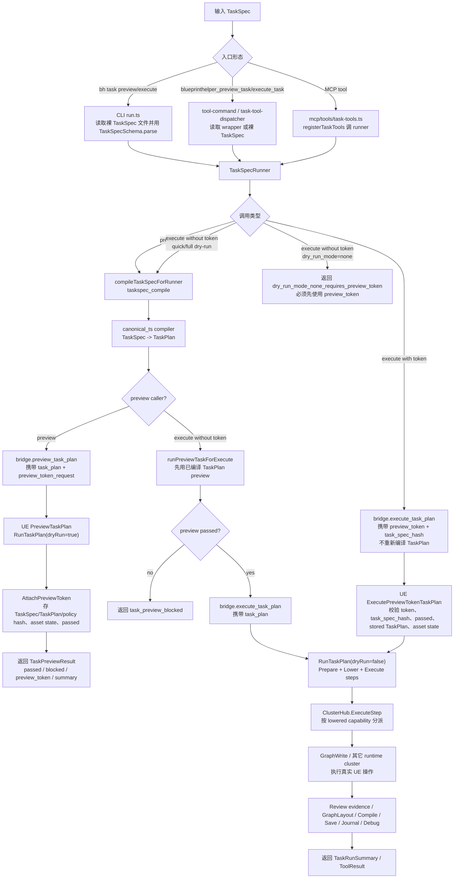

# BlueprintHelper TaskSpec 到真实 UE 操作执行链路架构图与流程图

日期：2026-05-27

## 结论

当前主线不是 Agent 直接写 Bridge payload，也不是旧 `nodes/links` GraphWrite 入口。主线是：

`BlueprintHelper.TaskSpec.v1` -> AgentFace task-core TypeScript compiler -> `BlueprintHelper.TaskPlan.v1` -> Bridge `preview_task_plan` / `execute_task_plan` -> UE `TaskRuntimeService` -> TaskPlan lowering -> cluster execute -> GraphWrite SemanticIR / ActionContext / ActionResolution -> UE `UBlueprintNodeSpawner` / Graph mutation / Compile / Save / Review / Debug。

`TaskSpec` 是 Agent 面向的唯一外层写入契约；`TaskPlan`、adapter payload、GraphWrite `logic_spec`、Review evidence、TaskRunJournal 都是内部执行产物。

下图把链路拆成两层：外层是 TaskSpec-first 到 UE TaskRuntime 的总编排；内层是 `graph_write` step 进入 GraphWrite cluster 后的执行分流。append/replace 的真实节点创建走 SemanticIR、ActionContext、ActionResolution 到 UE NodeSpawner；patch/merge 的真实写入主线走 mutation intent 和 `GraphWriteMutationCoordinator`。

## 分层架构图

```mermaid
flowchart TB
  Agent["Agent / Codex<br/>编写 BlueprintHelper.TaskSpec.v1"] --> CliSurface["CLI / MCP Tool Surface<br/>bh task preview/execute 或 blueprinthelper_preview_task/execute_task"]

  subgraph TS["AgentFaceService TypeScript 层"]
    CliSurface --> Parse["TaskSpecSchema / tool input schema<br/>解析 wrapper 或裸 TaskSpec"]
    Parse --> CompilerSvc["createTaskSpecCompiler<br/>选择 canonical_ts compiler strategy"]
    CompilerSvc --> Compiler["compileTaskSpecToTaskPlan<br/>按 task_type 生成 TaskPlan steps"]
    Compiler --> Runner["TaskSpecRunner<br/>previewTask / executeTask"]
    Runner --> BridgeClient["BridgeClient.sendCommand<br/>TCP length-prefixed JSON + request_id"]
  end

  BridgeClient --> Router["UE BridgeRouter<br/>preview_task_plan / execute_task_plan"]

  subgraph Runtime["UE TaskRuntime 层"]
    Router --> RuntimeService["FBlueprintHelperTaskRuntimeService<br/>PreviewTaskPlan / ExecuteTaskPlan / RunTaskPlan"]
    RuntimeService --> Prepare["PrepareService<br/>解析 TaskPlan、dry-run policy、step lowering、dependency"]
    Prepare --> Lower["TryLowerTaskPlanStep<br/>capability + adapter payload"]
    Lower --> Commit["TaskRuntimeCommitService<br/>main-thread commit boundary"]
    Commit --> ClusterHub["TaskRuntimeClusterHub<br/>GraphWrite / Variable / Signature / Component / DataTable 等 cluster dispatch"]
  end

  subgraph GraphWrite["GraphWrite 主线"]
    ClusterHub --> GraphWriteCluster["GraphWriteTaskRuntimeCluster<br/>adapter op: append / replace / patch / merge"]
    GraphWriteCluster --> GraphService["Append/Replace/Patch/Merge Graph Service<br/>目标解析、dry-run、写入事务或显式回滚"]
    GraphService --> GraphWriteBranch{"真实写入分流"}
    GraphWriteBranch -->|"append / replace"| SemanticIR["GraphSemanticIRBuilder<br/>logic_spec -> SemanticIR + diagnostics"]
    GraphWriteBranch -->|"patch / merge"| MutationIntent["MutationIntent + GraphWriteMutationCoordinator<br/>定点 patch/merge UE graph mutation"]
    SemanticIR --> FragmentDag["GraphFragmentDagBuilder<br/>statement/expression -> fragment DAG"]
    FragmentDag --> ActionContext["ActionContextPipeline<br/>demand -> snapshot -> inference -> projected scope"]
    ActionContext --> FragmentBuilder["FragmentBuilderRegistry / GraphStatementBuilder<br/>statement kind -> fragment builder"]
    FragmentBuilder --> ActionResolution["ActionResolutionCore<br/>context view validation + cluster resolver"]
    ActionResolution --> Spawner["UE ActionDatabase / BlueprintActionFilter / UBlueprintNodeSpawner<br/>选择真实 UE 节点生成器"]
    Spawner --> Mutator["ActionNodeSpawnerAdapter / GraphComposer / GraphLinker<br/>Invoke spawner、创建节点、连 pin、默认值"]
  end

  subgraph Post["执行后收敛"]
    Mutator --> Review["Review v2 evidence<br/>before/after snapshot + atomic targets"]
    MutationIntent --> Review
    Review --> Layout["GraphLayout flush<br/>任务布局提交边界"]
    Layout --> CompileSave["PostOperationExecutor<br/>compile / save"]
    CompileSave --> Journal["TaskRunJournal / ToolResult / DebugEntry<br/>结果、诊断、缓存统计"]
  end
```

## Preview / Execute 流程图

## 逐段链路职责

| 序号 | 链路 | 关键源码 | 主要作用 |
| --- | --- | --- | --- |
| 1 | Agent 输入 | `AgentFaceService/docs/TaskSpec_TaskPlan_Contract.md` | 规定普通 Agent 只提交 `BlueprintHelper.TaskSpec.v1`，不手写 `TaskPlan` 或 raw Bridge payload。 |
| 2 | CLI grouped command | `AgentFaceService/cli/src/cli/run.ts` | `task preview` / `task execute` 读取裸 TaskSpec 文件，`TaskSpecSchema.parse` 后调用 runner。 |
| 3 | CLI tool-name command | `AgentFaceService/cli/src/cli/tool-command.ts` | `blueprinthelper_preview_task` / `blueprinthelper_execute_task` 走工具注册表，可接受 wrapper。 |
| 4 | MCP tool surface | `AgentFaceService/mcp/src/mcp/tools/task-tools.ts` | 注册 MCP 工具，`preview_task` 和 `execute_task` 都委托给同一个 `TaskSpecRunner`。 |
| 5 | task-core tool dispatch | `AgentFaceService/task-core/src/tool-surface/task/task-execution-handlers.ts` | 解析 `task_spec` wrapper 或裸 TaskSpec，启动 timing，调用 `previewTask` / `executeTask`。 |
| 6 | compiler service | `AgentFaceService/task-core/src/task/compiler/task-compiler-service.ts` | 通过 policy + registry 选择 compiler strategy，当前默认是 `canonical_ts`。 |
| 7 | compiler registry | `AgentFaceService/task-core/src/task/compiler/task-compiler-registry.ts` | 限定当前 canonical TS 支持的 `task_type`，调用 `compileTaskSpecToTaskPlan`。 |
| 8 | TaskSpec compiler | `AgentFaceService/task-core/src/task/compiler/task-compiler.ts` | 按 `task_type` 将语义 TaskSpec 分解成 `TaskPlan.steps[]`，GraphWrite 生成 `capability=graph_write` + `write.ops[]`。 |
| 9 | TaskSpecRunner preview | `AgentFaceService/task-core/src/task/service/task-spec-runner.ts` | 编译 TaskPlan，生成 `task_spec_hash` / `task_plan_hash` / `execution_policy_hash`，发送 `preview_task_plan`。 |
| 10 | TaskSpecRunner execute | `AgentFaceService/task-core/src/task/service/task-spec-runner.ts` | 有 token 时直接传 `preview_token` + `task_spec_hash` 给 UE，不重新编译 TaskPlan；无 token 且 dry-run mode 为 quick/full 时先 preview，通过后写入；无 token 且 `dry_run_mode=none` 时直接要求 preview token。 |
| 11 | Bridge transport | `AgentFaceService/task-core/src/bridge/bridge-client.ts` | 构造 `{request_id, command, payload}`，通过持久 TCP 连接发送长度前缀 JSON 请求。 |
| 12 | UE Bridge router | `BlueprintHelper/Source/BlueprintHelper/Private/Entry/Bridge/BlueprintHelperBridgeRouter.cpp` | 将 `preview_task_plan` / `execute_task_plan` 路由到 `TaskRuntimeService`，返回标准 ToolResult envelope。 |
| 13 | Preview token store | `BlueprintHelper/Source/BlueprintHelper/Private/Runtime/TaskRuntime/BlueprintHelperTaskRuntimeService.cpp` | preview 后存 `TaskPlan`、`task_spec_hash`、`task_plan_hash`、`execution_policy_hash`、asset state 和 passed 状态；当前 execute token 路径显式校验 token、`task_spec_hash`、passed、stored `TaskPlan` 和当前 asset state，其余 hash 主要作为存档/诊断数据。 |
| 14 | TaskRuntime prepare | `BlueprintHelper/Source/BlueprintHelper/Private/Runtime/TaskRuntime/BlueprintHelperTaskRuntimeService.cpp` + `BlueprintHelperTaskRuntimePrepareService.*` | 解析 TaskPlan、dry-run policy、依赖关系、step payload hash，构造 `PreparedRun`。 |
| 15 | TaskPlan lowering | `BlueprintHelperTaskRuntimeService.cpp` | `graph_write` structural op 转换为 adapter operation：`ensure_entry -> append_blueprint_graph`、`replace_body -> replace_blueprint_graph`、`set_pin_default/set_node_comment/set_node_position -> patch_blueprint_graph`、`insert_flow -> merge_blueprint_graph`；`set_node_position` 是布局兼容入口，不是结构语义主线。 |
| 16 | Runtime commit boundary | `BlueprintHelperTaskRuntimeCommitService.cpp` | 统一进入 cluster hub；compile/save/layout flush 也经此服务形成主线程提交边界。 |
| 17 | Cluster dispatch | `BlueprintHelperTaskRuntimeClusterHub.cpp` | 按 lowered step 分派到 GraphWrite、BlueprintVariables、Signature、Component、ClassSettings、UMGWidget、DataTable、ObjectProperty 等 runtime cluster。 |
| 18 | GraphWrite cluster | `Runtime/TaskRuntime/Clusters/GraphWrite/BlueprintHelperGraphWriteTaskRuntimeCluster.cpp` | 接收 GraphWrite adapter op，调用 Append/Replace/Patch/Merge service，并构造 GraphWrite review evidence。 |
| 19 | GraphWrite service | `Systems/ToolClusters/GraphWrite/BlueprintHelperAppendBlueprintGraphService.cpp` 等 | 解析 target / graph / `logic_spec` 并执行 dry-run 或写入；Replace/Patch/Merge 使用 `FBlueprintHelperScopedAssetMutation`，Append 当前使用显式 graph create/remove 与 node cleanup 回滚。 |
| 20 | SemanticIR parser | `GraphStatement/BlueprintHelperGraphSemanticIR.*` | 把 `logic_spec` 的 statement/expression 解析成 `FBlueprintHelperGraphSemanticIR`，补齐 target/type/symbol 语义并收集 diagnostics。 |
| 21 | Fragment DAG | `GraphStatement/BlueprintHelperGraphFragmentDagBuilder.*` | 将 statement/expression 变成 fragment DAG，建立 exec/data edge 和 symbol producer。 |
| 22 | ActionContext | `ActionResolution/Context/*` | 从 SemanticIR 收集 demand，构建 snapshot，推断并投影成 `ActionContextScope`，供 resolver 读取统一上下文。 |
| 23 | Fragment builders | `GraphStatement/BlueprintHelperGraphFragmentBuilderRegistry.cpp` + `BlueprintHelperGraphStatementBuilder.cpp` | 按 statement kind 选择 call/field/control/event/generic/container 等 fragment builder，把语义请求转为 `ActionResolutionRequest`。 |
| 24 | ActionResolutionCore | `ActionResolution/BlueprintHelperActionResolutionCore.cpp` | 校验 projected context、semantic kind、stable identity、cluster completeness，然后交给 `SpawnerClusterResolver`。 |
| 25 | Resolver / evidence | `ActionResolution/*Resolver.cpp` + `BlueprintHelperActionDatabaseProjectionService.*` + `BlueprintHelperProjectedSpawnerEvidence.*` | 通过 UE ActionDatabase、ActionFilter、projected evidence 或受控 direct provider 选择 `UBlueprintNodeSpawner` 和 stable id。 |
| 26 | append/replace 真实 UE 节点生成 | `ActionResolution/BlueprintHelperActionNodeSpawnerAdapter.cpp` | 调 `UBlueprintNodeSpawner::Invoke`，创建 `UK2Node`，重建 pin，应用默认值。 |
| 27 | append/replace Graph compose / link | `GraphStatement/BlueprintHelperGraphComposer.cpp` + `Pipeline/BlueprintGraphLinker.*` | 用 UE schema 创建 exec/data pin connection，处理 wildcard 重建与连接 diagnostics。 |
| 28 | patch/merge 定点 UE mutation | `BlueprintHelperPatchBlueprintGraphService.cpp`, `BlueprintHelperMergeBlueprintGraphService.cpp`, `GraphWriteMutationCoordinator` | patch/merge 的真实写入主线构造 mutation intent，再由 coordinator 对目标 UE graph 做定点变更；SemanticIR 更多用于 dry-run、语义预检和可诊断性。 |
| 29 | Post-operation | `TaskRuntime/PostOperations/*` | 按 `execution_policy.should_compile/should_save` 规划并执行 compile / save。 |
| 30 | Review / Debug / Journal | `TaskRuntimeService.cpp` + Review/Debug services | execute 时采集 baseline、before/after evidence、写 `TaskRunJournal`，失败路径写 DebugEntry。 |

## GraphWrite 内部主线展开

```mermaid
flowchart LR
  TP["TaskPlan step<br/>capability=graph_write"] --> Lower["TryBuildGraphWriteIrPayload<br/>write.ops -> adapter op payload"]
  Lower --> GWCluster["GraphWriteTaskRuntimeCluster"]
  GWCluster --> Service{"adapter operation"}
  Service -->|"append_blueprint_graph"| Append["AppendGraphService"]
  Service -->|"replace_blueprint_graph"| Replace["ReplaceGraphService"]
  Service -->|"patch_blueprint_graph"| Patch["PatchGraphService"]
  Service -->|"merge_blueprint_graph"| Merge["MergeGraphService"]

  Append --> Logic["logic_spec / SemanticIR payload"]
  Replace --> Logic
  Patch --> PatchIntent["mutation intent payload<br/>set_pin_default / set_node_comment / set_node_position"]
  Merge --> MergeIntent["mutation intent payload<br/>insert_flow / callable fragment merge"]

  Logic --> IR["GraphSemanticIRBuilder<br/>parse + semantic diagnostics"]
  IR --> DAG["GraphFragmentDagBuilder<br/>fragments + exec/data edges"]
  DAG --> Demand["ActionContextDemandCollector"]
  Demand --> Scope["ActionContextScope<br/>snapshot + inference + projected bundle"]
  Scope --> Build["FragmentBuilderRegistry<br/>statement/expression builders"]
  Build --> Resolve["ActionResolutionCore"]
  Resolve --> Cluster["SpawnerClusterResolver<br/>Function / Field / EventDelegate / Generic / Container"]
  Cluster --> NodeSpawner["Selected UBlueprintNodeSpawner"]
  NodeSpawner --> Invoke["ActionNodeSpawnerAdapter.InvokeSelectedSpawner"]
  Invoke --> K2["UK2Node created / pins reconstructed / defaults applied"]
  K2 --> Links["GraphLinker / GraphComposer<br/>exec and data links"]
  PatchIntent --> PatchMutate["GraphWriteMutationCoordinator<br/>targeted UE graph mutation"]
  MergeIntent --> MergeMutate["GraphWriteMutationCoordinator<br/>targeted UE graph mutation"]
```

说明：append/replace 是“生成语义图”的完整链路，所以图中一路到 NodeSpawner 和 GraphLinker；patch/merge 会读取或校验语义输入，但真正落地 UE 变更时主要通过 mutation intent 和 `GraphWriteMutationCoordinator`，不能把它们等同成完整 NodeSpawner 主线。

## Preview 与 Execute 的关键差异

| 阶段 | Preview | Execute |
| --- | --- | --- |
| TS runner | `runPreviewTaskFromPlan` 发送 `preview_task_plan`，携带 preview token request。 | 有 token 时直接发送 `preview_token` 和 `task_spec_hash`；无 token 仅在 quick/full dry-run mode 下自动 preview 后发送完整 `task_plan`，`dry_run_mode=none` 必须先取得 preview token。 |
| UE runtime | `PreviewTaskPlan` 调 `RunTaskPlan(..., true)`，然后 `AttachPreviewToken`。 | `ExecuteTaskPlan` 调 `RunTaskPlan(..., false)`；token 路径恢复 stored TaskPlan，并校验 token、`task_spec_hash`、passed 和 asset state。 |
| 写资产 | dry-run 或 synthetic quick preview，不应产生最终资产写入。 | cluster 执行真实操作；Replace/Patch/Merge 用 `ScopedAssetMutation` 包住 graph 变更，Append 使用显式清理式回滚。 |
| Review | preview 返回阻塞/可执行信息和 diagnostics。 | capture baseline、before/after review evidence，并写 TaskRunJournal。 |
| 后处理 | 不执行 compile/save post-operation。 | 成功后 flush GraphLayout，再按 policy compile/save。 |

## Operation family 到链路的落点

| TaskSpec / Graph body family | 当前主线落点 | 作用 |
| --- | --- | --- |
| `call` / ordinary op-like call | FunctionAction cluster / operator resolver | 通过 ActionDatabase、operator/type-promotion evidence 或 function resolver 选择函数节点。 |
| `field` / `get_property` / `set_property` | FieldVariableAction cluster | 解析变量、成员路径、pin 类型和 get/set 节点。 |
| `component_bound_event` / `delegate` | EventDelegateAction cluster | 表达 delegate use-site，不负责创建事件/签名声明。 |
| `convert` / `schedule` / `create` / `control` | GenericAssetStructControl / GenericTransformSchedule / controlled providers | 处理 cast、type promotion、control flow、struct/type structure、部分 generic create/schedule 语义。 |
| `container_action` | ContainerActionResolver + FunctionAction-backed path | 数组、Map、Set 等 container 操作作为 first-class family，不降级成普通 `call`。 |
| `replace_body` / `set_pin_default` / `insert_flow` 等 structural op | TaskRuntime lowering 阶段 | 这些是 TaskPlan `write.ops[]` 的结构化编辑动作，降低到 append/replace/patch/merge adapter service。 |

## 明确不属于当前主线的路径

1. Agent 不应直接提交 `BlueprintHelper.TaskPlan.v1`。
2. Agent 不应手写 `append_blueprint_graph` / `replace_blueprint_graph` / `patch_blueprint_graph` / `merge_blueprint_graph` raw Bridge payload。
3. 旧 GraphWrite `nodes/links` 直接造节点路径已被禁用；当前 GraphWrite 只接受 `logic_spec` / SemanticIR。
4. 右键菜单、拖拽、Pin 拖拽等 UI/editor interaction evidence 不等于 TaskSpec 可写能力；TaskSpec 主线只表达可由 schema/compiler/runtime/resolver 承接的语义操作。
5. GraphLayout 是执行后布局提交边界，不是 TaskPlan / GraphWrite 结构语义本体。

## 证据索引

| 证据 | 路径 / 符号 |
| --- | --- |
| TaskSpec -> TaskPlan 合同 | `AgentFaceService/docs/TaskSpec_TaskPlan_Contract.md` |
| CLI grouped command | `AgentFaceService/cli/src/cli/run.ts` |
| MCP task tools | `AgentFaceService/mcp/src/mcp/tools/task-tools.ts` |
| tool dispatch | `AgentFaceService/task-core/src/tool-surface/task/task-execution-handlers.ts` |
| compiler service/registry | `AgentFaceService/task-core/src/task/compiler/task-compiler-service.ts`, `task-compiler-registry.ts` |
| TaskSpec compiler | `AgentFaceService/task-core/src/task/compiler/task-compiler.ts` |
| runner preview/execute | `AgentFaceService/task-core/src/task/service/task-spec-runner.ts` |
| Bridge transport | `AgentFaceService/task-core/src/bridge/bridge-client.ts` |
| UE router | `BlueprintHelper/Source/BlueprintHelper/Private/Entry/Bridge/BlueprintHelperBridgeRouter.cpp` |
| TaskRuntime | `BlueprintHelper/Source/BlueprintHelper/Private/Runtime/TaskRuntime/BlueprintHelperTaskRuntimeService.cpp` |
| Cluster hub/commit | `BlueprintHelperTaskRuntimeClusterHub.cpp`, `BlueprintHelperTaskRuntimeCommitService.cpp` |
| GraphWrite runtime cluster | `Runtime/TaskRuntime/Clusters/GraphWrite/BlueprintHelperGraphWriteTaskRuntimeCluster.cpp` |
| SemanticIR / FragmentDAG / ActionContext / ActionResolution | `Systems/ToolClusters/GraphWrite/GraphStatement/*`, `ActionResolution/Context/*`, `ActionResolution/*` |
| UE NodeSpawner invocation | `Systems/ToolClusters/GraphWrite/ActionResolution/BlueprintHelperActionNodeSpawnerAdapter.cpp` |
