# BlueprintHelper v0.5.0 TaskSpec 执行链路性能优化计划

日期：2026-05-19

## 版本目标

计划在 v0.5.0 优化从提交 `BlueprintHelper.TaskSpec.v1` 到 UE 真实执行开始之间的延迟。

本计划优先关注 `TaskSpec -> TaskPlan` 转换链路，但当前只读扫描和本地抽样结论显示：转换本身不是 2-5s 延迟的主要来源。当前默认 Python 子进程编译约 43-60ms，TS in-process 编译约 0.4-3ms；更大的延迟风险来自 execute 前强制 preview、UE dry-run 真实生成预览图、CallFunction 重复解析，以及 Review 快照和记录 IO。

## 当前链路判断

1. AgentFace `executeTask()` 当前会先执行 `previewTask()`，preview 成功后才发送 `execute_task_plan`。
2. 默认 `TaskSpec -> TaskPlan` 编译器为 Python 子进程，每次编译通过 stdin/stdout 传输 JSON。
3. UE 侧 preview 和 execute 都进入 `RunTaskPlan`，preview 不是纯 schema 校验。
4. GraphWrite dry-run 会运行语义构建、预览图生成和回滚，成本接近一次真实图写入前半段。
5. 原始问题：`dry_run_mode` 字段已经存在于 schema，但 runtime 未消费该字段降低 preview 成本；P0-2 后已落地 `full|quick|none` policy。
6. 原始问题：CallFunction 在 runtime 预解析和 GraphStatementBuilder 生成节点阶段存在重复解析风险，preview 与 execute 又会重复一次；P0-3 后已落地 request-level resolution cache。
7. Review baseline snapshot、semantic snapshot、review record merge/write 属于真实 execute 侧成本，可能放大任务启动和收口耗时。

## 读链路详细化

v0.5.0 的读链路计时目标不是把 UE 读操作并发化，而是先把 CLI 接收、AgentFace 编排、Bridge 往返、UE 主线程读取、AgentFace payload 规整和 CLI 返回分清。读链路仍以 GameThread 读取 UObject / Blueprint / UEdGraph / UWidgetTree / UProperty 为安全边界；后续可优化的是“GameThread 快照 + 后台格式化”，而不是让多个后台线程直接触碰 UE 对象。

### AgentFace read_context 主链路

1. CLI 接收命令并解析参数：`cli.parse_args`。
2. CLI 进入通用工具分支：`cli.invoke_tool` 包住整个 `read_context` 调用。
3. `executeReadContext()` 解析输入 schema：`read_context.parse_input`。
4. 根据 `read_type` / `view.format` 解析目标读格式：`read_context.resolve_format`。
5. 构建读路由 / bridge request：`read_context.resolve_bridge_request`。logic 读在这里统一得到 `format`、UE command 和 payload schema；非 logic 读得到对应 bridge command 与 payload schema。
6. 构建 UE bridge payload，并在 develop 模式附加 `include_timing=true`：`read_context.build_bridge_payload`。
7. 发送 bridge 命令并等待 UE 返回：`read_context.bridge.<command>`。
8. develop 模式把 UE 回传的 timing 追加到 `data.timing.nested[]`，命名为 `ue.<command>`。
9. 解析 Bridge payload：`read_context.extract_bridge_payload`。
10. 移除诊断字段 `timing`：`read_context.strip_bridge_timing`。
11. 按 read type 做 payload compact/filter：普通 payload 使用 `read_context.post_process_payload`；`LogicFlow.v1` 使用 `read_context.logic_flow_build_payload` 单独记录 structured LogicJson 到 LogicFlow 的转换成本。
12. 包装 `ReadContextPack.v1` ToolResult：`read_context.result_wrap`。
13. CLI 返回前写入最终 `data.timing`：`cli.result_return`。

### read_type 到 UE 命令映射

| read_type | UE bridge command | UE 服务边界 | 主要成本来源 |
| --- | --- | --- | --- |
| `asset_context` | `get_asset_info` | AssetBrowse service | AssetRegistry / asset metadata 查询 |
| `blueprint_logic` + `logic_flow` | `read_blueprint_logic_json` | LogicJsonReadService + AgentFace LogicFlow builder | Blueprint/Graph 快照、结构化 JSON 返回、AgentFace `LogicFlow.v1` 压缩转换 |
| `blueprint_logic` + `logic_md` | `read_blueprint_logic_md` | LogicMdReadService | Blueprint/Graph 快照、逻辑分组、Markdown 格式化 |
| `blueprint_logic` + `logic_json` | `read_blueprint_logic_json` | LogicJsonReadService | Blueprint/Graph 快照、逻辑分组、JSON 规整 |
| `graph_context` | `read_blueprint_logic_json` | LogicJsonReadService | 单图目标解析、Graph 快照、JSON 规整 |
| `component_context` | `read_components` | Component service | Blueprint SCS / component 模板读取 |
| `variable_context` | `list_variables` | BlueprintStructure / Variable service | MyBlueprint 成员变量反射读取 |
| `variable_context:event_dispatcher` | `list_event_dispatchers` | BlueprintStructure service | Dispatcher 签名读取 |
| `widget_context` | `get_widget_tree` / `get_widget_properties` | UMGWidget service | UWidgetTree 遍历、Widget 属性读取 |
| `data_table_context` | `get_datatable_rows` | DataTable service | UDataTable 行读取和字段序列化 |
| `data_asset_context` / `object_property_context` | `get_object_properties` | PropertyReflection service | UObject / UProperty 反射读取 |

### UE 读链路计时边界

UE Bridge Router 统一消费 payload `include_timing=true`，只对读命令启用 `ue_bridge_router` timing。该 timing 不进入业务模型，也不改变读结果语义：

1. Bridge request 已完成 payload parse 后进入 router。
2. Router 完成 payload validation / authorization。
3. Router 根据 command/cluster 分发到对应 read route。
4. `route_execute` 覆盖当前 UE 读 route 的实际执行时间，包括具体 read service 内的 GameThread 对象读取和 DTO 构造。
5. Router 将 timing 附加到 ToolResult `data.timing`；raw payload 读命令则附加到顶层 `timing`。
6. AgentFace 抽取 timing 作为 nested diagnostic，并在最终 read payload 中移除该诊断字段，保证 agent-facing `payload` 不混入计时数据。

下一阶段如需进一步细化 UE read service 内部阶段，应沿用同一套 timing trace DTO，在 service 边界增加 `snapshot_read`、`dto_build`、`format_output` 等阶段，而不是在每个 UI/CLI 调用点写特判。

### 当前读链路抽样基线

测试输入目录：

`D:\UEProjects\Template\Plugins\BlueprintHelper\BlueprintHelper\Develop\v0.4.4\ReadSpecs\BP_ThirdPersonCharacter_20260519`

产物目录：

`D:\UEProjects\Template\Plugins\BlueprintHelper\.tmp\timing_20260519_203352`

| Spec | 状态 | data.timing total_ms | wall_ms | 备注 |
| --- | --- | ---: | ---: | --- |
| `01_asset_context.json` | completed | 1668.343 | 1762.055 | 资产元信息读取 |
| `02_blueprint_logic_json.json` | completed | 1997.325 | 2091.087 | 全 Blueprint logic JSON |
| `03_blueprint_logic_md.json` | completed | 1811.723 | 1903.964 | 全 Blueprint logic Markdown |
| `04_eventgraph_logic_json.json` | completed | 1904.062 | 1998.434 | EventGraph logic JSON |
| `05_eventgraph_logic_md.json` | completed | 1905.955 | 1997.196 | EventGraph logic Markdown |
| `06_eventgraph_context_json.json` | completed | 1904.545 | 1998.536 | graph_context JSON |
| `07_components_context.json` | completed | 1898.746 | 1995.797 | components context |
| `08_variables_context.json` | completed | 1904.481 | 1997.009 | variables context |
| `09_event_dispatchers_context.json` | completed | 1906.919 | 1999.886 | event dispatchers context |
| `10_object_properties_context.json` | completed | 1903.216 | 1997.916 | object properties context |

读链路本次样本：count=10，avg=1880.532ms，min=1668.343ms，max=1997.325ms，p50=1904.062ms。旧样本只包含 CLI 总阶段；v0.5.0 继续测试时需要使用新的 read_context 分段计时和 UE nested timing 判断耗时集中在 AgentFace、Bridge round-trip、还是 UE route 执行。

旧基线代表性最慢成功样本 `02_blueprint_logic_json.json`：

| 阶段 | duration_ms |
| --- | ---: |
| `cli.parse_args` | 0.496 |
| `cli.invoke_tool` | 1996.630 |
| `cli.result_return` | 0.005 |
| nested `ue.read_blueprint_logic_json` total | 未返回 |

样本说明：该样本是当前 10 个读 Spec 中 `data.timing.total_ms` 最大的成功样本，payload schema 为 `LogicJson.v1`，覆盖 full blueprint logic JSON 读取。旧样本只能证明耗时集中在 `cli.invoke_tool` 包住的读工具调用内，不能继续拆分 AgentFace route、Bridge round-trip、UE route 和 payload 后处理。

Editor 手动重启后补测汇总：

| Spec | total_ms | bridge stage | bridge_ms | nested UE route_ms | bridge - UE route_ms |
| --- | ---: | --- | ---: | ---: | ---: |
| `01_asset_context.json` | 372.479 | `read_context.bridge.get_asset_info` | 369.189 | 0.118 | 369.071 |
| `02_blueprint_logic_json.json` | 3505.372 | `read_context.bridge.read_blueprint_logic_json` | 3502.000 | 1668.266 | 1833.734 |
| `03_blueprint_logic_md.json` | 176.984 | `read_context.bridge.read_blueprint_logic_md` | 173.049 | 0.434 | 172.615 |
| `04_eventgraph_logic_json.json` | 1746.621 | `read_context.bridge.read_blueprint_logic_json` | 1743.153 | 0.364 | 1742.789 |
| `05_eventgraph_logic_md.json` | 1904.624 | `read_context.bridge.read_blueprint_logic_md` | 1901.101 | 0.352 | 1900.749 |
| `06_eventgraph_context_json.json` | 1912.135 | `read_context.bridge.read_blueprint_logic_json` | 1908.662 | 0.399 | 1908.263 |
| `07_components_context.json` | 2230.550 | `read_context.bridge.read_components` | 2227.493 | 0.073 | 2227.420 |
| `08_variables_context.json` | 1904.157 | `read_context.bridge.list_variables` | 1901.067 | 0.075 | 1900.992 |
| `09_event_dispatchers_context.json` | 1906.002 | `read_context.bridge.list_event_dispatchers` | 1902.855 | 0.035 | 1902.820 |
| `10_object_properties_context.json` | 1904.690 | `read_context.bridge.get_object_properties` | 1901.494 | 0.098 | 1901.396 |

补测产物目录：

`D:\UEProjects\Template\Plugins\BlueprintHelper\.tmp\read_timing_20260519_manual_editor`

补测后的代表性最慢成功样本 `02_blueprint_logic_json.json`：

| 阶段 | duration_ms |
| --- | ---: |
| `cli.parse_args` | 0.443 |
| `read_context.parse_input` | 0.115 |
| `read_context.resolve_format` | 0.026 |
| `read_context.build_bridge_payload` | 0.070 |
| `read_context.bridge.read_blueprint_logic_json` | 3502.000 |
| `read_context.extract_bridge_payload` | 0.085 |
| `read_context.post_process_payload` | 0.147 |
| `read_context.result_wrap` | 0.457 |
| `cli.invoke_tool` | 3504.743 |
| `cli.result_return` | 0.005 |
| nested `ue.read_blueprint_logic_json` total | 1668.266 |
| nested `ue.read_blueprint_logic_json.route_execute` | 1668.263 |

同一代表性样本 warm 状态重复补测：

| Run | total_ms | bridge_ms | nested UE route_ms | bridge - UE route_ms |
| ---: | ---: | ---: | ---: | ---: |
| 1 | 287.988 | 284.686 | 0.396 | 284.290 |
| 2 | 1833.524 | 1830.181 | 0.403 | 1829.778 |
| 3 | 1902.445 | 1899.152 | 0.416 | 1898.736 |

补测结论：UE nested timing 已可返回，读工具现在具备与写工具同粒度的阶段表。`02_blueprint_logic_json.json` 的冷样本中 UE route 本身占 1668.266ms，说明 full blueprint logic JSON 的首次读取/构造仍是 R1 的关键样本；但 warm 重复补测中 UE route 约 0.4ms，Bridge round-trip 仍可能出现 1.8-1.9s，说明 `bridge - UE route` 的 gap 还需要继续拆分为 bridge queue、socket transport、UE response serialization、AgentFace JSON parse / receive 等阶段，不能把所有耗时都归因于 UObject 读取。

### MCP 重启后 logic_flow 补测

补测方式：用户关闭 Editor 后，使用 `mcp__blueprint_helper__blueprint_open_editor` 启动 `D:\UEProjects\Template\Template.uproject`，MCP 返回 `EDITOR_BRIDGE_AVAILABLE` 后，通过 CLI 顺序执行 `BP_ThirdPersonCharacter_20260519` 下 11 个 ReadSpec。第一次用 CLI `open_editor` 重启后 Editor 进程在 Bridge 可用后退出，11 个读请求均为 `bridge_unavailable`；本次有效数据以 MCP lifecycle 启动后的结果为准。

补测产物目录：
`D:\UEProjects\Template\Plugins\BlueprintHelper\.tmp\read_timing_20260519_mcp_reopen_logicflow`

| Spec | total_ms | bridge stage | bridge_ms | strip_timing_ms | post_process_ms | logic_flow_build_ms | nested UE route_ms |
| --- | ---: | --- | ---: | ---: | ---: | ---: | ---: |
| `01_asset_context.json` | 177.187 | `read_context.bridge.get_asset_info` | 173.760 | 0.025 | 0.096 |  | 0.099 |
| `02_blueprint_logic_json.json` | 2646.566 | `read_context.bridge.read_blueprint_logic_json` | 2643.227 | 0.022 | 0.101 |  | 809.269 |
| `03_blueprint_logic_md.json` | 1028.406 | `read_context.bridge.read_blueprint_logic_md` | 1024.825 | 0.021 | 0.470 |  | 0.315 |
| `04_eventgraph_logic_json.json` | 2130.899 | `read_context.bridge.read_blueprint_logic_json` | 2127.526 | 0.022 | 0.101 |  | 0.363 |
| `05_eventgraph_logic_md.json` | 1905.216 | `read_context.bridge.read_blueprint_logic_md` | 1901.686 | 0.022 | 0.434 |  | 0.353 |
| `06_eventgraph_context_json.json` | 1906.068 | `read_context.bridge.read_blueprint_logic_json` | 1902.587 | 0.026 | 0.124 |  | 0.435 |
| `07_components_context.json` | 1905.417 | `read_context.bridge.read_components` | 1902.098 | 0.022 | 0.063 |  | 0.049 |
| `08_variables_context.json` | 1904.121 | `read_context.bridge.list_variables` | 1900.989 | 0.024 | 0.065 |  | 0.052 |
| `09_event_dispatchers_context.json` | 1905.308 | `read_context.bridge.list_event_dispatchers` | 1902.168 | 0.026 | 0.067 |  | 0.018 |
| `10_object_properties_context.json` | 1906.668 | `read_context.bridge.get_object_properties` | 1903.432 | 0.022 | 0.064 |  | 0.080 |
| `11_blueprint_logic_flow.json` | 1906.022 | `read_context.bridge.read_blueprint_logic_json` | 1901.729 | 0.027 |  | 1.014 | 0.378 |

logic_flow 补测结论：新增 `read_context.strip_bridge_timing` 能证明 UE timing 诊断字段已在 Agent-facing payload 前被剥离；`read_context.logic_flow_build_payload=1.014ms` 说明当前 LogicFlow 转换成本很低，不是读链路主瓶颈。`11_blueprint_logic_flow.json` 的 UE `route_execute=0.378ms`，但 Bridge 往返约 1901.729ms，仍指向 Bridge transport / Editor 端排队 / JSON response 传输解析 gap，需要后续继续拆分。

### 读工具测速典型案例

测速命令模板：

```powershell
node AgentFaceService/cli/build/cli/index.js blueprinthelper_read_context --file "<ReadSpec.json>" --develop --format full --omit tool_result.data.payload
```

每个典型案例至少记录：

- `tool_result.data.timing.total_ms`：CLI develop 总耗时。
- `read_context.bridge.<command>`：AgentFace 到 UE Bridge 往返耗时。
- `read_context.bridge_payload_extract`、`read_context.post_process_payload` / `read_context.logic_flow_build_payload`、`read_context.result_wrap`：AgentFace 侧 payload 处理成本。
- `data.timing.nested[].source=ue_bridge_router` 的 `route_execute`：UE route 内部执行耗时；已在 Editor 手动重启后补测返回。
- payload 规模：已记录 `read_context.bridge_payload_bytes`、`read_context.ue_raw_payload_bytes`、`read_context.post_processed_payload_bytes`，用于区分输出体积导致的序列化/格式化成本。

测速方式：

1. Editor 启动并加载当前编译后的 BlueprintHelper 插件。
2. 对每个 Spec 先跑 1 次 warm-up，不计入基线。
3. 正式记录至少 3 次，保存每次 `result.json` artifact。
4. 对每个案例统计 min / avg / p50 / max；长读案例额外记录 payload size。
5. 若 `read_context.bridge.<command>` 接近 total，优先怀疑 UE route、Bridge 传输或序列化；若 `post_process_payload` 或 `result_wrap` 异常增大，优先看 AgentFace compact/filter 和输出包装；若 UE `route_execute` 明显小于 Bridge 往返，则优先看 Bridge transport、JSON 序列化或 Editor 端排队。

当前已覆盖的典型案例：

| 案例 | Spec | read_type / command | 覆盖目的 | 重点观察 |
| --- | --- | --- | --- | --- |
| 轻量资产元信息读 | `01_asset_context.json` | `asset_context` / `get_asset_info` | 建立最轻 read_context 基线，覆盖 AssetRegistry / asset metadata 查询。 | 如果该案例也很慢，优先排查 Bridge 往返、Editor 排队或 AssetRegistry 初次加载，而不是 Blueprint 解析。 |
| 全 Blueprint logic JSON | `02_blueprint_logic_json.json` | `blueprint_logic` / `read_blueprint_logic_json` | 覆盖 full blueprint 逻辑快照、Graph 遍历、逻辑分组、JSON DTO 输出。 | R1 的核心样本；后续应拆出 `snapshot_read` 与 `format_output`，判断 GameThread 读取和 JSON 格式化比例。 |
| 全 Blueprint logic Markdown | `03_blueprint_logic_md.json` | `blueprint_logic` / `read_blueprint_logic_md` | 覆盖 full blueprint 逻辑快照复用潜力和 Markdown formatter 成本。 | 与 `02` 对比；若 UE 快照成本接近但 MD 更慢，优先优化 Markdown formatter；若两者都慢，优先优化 snapshot/Graph 遍历。 |
| 单 EventGraph logic JSON | `04_eventgraph_logic_json.json` | `blueprint_logic` / `read_blueprint_logic_json` | 覆盖单图目标解析和局部 Graph JSON 输出。 | 与 `02` 对比；若单图与全 Blueprint 接近，说明固定开销或 route 内部未有效缩小读取范围。 |
| 单 EventGraph logic Markdown | `05_eventgraph_logic_md.json` | `blueprint_logic` / `read_blueprint_logic_md` | 覆盖单图 Markdown 输出成本。 | 与 `04` 对比 formatter 成本；与 `03` 对比 scope 缩小是否有效。 |
| graph_context JSON | `06_eventgraph_context_json.json` | `graph_context` / `read_blueprint_logic_json` | 覆盖 AgentFace `graph_context` 路由和 target_type 推导。 | 应与 `04` 接近；若差异大，排查 AgentFace route builder 或 UE target ref 解析。 |
| Components context | `07_components_context.json` | `component_context` / `read_components` | 覆盖 Blueprint SCS / component template 读取和 component DTO 构造。 | 如果 UE `route_execute` 高，R1 应拆 `ComponentSnapshot`；如果 post-process 高，检查 component array filter。 |
| Variables context | `08_variables_context.json` | `variable_context` / `list_variables` | 覆盖 MyBlueprint 成员变量读取、pin type/default/category 输出。 | 观察 UE 反射/变量列表读取成本；后续可作为 Variable formatter 复用边界样本。 |
| Event Dispatchers context | `09_event_dispatchers_context.json` | `variable_context:event_dispatcher` / `list_event_dispatchers` | 覆盖 dispatcher 签名读取。 | 与 `08` 对比，判断 BlueprintStructure 读签名和变量读取成本差异。 |
| Object properties context | `10_object_properties_context.json` | `object_property_context` / `get_object_properties` | 覆盖 UObject / UProperty 反射读取。 | 这是禁止后台直接读 UE 反射对象的典型案例；R1 只能把反射结果快照成 DTO 后再后台格式化。 |

需要补齐的典型案例：

| 缺口案例 | read_type / command | 补齐原因 | 计划 Spec |
| --- | --- | --- | --- |
| WidgetTree 全树读取 | `widget_context` / `get_widget_tree` | 覆盖 UWidgetTree 遍历、层级 DTO、slot 信息输出，是 UI 资产读链路的代表。 | 新增 `ReadSpecs/<WidgetBlueprint>/01_widget_tree_context.json`。 |
| Widget 单节点属性读取 | `widget_context` / `get_widget_properties` | 覆盖 UWidget 属性反射和 target_name filter。 | 新增 `ReadSpecs/<WidgetBlueprint>/02_widget_properties_context.json`。 |
| DataTable 行读取 | `data_table_context` / `get_datatable_rows` | 覆盖 UDataTable row 序列化和字段展开。 | 新增 `ReadSpecs/<DataTable>/01_datatable_rows_context.json`。 |
| DataAsset 属性读取 | `data_asset_context` / `get_object_properties` | 覆盖 DataAsset UObject 属性反射，与普通 object_property_context 区分。 | 新增 `ReadSpecs/<DataAsset>/01_data_asset_properties_context.json`。 |
| Function / CustomEvent 局部读取 | `blueprint_logic` target function/event | 覆盖 target function/event scope 是否能真正缩小 Graph 读取范围。 | 新增 `ReadSpecs/BP_ThirdPersonCharacter/function_logic_json.json`、`custom_event_logic_json.json`。 |

这些典型案例用于 R0/R1/R2 的验收：R0 证明 timing 可定位瓶颈；R1 判断哪些读工具适合先拆 GameThread 快照与后台格式化；R2 判断哪些输出需要抽 DTO/formatter 复用边界。

实现后抽样验证：

| Spec | 验证结果 |
| --- | --- |
| `01_asset_context.json` | 已返回 AgentFace 分段：`read_context.parse_input`、`read_context.resolve_bridge_request`、`read_context.bridge.get_asset_info`、`read_context.extract_bridge_payload`、`read_context.post_process_payload`、`read_context.result_wrap`。 |
| `02_blueprint_logic_json.json` | 已返回 AgentFace 分段：`read_context.parse_input`、`read_context.resolve_format`、`read_context.build_bridge_payload`、`read_context.bridge.read_blueprint_logic_json`、`read_context.extract_bridge_payload`、`read_context.post_process_payload`、`read_context.result_wrap`。 |
| `11_blueprint_logic_flow.json` | MCP 重启后已返回 AgentFace 分段：`read_context.resolve_bridge_request`、`read_context.strip_bridge_timing`、`read_context.logic_flow_build_payload`；LogicFlow 构建耗时 1.014ms，UE `route_execute` 0.378ms。 |

Editor 手动重启后已返回 UE nested read timing，`ue_bridge_router.route_execute` 可用于拆分 UE route 成本和 Bridge round-trip gap。

## 读工具优化计划

读工具优化进入 v0.5.0 计划，但优化方向必须保持通用性和线程安全边界：UE 对象读取仍在 GameThread 完成，后台线程只处理已经脱离 UObject 的纯 DTO。当前不把“多个后台线程直接并发读 Blueprint / UEdGraph / UWidgetTree / UProperty”列为优化方案。

### R0：补齐读工具端到端计时

目标：让所有读工具和 TaskSpec 写链路使用同一套 develop timing 观察方式，先证明耗时集中点再改结构。

计划：
- 保持 CLI `--develop` 作为唯一 CLI 诊断开关，普通调用不启动 timing、不返回 `data.timing`。
- `read_context` 已记录 AgentFace 编排阶段：parse、format resolve、route resolve、payload build、Bridge round-trip、payload extract、strip bridge timing、post-process / logic_flow build、result wrap。
- UE Bridge read router 使用 `include_timing=true` 返回 `ue_bridge_router.route_execute`，用于拆分 Bridge 往返与 UE route 内部耗时。
- 已在 Editor 手动重启后重新跑读 Spec，并补齐 `data.timing.nested[].source=ue_bridge_router` 的实测数据；新增 `logic_flow` 后已用 MCP lifecycle 重启 Editor 并补测 `11_blueprint_logic_flow.json`。

验收：
- 所有 read_context develop 结果都包含 AgentFace 分段 timing。
- 当前 ReadSpecs 至少覆盖 `asset_context`、`blueprint_logic`、`graph_context`、`component_context`、`variable_context`、`event_dispatchers_context`、`object_properties_context`。
- UE nested timing 已能显示 `route_execute`。

### R1：GameThread 快照，后台格式化

目标：降低长读工具的主线程占用，尤其是 `blueprint_logic` 的 Markdown/JSON 输出和后续大 payload 规整。

计划：
- 在 UE read service 边界拆出纯数据 Snapshot DTO，例如 `BlueprintLogicSnapshot`、`ComponentSnapshot`、`WidgetTreeSnapshot`、`ObjectPropertySnapshot`。
- GameThread 只负责解析目标资产、读取 UObject/Blueprint/Graph/WidgetTree/Property 并填充 Snapshot DTO。
- 后台阶段只接收 Snapshot DTO，不持有 `UObject*`、`UEdGraph*`、`UWidget*`、`FProperty*` 或任何 Editor 对象指针。
- Markdown、JSON、compact/filter、统计信息生成等格式化逻辑迁移到纯 DTO formatter。
- 对 `blueprint_logic_md` / `blueprint_logic_json` 优先落地，因为它们最容易把对象读取和输出格式化混在同一条重路径里。

验收：
- 后台 formatter 可以在无 UObject 访问的单元测试里运行。
- UE read timing 至少能区分 `snapshot_read` 和 `format_output`。
- `snapshot_read` 仍在 GameThread，`format_output` 不调用 UE Editor API。
- 输出 schema 与现有 `LogicMd.v1`、`LogicJson.v1`、`ReadContextPack.v1` 保持一致。

### R2：读 DTO / Formatter 复用边界

目标：避免每个 read command 各自维护一套输出解释，提升读工具复用性。

计划：
- 按领域建立复用 formatter：Logic、Component、Variable、Widget、DataTable、ObjectProperty。
- `read_context` 只负责 route 和通用 post-process，不内联领域业务解释。
- UE service 返回领域 DTO，AgentFace 层只做 agent-facing compact/filter，不重建业务语义。
- DebugBundle、Review evidence、UI overlay 如果需要读模型，应复用同一类 Snapshot/DTO，而不是各自重新解释 Blueprint 状态。

验收：
- 新增 read type 时优先扩展 read route builder、UE service、DTO formatter，而不是在 CLI 或 UI 入口写特判。
- 同一类读输出的字段命名、计数、target 描述由同一 formatter 生成。
- AgentFace compact/filter 不改变 UE DTO 的业务含义。

### R3：同资产多格式复用，暂不做泛化 batch read 主线

目标：只在有实际重复成本证据时复用同一资产快照，不把“批量读”作为替代 full blueprint 读的主优化。

计划：
- 对同一请求链路内的 `blueprint_logic_md` 与 `blueprint_logic_json`，允许复用同一个 `BlueprintLogicSnapshot`。
- 若未来出现同一资产连续多次读不同视图的场景，可以增加 request-level snapshot cache，生命周期仅限一次 CLI/tool 调用。
- 不做长期 Blueprint 读缓存，除非有明确的资产变更失效策略。
- 不把“按 asset 分组的 batch read”列为 v0.5.0 主优化，因为已有 full blueprint read 能覆盖大量一次性上下文读取需求。

验收：
- 单次请求内复用快照不改变任何输出字段。
- cache key 至少包含 asset path、target graph/function/event/block、read detail、format 相关选项。
- 请求结束后释放快照，避免跨用户编辑状态污染。

### R4：纯数据缓存仅限非 UE 核心对象状态

目标：缓存只用于稳定的纯数据，不缓存可能被用户编辑即时改变的 Blueprint / UObject 状态。

计划：
- 允许缓存 read capability matrix、CLI schema metadata、runtime profile 中不触碰 UE 核心对象的纯数据。
- 不缓存 Blueprint 图、WidgetTree、DataTable rows、DataAsset properties 等用户可编辑资产内容。
- 如需缓存资产内容，必须先定义明确的 package dirty、asset save、editor change event 或 request-local invalidation 策略。

验收：
- 缓存数据不依赖 UObject 生命周期。
- 用户在 Editor 内修改资产后，普通读工具不会返回旧 Blueprint / Widget / Property 状态。
- runtime profile 类读取若只涉及插件能力信息，可以并发或缓存；涉及 UE 反射/资产状态时仍走 GameThread 快照。

### R5：读链路指标与回归门槛

目标：用统一指标判断读工具优化是否有效，避免只凭单次 wall time 判断。

计划：
- 基线指标使用 `data.timing.total_ms`、`read_context.bridge.<command>`、nested `ue_bridge_router.route_execute`。
- 长读工具额外记录 `snapshot_read`、`format_output`、`read_context.bridge_payload_bytes`、`read_context.ue_raw_payload_bytes`、`read_context.post_processed_payload_bytes`。
- 读优化完成后重跑同一组 ReadSpecs，并与写链路对照组分开统计。

验收：
- `blueprint_logic_json/md` 至少能显示主线程快照和后台格式化的耗时占比。
- 普通读工具没有 develop timing 字段泄漏。
- 优化前后同一 ReadSpec 输出 payload 保持结构兼容。

## 写链路详细对照组

写链路作为 v0.5.0 优化的对照组保留完整 TaskSpec execute 形态，原因是它覆盖了当前最重的路径：TaskSpec 文件读取、TaskSpec->TaskPlan 编译、UE preview/dry-run、UE execute、Review evidence、资产 mutation、compile/save/post operation 和结果包装。

### 当前写链路主流程

1. CLI 接收 `task execute --input <TaskSpec> --develop`。
2. `cli.parse_args` 解析参数。
3. `taskspec_file_read_parse` 读取并解析 TaskSpec 文件。
4. `taskspec_compile` 将 `BlueprintHelper.TaskSpec.v1` 编译为 TaskPlan。
5. `bridge.preview_task_plan` 发送 preview payload，develop 模式附加 `include_timing=true`。
6. UE `preview_task_plan` 进入 TaskRuntime `RunTaskPlan(true)`，执行 task plan parse、review baseline policy、step lowering、CallFunction resolution、dry-run cluster execution、review snapshot 和 result wrap。
7. preview 成功后，AgentFace 发送 `bridge.execute_task_plan`。
8. UE `execute_task_plan` 进入 TaskRuntime `RunTaskPlan(false)`，执行真实 mutation、review evidence/record、graph layout flush、compile/save 等后处理。
9. AgentFace `result_wrap` 汇总 preview/execute 结果。
10. CLI `cli.result_return` 写入最终 `data.timing`。

### 当前写链路抽样基线

测试输入目录：

`D:\UEProjects\Template\Plugins\BlueprintHelper\BlueprintHelper\Develop\v0.4.3\ArchivedReference\RetiredReviewDebugDocs_20260518\PlanArtifacts\ReviewPanel_UI_Test_TaskSpecs_20260518`

产物目录：

`D:\UEProjects\Template\Plugins\BlueprintHelper\.tmp\timing_20260519_203352`

| Spec | 状态 | data.timing total_ms | wall_ms | 备注 |
| --- | --- | ---: | ---: | --- |
| `01_create_blueprint_actor.json` | executed | 778.544 | 877.910 | 创建 Blueprint Actor |
| `02_edit_blueprint_components.json` | executed | 1828.563 | 1929.450 | 组件写入 |
| `03_edit_blueprint_variables.json` | executed | 2240.277 | 2336.795 | 变量写入 |
| `04_edit_blueprint_signatures.json` | executed | 2177.983 | 2278.201 | 函数/事件签名写入 |
| `04b_write_function_body.json` | executed | 3246.974 | 3341.578 | 函数图写入 |
| `05_append_graph_review_body.json` | failed | 936.306 | 1032.360 | preview 被 review baseline dirty policy 阻塞 |
| `06_create_structure_row.json` | executed | 2835.556 | 2929.841 | Struct 行创建 |
| `07_create_data_table.json` | executed | 1682.314 | 1776.274 | DataTable 创建 |
| `08_edit_data_table_rows.json` | executed | 2248.840 | 2341.396 | DataTable 行写入 |
| `09_create_data_asset_class.json` | executed | 2396.901 | 2490.762 | DataAsset class 创建 |
| `10_edit_data_asset_class_variables.json` | executed | 1702.325 | 1797.226 | DataAsset class 变量写入 |
| `11_create_data_asset_instance.json` | executed | 2604.367 | 2702.276 | DataAsset instance 创建 |
| `12_edit_data_asset_properties.json` | executed | 2197.007 | 2302.228 | DataAsset 属性写入 |
| `13_create_widget_blueprint.json` | executed | 2531.668 | 2624.600 | Widget Blueprint 创建 |
| `14a_edit_widget_tree_root.json` | executed | 1839.756 | 1937.416 | Widget root 写入 |
| `14b_edit_widget_tree_child.json` | executed | 2209.757 | 2307.205 | Widget child 写入 |
| `14c_edit_widget_tree_property.json` | executed | 2247.066 | 2341.360 | Widget property 写入 |

写链路成功样本：count=16，avg=2172.994ms，min=778.544ms，max=3246.974ms，p50=2209.757ms。包含失败样本：count=17，avg=2100.247ms，min=778.544ms，max=3246.974ms，p50=2209.757ms。

代表性最慢成功样本 `04b_write_function_body.json`：

| 阶段 | duration_ms |
| --- | ---: |
| `cli.parse_args` | 0.277 |
| `taskspec_file_read_parse` | 2.483 |
| `taskspec_compile` | 48.703 |
| `bridge.preview_task_plan` | 2063.882 |
| `bridge.execute_task_plan` | 1129.964 |
| `result_wrap` | 0.535 |
| `cli.result_return` | 0.005 |
| nested `ue.preview_task_plan` total | 456.449 |
| nested `ue.execute_task_plan` total | 791.983 |

对照结论：AgentFace 编译不是主耗时；当前写链路耗时主要落在 Bridge preview/execute round-trip 和 UE TaskRuntime 执行。v0.5.0 的优化应优先验证 P0-1 preview 复用/跳过、P0-2 dry_run_mode、P0-3 CallFunction resolution cache、P2-6 Review IO，以及 P2-7 三层 TaskRuntime 是否实际降低写链路 p50 和最慢样本。

## v0.5.0 优化项

### P0-0：TaskSpec 到返回结果的端到端计时流程

目标：在执行任何性能优化前，先建立稳定的耗时证据链，覆盖从 TaskSpec 输入到最终 ToolResult 返回的主链路。

状态：已落地基础计时流程，并收敛到 develop 诊断模式下启用。

已覆盖：
- 仅当 CLI 附带 `--develop`，或 MCP/tool 输入显式传入 `develop: true` 时启动计时。
- CLI 侧计时是通用能力：从 CLI 接收命令并完成参数解析开始，覆盖所有 CLI 工具分支，到 ToolResult 返回前统一写入 `data.timing`。
- AgentFace TaskSpec tool surface：develop 模式记录 `taskspec_parse`。
- AgentFace CLI：develop 模式对所有 CLI 命令记录 `cli.parse_args`、命令执行阶段和 `cli.result_return`；TaskSpec 文件入口额外记录 `taskspec_file_read_parse`。
- AgentFace read_context：develop 模式记录 `read_context.parse_input`、`read_context.resolve_format`、`read_context.resolve_bridge_request`、`read_context.build_bridge_payload`、`read_context.bridge.<command>`、`read_context.extract_bridge_payload`、`read_context.post_process_payload`、`read_context.result_wrap`。
- AgentFace TaskSpec runner：develop 模式记录 `taskspec_compile`、`bridge.preview_task_plan`、`bridge.execute_task_plan`、`result_wrap`。
- UE TaskRuntime：仅在 payload `include_timing=true` 时记录 `parse_task_plan`、`review_baseline_policy`、`review_baseline_capture`、`review_archive_session_write`、每个 step 的 `lowering`、`call_function_resolution`、`review_before_snapshot`、`cluster_execute`、`review_after_record_write`、`graph_layout_flush`、`post_operation.compile`、`post_operation.save`、`result_wrap`。
- UE Bridge read router：仅在 read payload `include_timing=true` 时记录 `ue_bridge_router` 的 `route_execute`，用于区分 AgentFace/Bridge round-trip 和 UE read route 成本。
- ToolResult `data.timing` 只在 develop 模式返回 AgentFace 端计时。
- AgentFace `data.timing.nested` 只在 develop 模式挂载 UE preview/execute 的 `BlueprintHelper.TimingTrace.v1`。
- UE TaskRunJournal 只在 develop 模式同步记录 TaskRuntime timing，便于 `get_task_result` 后查。

验收：
- 普通 CLI 和 MCP/tool 调用返回体不包含 `data.timing`，且不会启动 AgentFace/UE timing trace。
- 附带 CLI `--develop` 时，所有 CLI 工具返回体的 ToolResult 均包含 `data.timing`。
- MCP/tool 输入显式传入 `develop: true` 时，TaskSpec preview/execute 返回体包含 `data.timing`。
- execute 返回体能区分 AgentFace 编译、Bridge preview、Bridge execute、结果包装耗时。
- nested UE timing 能继续细分 TaskRuntime 内部阶段。
- 计时字段只作为诊断数据，不改变 TaskPlan、Review evidence、资产写入语义。

### R0-R5：读工具优化计划

目标：把读工具优化纳入 v0.5.0，但保持“GameThread 读取 UE 对象、后台只处理纯 DTO”的架构边界。

可执行计划：`Optimization/BlueprintHelper_v0.5.0_TaskSpecExecution_PerformanceOptimization_20260519_CN/R0_R5_ReadPipeline_ExecutablePlan_CN.md`

计划：
- R0 补齐 read_context 和 UE read route timing，先区分 AgentFace、Bridge round-trip、UE route 执行成本。
- R1 优先落地 GameThread 快照与后台格式化，面向 `blueprint_logic_md/json` 等长读输出。
- R2 抽出可复用 DTO / formatter 边界，避免 read command、DebugBundle、Review evidence、UI overlay 各自解释同一类读模型。
- R3 仅在同一次请求内复用同资产快照，不把泛化 batch read 作为 v0.5.0 主线。
- R4 只缓存非 UE 核心对象状态的纯数据，不缓存用户可编辑 Blueprint / WidgetTree / Property 内容。
- R5 使用统一 timing 指标做读工具回归判断。

验收：
- read_context develop timing 和 UE nested route timing 可稳定复现。
- 后台 formatter 不触碰 UObject / UEdGraph / UWidgetTree / FProperty。
- 优化前后同一 ReadSpec 输出结构保持兼容。
- 普通读工具调用不返回 `data.timing`。

实施状态：2026-05-20 已完成 R0-R5 首轮落地。

- R0：AgentFace read_context 已拆出 `bridge_send_receive`、`bridge_payload_extract`、`ue_timing_extract`、payload bytes marker；UE route 已返回 `ue.route.read_request_parse`、`ue.route.snapshot_read`、`ue.route.format_output`、`ue.route.response_wrap`。
- R1/R2：Logic JSON / MD 读链路已拆成 `FBlueprintHelperLogicReadSnapshotService` + `FBlueprintHelperLogicReadSnapshotFormatter`；formatter registry 支持 `logic_json` / `logic_md`，格式化层只消费 Snapshot DTO。
- R3：已接入 `FBlueprintHelperLogicReadRequestSnapshotCache`，生命周期限制在单次 read request；当前单格式请求预期表现为 miss=1、hit=0，不宣称性能收益。
- R4：已增加 `FBlueprintHelperReadCachePolicy`，并在 AgentFace 对 read capabilities 做 schema-versioned 纯数据缓存；runtime profile 当前未缓存 UE 核心对象状态。
- R5：新增 `Develop/Scripts/MeasureReadContextTiming.ps1`，支持 fixed ReadSpec 目录的 warmup / iteration / summary 输出。

验证结果：
- AgentFace：`npm.cmd --prefix .\AgentFaceService\task-core run build` 通过；`npm.cmd --prefix .\AgentFaceService\task-core run test:node` 通过，142/142。
- CLI：`npm.cmd --prefix .\AgentFaceService\cli run build` 通过。
- UE：`Build.bat TemplateEditor Win64 Development D:\UEProjects\Template\Template.uproject -WaitMutex` 通过。
- 普通模式：`02_blueprint_logic_json.json` 不带 `--develop` 返回 `timing_absent`。

读工具 R0-R5 成功测速：

测试时间：2026-05-20
测试目录：`.tmp/read_timing/read_timing_20260520_024547`
测试方式：11 个 ReadSpec，`--develop`，`warmup=1`，`iterations=5`，成功样本 55/55。

| 样本 | ok | fail | median_wall_ms | p95_wall_ms | max_wall_ms | slowest_bridge_ms | slowest_ue_ms | raw_bytes | final_bytes |
| --- | ---: | ---: | ---: | ---: | ---: | ---: | ---: | ---: | ---: |
| `01_asset_context.json` | 5 | 0 | 1996.511 | 2004.077 | 2004.077 | 1903.994 | 0.073 | 445 | 84 |
| `02_blueprint_logic_json.json` | 5 | 0 | 1994.332 | 1999.806 | 1999.806 | 1894.589 | 0.401 | 2894 | 2061 |
| `03_blueprint_logic_md.json` | 5 | 0 | 1997.072 | 2001.786 | 2001.786 | 1900.322 | 0.353 | 2026 | 1103 |
| `04_eventgraph_logic_json.json` | 5 | 0 | 1997.176 | 2000.488 | 2000.488 | 1899.983 | 0.435 | 2910 | 2061 |
| `05_eventgraph_logic_md.json` | 5 | 0 | 1997.291 | 2000.833 | 2000.833 | 1895.692 | 0.377 | 2015 | 1103 |
| `06_eventgraph_context_json.json` | 5 | 0 | 1997.269 | 1999.385 | 1999.385 | 1898.036 | 0.378 | 2895 | 2061 |
| `07_components_context.json` | 5 | 0 | 1996.882 | 1999.178 | 1999.178 | 1899.797 | 0.037 | 351 | 95 |
| `08_variables_context.json` | 5 | 0 | 1998.409 | 2001.287 | 2001.287 | 1896.734 | 0.037 | 312 | 57 |
| `09_event_dispatchers_context.json` | 5 | 0 | 1998.450 | 2002.764 | 2002.764 | 1896.113 | 0.013 | 311 | 71 |
| `10_object_properties_context.json` | 5 | 0 | 1996.921 | 2001.114 | 2001.114 | 1900.529 | 0.079 | 1814 | 1588 |
| `11_blueprint_logic_flow.json` | 5 | 0 | 1997.659 | 1999.823 | 1999.823 | 1898.527 | 0.429 | 2895 | 445 |

代表性最慢成功样本 `02_blueprint_logic_json.json`：

| 阶段 | duration_ms | bytes/value |
| --- | ---: | ---: |
| `cli.parse_args` | 0.380 |  |
| `read_context.parse_input` | 0.114 |  |
| `read_context.resolve_format` | 0.022 |  |
| `read_context.resolve_bridge_request` | 0.039 |  |
| `read_context.build_bridge_payload` | 0.062 |  |
| `read_context.bridge_send_receive` | 1894.589 |  |
| `read_context.bridge_payload_bytes` | 0.000 | 2894 |
| `read_context.bridge_payload_extract` | 0.169 |  |
| `read_context.ue_raw_payload_bytes` | 0.000 | 2894 |
| `read_context.ue_timing_extract` | 0.030 |  |
| `read_context.post_process_payload` | 0.127 |  |
| `read_context.post_processed_payload_bytes` | 0.000 | 2061 |
| `read_context.result_wrap` | 0.538 |  |
| nested `ue.route.read_request_parse` | 0.002 |  |
| nested `ue.route.snapshot_read` | 0.231 |  |
| nested `ue.read_snapshot_cache_hit` | 0.000 | 0 |
| nested `ue.read_snapshot_cache_miss` | 0.000 | 1 |
| nested `ue.route.format_output` | 0.125 |  |
| nested `ue.route.response_wrap` | 0.030 |  |
| nested `route_execute` | 0.399 |  |

代表性 `11_blueprint_logic_flow.json`：

| 阶段 | duration_ms | bytes/value |
| --- | ---: | ---: |
| `read_context.bridge_send_receive` | 1898.527 |  |
| `read_context.ue_raw_payload_bytes` | 0.000 | 2895 |
| `read_context.logic_flow_build_payload` | 0.971 |  |
| `read_context.post_processed_payload_bytes` | 0.000 | 445 |
| nested `ue.read_blueprint_logic_json` total | 0.429 |  |

结论：R1-R3 后 UE 内部 read route 已降到亚毫秒级，Logic JSON 样本中 `snapshot_read=0.231ms`、`format_output=0.125ms`，当前 2s 级耗时主要仍落在 Bridge/CLI `bridge_send_receive` gap，而不是 UObject 读取或 formatter。下一轮读优化应继续细分 socket transport / CLI process / bridge queue / response serialization 的等待来源。

### P0-1：execute 支持 preview 复用或跳过二次 preview

目标：避免同一个 TaskSpec 在 execute 前重复做完整 UE dry-run。

计划：
- preview 返回 32 位 hex 字符串 token。该 token 只作为 Editor session preview store 的短句柄，不承载完整校验数据。
- Editor 生命周期内保存 preview store，value 包含已编译 TaskPlan、preview result、TaskSpec hash、TaskPlan hash、execution policy hash、目标资产 revision / dirty generation、createdAt。
- execute 接受 32 位 hex token，在 Editor session、TaskSpec hash、TaskPlan hash、执行策略、目标资产状态未变化时直接复用 store 内 TaskPlan，不再重新编译 TaskSpec，也不再调用 `bridge.preview_task_plan`。
- token 生成使用 128-bit 随机数并编码为 32 hex 字符；store 插入时检测碰撞，碰撞则重新生成。完整 hash 仍保存在 store 中并在 execute 前校验，短 token 不替代安全校验。
- 对没有 preview token 的调用保留现有安全路径，避免破坏当前 CLI/MCP 调用。
- 复用失败时返回明确诊断，不静默降级为错误执行。

验收：
- 已 preview 的任务进入 execute 时，不再重复调用同一次完整 `RunTaskPlan(true)`。
- 已 preview 的任务进入 execute 时，不再重复执行 `TaskSpec -> TaskPlan` compile。
- 未 preview 的任务仍保持现有行为。
- 复用路径有 Editor session、TaskSpec hash、TaskPlan hash、目标资产 revision / dirty generation、execution policy 的一致性校验。

### P0-2：让 `dry_run_mode=quick|none` 真正生效

目标：把 dry-run 从单一重型路径拆成可控策略，降低真实执行前等待。

计划：
- `full` 保持当前行为，用于高风险写入。
- `quick` 只做 schema、lowering、SemanticIR、目标解析和 CallFunction 预解析，不生成预览图。
- `none` 用于可信内部链路或已复用 preview 的 execute，不做 UE preview。
- runtime 明确消费 `execution_policy.dry_run_mode`，并在返回结果中写明实际采用的 dry-run 策略。

验收：
- `quick` 不触发 GraphWrite 预览图生成和回滚。
- `none` 不触发 `RunTaskPlan(true)`。
- 默认策略保持向后兼容，不影响未显式配置的调用。

### P0-3：缓存并传递 CallFunction resolution 结果

目标：消除 preview/execute 以及 runtime/GraphStatementBuilder 之间的重复 CallFunction 解析。

计划：
- 在单个 TaskPlan 执行上下文内建立 request-level resolution cache。
- cache key 至少包含 query、search_mode、参数类型、target object type、blueprint context。
- runtime 预解析结果传递给 GraphStatementBuilder，GraphStatementBuilder 优先使用已解析结果。
- 对完全相同的 CallFunction statement 做去重解析。
- 对 editor-session 级候选 universe 可做短生命周期缓存，但必须有 Blueprint/action database 失效策略。

验收：
- 同一个 TaskPlan 中相同 CallFunction 查询只解析一次。
- preview 生成节点阶段不再重复解析 runtime 已解析的调用。
- execute 复用 preview 时可复用已确认的 resolution 结果，或显式校验后重用。

## 阶段计划文档索引

详细实施计划已迁移到独立优化目录：

`BlueprintHelper/Develop/Plan/Optimization/BlueprintHelper_v0.5.0_TaskSpecExecution_PerformanceOptimization_20260519_CN/`

| 阶段 | 文档 | 覆盖范围 | 当前状态 |
| --- | --- | --- | --- |
| P0 | `Optimization/BlueprintHelper_v0.5.0_TaskSpecExecution_PerformanceOptimization_20260519_CN/P0_TaskSpecExecuteFastPath_ImplementationPlan_CN.md` | 端到端 timing、preview token 复用、`dry_run_mode`、CallFunction resolution cache | 已完成首轮实现和测速 |
| P1 | `Optimization/BlueprintHelper_v0.5.0_TaskSpecExecution_PerformanceOptimization_20260519_CN/P1_TaskSpecCompilerFastPath_ImplementationPlan_CN.md` | TaskSpec compiler fast path / Python worker、compile 输出裁剪、parity gate | 已完成首轮实现和测速 |
| P2 | `Optimization/BlueprintHelper_v0.5.0_TaskSpecExecution_PerformanceOptimization_20260519_CN/P2_TaskRuntimeReviewIO_ImplementationPlan_CN.md` | Review IO 批处理、TaskRuntime `PurePrepare -> MainThreadCommit -> PostIO` 三层拆分 | 已完成首轮实现和测速 |
| P3 | `Optimization/BlueprintHelper_v0.5.0_TaskSpecExecution_PerformanceOptimization_20260519_CN/P3_ReadPipelineSnapshotCache_ImplementationPlan_CN.md` | 读链路 GameThread 快照、DTO formatter、request-local snapshot 复用、纯数据缓存、Bridge gap 细分 | 已完成 v0.5.0 范围，`logic_flow` 复用 `logic_json` 快照链路 |
| P4 | `Optimization/BlueprintHelper_v0.5.0_TaskSpecExecution_PerformanceOptimization_20260519_CN/P4_PreviewPartialReuseAndFineGrainedCache_ImplementationPlan_CN.md` | 失败 preview 短窗口部分复用、CallFunction resolved facts TTL cache、GraphWrite 纯数据 plan cache、缓存配置外置 | 已完成首轮实现和测速 |
| P5 | `Optimization/BlueprintHelper_v0.5.0_TaskSpecExecution_PerformanceOptimization_20260519_CN/P5_GraphWriteClusterExecute_ImplementationPlan_CN.md` | GraphWrite `cluster_execute` 降成本、GraphMutationPlan、GraphWriteContext、pin lookup 缓存、执行 stats | 已完成首轮实现和 P5 隔离测速 |
| P6 | `Optimization/BlueprintHelper_v0.5.0_TaskSpecExecution_PerformanceOptimization_20260519_CN/P6_CompileSavePostOperationPlanner_ImplementationPlan_CN.md` | compile/save `PostOperationPlanner`、target asset 去重、clean save skip、per-asset diagnostics | 计划已写，待执行 |
| R0-R5 | `Optimization/BlueprintHelper_v0.5.0_TaskSpecExecution_PerformanceOptimization_20260519_CN/R0_R5_ReadPipeline_ExecutablePlan_CN.md` | 读链路可执行 checklist、目标文件结构、分阶段验收、benchmark 和回归门槛 | 已完成并作为 P3 执行证据 |

说明：主文档继续保留背景、测速记录、优化项摘要、优先级排序、度量要求和当前状态；阶段文档负责执行 checklist、文件结构、测试命令和验收标准。

### P1-4：TaskSpec 编译优先走 in-process fast path

目标：减少 Python 子进程启动和 JSON 往返的固定开销。

计划：
- 对已覆盖且通过 parity 校验的 task type，允许使用 TS in-process fast path。
- Python compiler 保留为 canonical fallback，避免未覆盖 task type 或复杂 composite 行为漂移。
- 如果继续坚持 Python 作为唯一生产 compiler，则替代方案为 long-lived Python worker，避免每次 spawn。
- v0.5.0 实施前需要明确 compiler policy：TS fast path + parity gate，或 Python worker。

落地状态（2026-05-20）：
- 已选择 `TS in-process fast path + Python canonical fallback`；本轮不启用 Python worker。
- `task-core` 新增 compiler registry / policy / service / parity gate，CLI/MCP 生产入口不再直接引用 Python compiler。
- 已通过 parity gate 的生产 fast path 类型：`create_blueprint_feature`、`edit_blueprint_graph`、`edit_blueprint_variables`、`edit_object_properties`、`edit_blueprint_signature`。
- `create_asset`、`edit_blueprint_components`、`edit_blueprint_class_settings`、`edit_umg_widget`、`edit_data_table` 继续走 `canonical_python`。
- `--develop` timing 已记录 `taskspec_compile.strategy`、`parity_status`、`fallback_reason`、`output_bytes`。

验收：
- [x] 支持类型的编译固定开销从约 43-60ms 降到毫秒级，或 Python worker 去掉每次 spawn 成本。
- [x] TS/Python 输出必须有契约测试覆盖，禁止出现同一 TaskSpec 生成不同 TaskPlan 的漂移。
- [x] 生产入口策略要和架构边界测试同步更新。

### P1-5：减少 Python compile 无用输出

目标：降低大 TaskPlan 场景下的序列化和解析成本。

计划：
- 默认 compile 输出只返回 runner 必需的 `task_plan`。
- `bridge_payload`、`task_plan_summary` 改为 debug/diagnostic 模式按需输出。
- runner 侧继续使用统一 summary 生成方式，避免 Python/TS summary 双源。

落地状态（2026-05-20）：
- Python compile 子进程普通输出已裁剪为 `task_plan`。
- diagnostic mode 仍返回 `bridge_payload`、`task_plan_summary` 等诊断数据。
- runner 改为只消费统一 `CompiledTaskPlan.taskPlan`，不依赖 Python 旧输出字段。

验收：
- [x] 大 TaskSpec 编译输出体积下降。
- [x] 现有 CLI/MCP 正常执行不依赖被裁剪字段。
- [x] debug 模式仍可拿到完整诊断信息。

### P2-6：Review 快照和记录写入异步化或批处理

目标：降低真实 execute 阶段 Review IO 对任务启动和收口耗时的影响。

计划：
- 对 baseline snapshot、semantic snapshot、review record merge/write 增加阶段耗时采样。
- 保持一致性要求的快照仍同步执行。
- 可延迟的记录整理、archive 写入、重复 target 快照改为批处理或后台队列。
- 对同一 TaskPlan 内相同 review target 做去重。

验收：
- Review IO 有明确耗时指标。
- 同一任务不会重复捕获等价 target 快照。
- 异步化不影响 reject/apply review action 的可恢复性。

### P2-7：UE TaskRuntime 三层执行模型

目标：把当前 `RunTaskPlan` 中混合在一个同步流程里的准备、UE 主线程写入、结果 IO 拆成三层，降低耦合并为后续安全并发留出边界。

三层模型：
- `PurePrepare`：只处理纯数据，不触碰 UObject。负责 TaskPlan 结构读取、step id / depends_on / target_assets / execution_policy 规范化、step 顺序或 DAG 计划构建、JSON 到 lowered payload 的纯转换、CallFunction query 收集和去重 key 构建。
- `MainThreadCommit`：唯一允许触碰 UObject / Blueprint / UEdGraph / transaction 的层。负责 baseline policy 的写入前屏障、写入前快照、Blueprint/Graph 解析、CallFunction 对 UE 上下文的解析、cluster 执行、GraphWrite dry-run 或真实写入、before/after target snapshot 采集、graph layout flush、compile/save。
- `PostIO`：负责不改变 UE 对象状态的结果收口。包括 ReviewRecord 批量 merge/write、TaskRunJournal 持久化或内存登记、DebugEntry best-effort 写入、runtime facts 附加、archive session 元数据 flush。

边界要求：
- baseline snapshot 是写入前屏障，不能作为普通 PostIO 延后到 mutation 之后。
- `PurePrepare` 不得调用 `ResolveBlueprint`、查找 `UEdGraph`、遍历 node/pin、访问 `FBlueprintActionDatabase`、`Modify()`、`MarkPackageDirty()`、compile/save。
- `MainThreadCommit` 保持按 asset lock 和 step dependency 串行提交；v0.5.0 不把 UObject 写入并发化。
- 层间只传 DTO，例如 `PreparedTaskRun`、`PreparedStep`、`CommitResult`、`PostIoBatch`，避免重新形成大 service 隐式共享状态。

验收：
- `RunTaskPlan` 可以从编排角度清晰映射到 `PurePrepare -> MainThreadCommit -> PostIO`。
- 只有 `MainThreadCommit` 层触碰 UObject 和 Editor API。
- Review record 写入从逐 step 即时写入改为可批处理的 PostIO 批次，且不破坏 reject/apply review action 的可恢复性。
- 分阶段耗时至少能区分 pure prepare、main-thread commit、post IO。

### P3-8：读链路快照、缓存与 Bridge gap 收口

目标：承接 R1-R5，把读链路优化从零散 read command 调整为 GameThread snapshot、纯 DTO formatter、request-local snapshot cache 和 Bridge gap 细分的通用架构。

计划：
- GameThread 只负责读取 UObject / Blueprint / UEdGraph / UWidgetTree / FProperty 并构造 Snapshot DTO。
- 后台 formatter 只消费 Snapshot DTO，不持有 UE 对象指针。
- 同一次请求内允许复用同资产同 target 的 Snapshot DTO。
- 长期缓存只允许保存 capability matrix、CLI schema metadata、纯 runtime profile 等非 UE 核心对象状态。
- 继续拆 `bridge - UE route` gap，至少区分 Bridge queue、transport、response serialization、AgentFace receive/parse。

落地状态（2026-05-20）：
- `blueprint_logic_json` / `blueprint_logic_md` 已迁移为 `BuildSnapshot -> FormatSnapshot`，UE route 返回 `snapshot_read`、`format_output`、`response_wrap` 子阶段。
- `logic_flow` 没有新增 UE 专用 route；现实实现是复用 `read_blueprint_logic_json` 的 Snapshot DTO / LogicJson 结构化输出，再由 AgentFace `buildLogicFlowPayload()` 压缩为 `LogicFlow.v1`。
- request-local snapshot cache 已接入 `read_blueprint_logic_json` / `read_blueprint_logic_md` route，仅在单次 Bridge request 生命周期内存在，不跨 CLI 请求和 Editor 生命周期缓存资产内容。
- 长期缓存只落在 AgentFace read capability pure-data cache 与 C++ cache policy 边界，不缓存 Blueprint 图、WidgetTree、DataTable rows、DataAsset properties 等用户可编辑资产内容。
- Bridge gap 已拆出 CLI connect/write/client_parse、UE Bridge receive、GameThread enqueue wait、route execute、response serialize；response socket write 不写入同帧 response timing，避免伪造数据。
- R0-R5 执行证据见阶段执行文档 `R0_R5_ReadPipeline_ExecutablePlan_CN.md`。

验收：
- [x] `blueprint_logic_json/md` 至少能显示 `snapshot_read` 与 `format_output` 占比。
- [x] request-local snapshot cache 不跨用户编辑状态泄漏。
- [x] 普通读工具不返回 develop timing。
- [x] 优化前后同一 ReadSpec 输出 schema 兼容。
- [x] 新增 `logic_flow` 已适配现实链路：复用 `read_blueprint_logic_json`，AgentFace 侧生成 `LogicFlow.v1`，并记录 `read_context.logic_flow_build_payload`。

### P4-9：失败 preview 部分复用与细粒度缓存

目标：降低 Agent 修正同一 TaskSpec 后重复 preview 的成本，同时继续压低最慢写样本中的 `call_function_resolution` 和 GraphWrite 纯数据 plan 构建成本。当前 `04b_write_function_body.json` 的 preview+execute 中，CallFunction resolution 合计约 726ms，是最主要的真实 UE 侧瓶颈。

阶段计划文档：

`Optimization/BlueprintHelper_v0.5.0_TaskSpecExecution_PerformanceOptimization_20260519_CN/P4_PreviewPartialReuseAndFineGrainedCache_ImplementationPlan_CN.md`

计划：
- 新增 `FBlueprintHelperTaskRuntimeCacheConfig`，把 TTL、容量、字节预算、prune interval 等硬编码配置集中到独立配置边界；调用点不得散落数字常量。
- 新增 partial preview cache：失败 preview 后在短窗口内缓存已通过 step / group 的纯 DTO 结果，Agent 40s 内重传修正版时只重新 preview 失败项和依赖受影响项。
- partial preview cache 只服务 preview，不生成可 execute 的 passed token；只有全量 preview 通过后，现有 preview store 才能继续生成 execute token。
- CallFunction resolved facts 缓存从 request-level 扩展到受 TTL / 容量 / asset-state 校验约束的 Editor 生命周期级 stable facts cache。
- GraphWrite 只缓存不触碰 UObject 的纯数据 plan，例如 statement lowering、pin alias map、link intent、layout intent；真实 `UK2Node` / `UEdGraphPin` 指针不进入缓存。
- preview token、partial preview cache、CallFunction facts cache、GraphWrite plan cache 共用 cache key / digest / diagnostics 工具类，避免各 service 自己拼 key。

缓存默认值独立项（P4-0）：
- `PartialPreviewTtl=40s`、`PartialPreviewMaxGroups=64`、`PartialPreviewMaxStepEntries=512`、`PartialPreviewMaxBytes=8MiB`。
- `CallFunctionFactTtl=180s`、`CallFunctionFactMaxEntries=2048`、`CallFunctionFactMaxBytes=8MiB`。
- `GraphWritePlanTtl=90s`、`GraphWritePlanMaxEntries=256`、`GraphWritePlanMaxBytes=16MiB`。
- `PruneOnAccessMinInterval=1s`。

落地状态（2026-05-20）：
- 已新增 `FBlueprintHelperTaskRuntimeCacheConfig`、稳定 JSON hash/key utils、cache diagnostics、partial preview cache、CallFunction TTL facts cache、GraphWrite 纯数据 plan cache。
- `FBlueprintHelperTaskRuntimeService` 持有 Editor 生命周期缓存；每次请求重置 request stats，但不清空有效 cache entry。
- partial preview cache 只在 `bDryRun=true` 路径 lookup/store；execute 路径仍只接受当前成功 preview token 或正常 dry-run 策略。
- CallFunction cache 命中时仍校验 asset state、resolver version、stable id、owner class 和 `UFunction` 可用性；失效则回退正常 resolver。
- `cache_diagnostics` 只在 `--develop` / `include_timing=true` 返回；普通 Agent-facing preview 输出不泄漏诊断。

验收：
- [x] 失败 preview 的重传能命中已通过项 cache，且任何 step payload、依赖闭包、target asset state、execution policy 变化都会触发重新 preview。
- [x] blocked preview token 仍不可 execute，不因为 partial cache 放宽安全语义。
- [x] execute 命中 preview token 后不再完整跑 `FBlueprintHelperCallFunctionResolver::Resolve`，只做 stable id / owner / function / asset state 轻量校验。
- [x] GraphWrite plan cache 只保存纯 DTO；MainThreadCommit 仍是唯一触碰 UObject / Blueprint / UEdGraph 的层。
- [x] 所有缓存配置从 `FBlueprintHelperTaskRuntimeCacheConfig` 读取，并有架构测试防止缓存 TTL / 容量硬编码重新散落。

P4 benchmark（2026-05-20，Editor 通过 MCP 启动，CLI `task preview --develop`）：

| 样本 | 结果 | wall_ms | nested UE preview total | cache evidence | 关键阶段 |
| --- | --- | ---: | ---: | --- | --- |
| `p4_multi_step_retry_fail.json` | blocked | 487.808 | 283.831 | partial miss 2, call miss 1 | missing call resolution 283.043ms |
| `p4_multi_step_retry_fixed.json` | passed | 707.985 | 545.374 | partial hit 1, reused `step_001`; call miss 1; graph plan miss 1 | fixed step call resolution 276.399ms, cluster execute 268.534ms |
| `p4_multi_step_retry_fixed.json` immediate rerun | passed | 107.978 | 0.421 | partial hit 1, reused `step_002` | UE route work fell to sub-ms after reusable step hit |
| `p4_single_graph_retry_fail.json` | blocked | 517.565 | 288.741 | partial miss 1, call miss 1 | missing call resolution 287.738ms |
| `p4_single_graph_retry_fixed.json` | passed | 507.421 | 304.757 | partial miss 1, call miss 1, graph plan miss 1 | PrintString resolution 291.850ms, cluster execute 12.241ms |
| `p4_single_graph_retry_fixed.json` immediate rerun | passed | 79.461 | 0.536 | partial hit 1, reused `step_001` | preview step skipped through partial cache |
| `p4_single_graph_retry_fixed_value2.json` | passed | 86.530 | 17.198 | partial miss 1, call fact hit 1, graph plan miss 1 | CallFunction resolution fell to 6.523ms |
| `p4_single_graph_retry_fixed_value2.json` after 45s | passed | 298.879 | 16.955 | partial miss 1, call fact hit 1, graph plan hit 1 | partial TTL expired; 180s CallFunction facts and 90s GraphWrite plan still hit |

P4 优化结果对比图：

图例说明：

| 标签 | 样本含义 |
| --- | --- |
| `baseline` | `p4_single_graph_retry_fixed.json` 首次成功 preview，无可用 P4 cache |
| `partial hit` | 同一 `p4_single_graph_retry_fixed.json` 40s 内重跑，命中 partial preview cache |
| `call hit` | `p4_single_graph_retry_fixed_value2.json` 修改 literal 后重跑，partial miss 但 CallFunction facts hit |
| `plan hit` | `p4_single_graph_retry_fixed_value2.json` 45s 后重跑，partial TTL 过期但 CallFunction facts 和 GraphWrite plan hit |

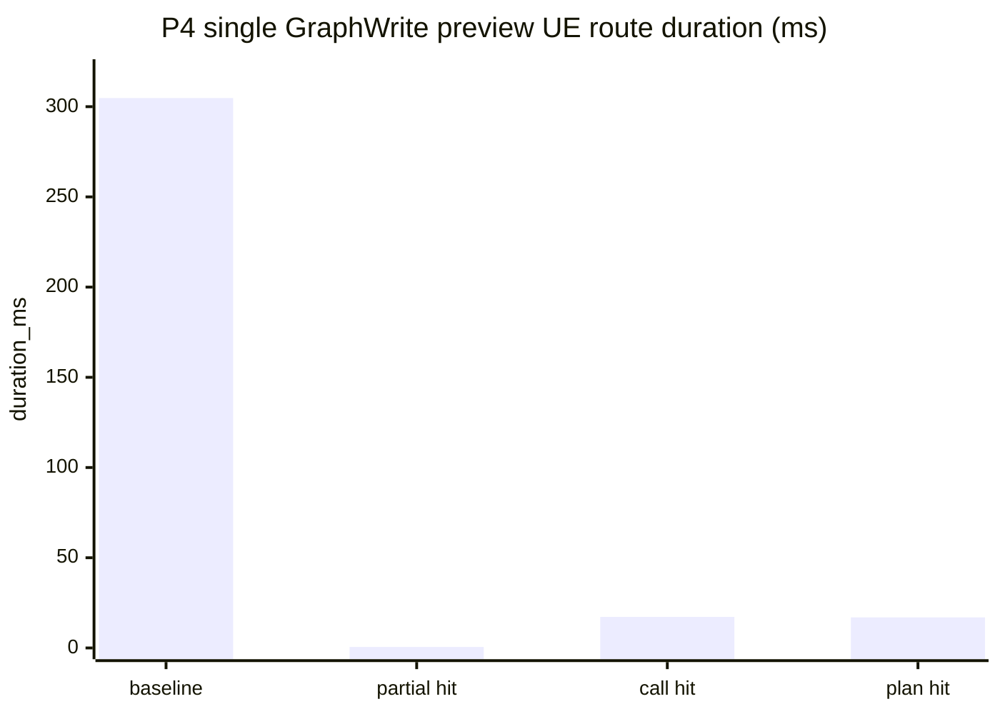

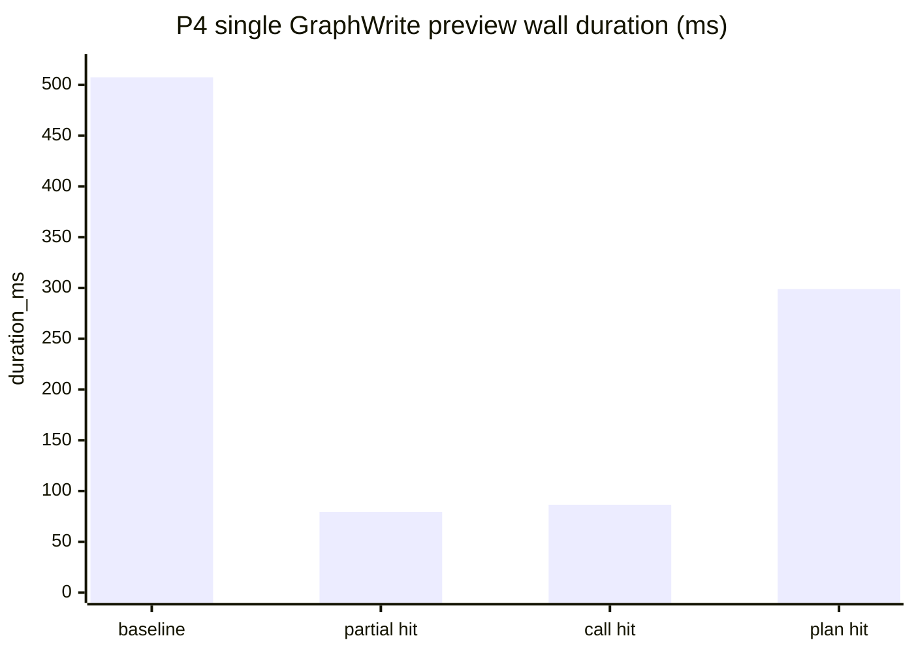

| 指标 | baseline | 优化后 | 提升百分比 |
| --- | ---: | ---: | ---: |
| UE preview total: partial preview hit | 304.757ms | 0.536ms | 99.82% |
| UE preview total: CallFunction facts hit | 304.757ms | 17.198ms | 94.36% |
| UE preview total: GraphWrite plan hit after partial TTL expired | 304.757ms | 16.955ms | 94.44% |
| CLI wall: partial preview hit | 507.421ms | 79.461ms | 84.34% |
| CLI wall: CallFunction facts hit | 507.421ms | 86.530ms | 82.95% |
| CLI wall: GraphWrite plan hit after partial TTL expired | 507.421ms | 298.879ms | 41.10% |
| CallFunction resolution | 291.850ms | 6.523ms | 97.76% |

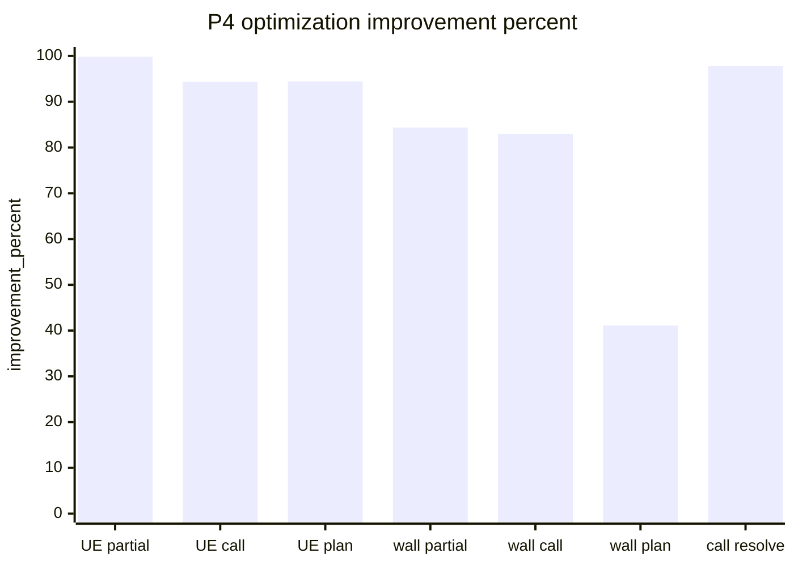

结论：
- P4 对 Agent “短时间修正同一 preview”收益明确：exact rerun 的 UE preview 从约 304.757ms 降到 0.536ms；多步修正可以跳过已通过 step。
- CallFunction facts cache 对“同一函数、payload literal 改动”的收益明确：PrintString resolution 从约 291.850ms 降到 6.523ms。
- GraphWrite plan cache 已按纯 DTO 命中，但它不跳过真实 `cluster_execute`，因此主要收益是减少纯 plan 重建，不改变 UObject 写入安全边界。
- wall time 仍可能被 Bridge / GameThread enqueue wait 主导；例如 after-45s 样本 UE route 只有 16.955ms，但 wall 为 298.879ms。

### P5-10：GraphWrite cluster execute 降成本

目标：降低真实写图阶段的 node spawn、pin lookup、linking 和 layout 记录成本。当前 `04b_write_function_body.json` execute 的 `cluster_execute` 约 275ms，是第二大真实 UE 侧瓶颈。

阶段计划文档：

`Optimization/BlueprintHelper_v0.5.0_TaskSpecExecution_PerformanceOptimization_20260519_CN/P5_GraphWriteClusterExecute_ImplementationPlan_CN.md`

计划：
- 在 `PurePrepare` 或 GraphWrite service 边界生成纯数据 `GraphMutationPlan`，包含 node spawn plan、pin default plan、link plan、layout plan。
- `MainThreadCommit` 只消费 `GraphMutationPlan`，最小化触碰 `UEdGraph` 的操作。
- 复用 P4 的 resolved function facts，GraphWrite pipeline 不再对同一 call_function 做二次 resolver。
- 每个 graph 建 `GraphWriteContext`，缓存 schema、existing node map、created node map、node id -> UK2Node、normalized pin alias map。
- pin lookup 从“每条 link 扫描 pins”改为“每个 node 建一次 pin map 后 O(1) 查询”。
- 继续保持 graph layout flush 在 TaskRuntime 后段统一执行，禁止每个 step / 每个 node 单独 flush。

验收：
- `cluster_execute` timing 能进一步拆分出 node spawn、apply defaults、linking、layout record。
- 同一 graph 的 schema、node、pin 查找不重复扫描。
- `04b_write_function_body.json` 的 execute `cluster_execute` 从约 275ms 降到 80-150ms 目标区间。
- `GraphMutationPlan` 和 `GraphWriteContext` 是独立 DTO/service 边界，不和 UI、CLI 或单个 node handler 绑定。

落地状态（2026-05-20）：
- 已新增 `FBlueprintGraphWriteExecutionStats`、`FBlueprintGraphWriteContext`、`FBlueprintGraphMutationPlan`、`FBlueprintGraphMutationPlanBuilder`、`FBlueprintGraphMutationPlanExecutor`。
- default value / link 处理改为通过 request-local `GraphWriteContext` 查询 node/pin，架构测试禁止重新回到 `FBlueprintGraphNodeUtility::FindPinByAlias` 的直接扫描路径。
- `graph_write_execution_stats` 只在 `--develop` / `include_timing=true` 返回；普通 CLI/tool 输出不携带该诊断。
- GraphWrite semantic node generation 增加 stable-id fast path，避免已解析 call_function 在 node spawn 阶段再次走完整候选 universe。

P5 隔离 benchmark（2026-05-20，Editor 通过 MCP 启动，CLI `task preview -> task execute --preview-token --develop`）：

说明：当前本地原始 `04b_write_function_body.json` 直接重跑时可能被旧测试资产 dirty/save 状态阻塞。该失败属于 SaveAsset / fixture hygiene / P6 post-operation 范围，不记录为 P5 性能结果。P5 使用同一 `04b` 语义的临时 Spec：`.tmp/p5_graphwrite_cluster_execute/isolated_04b/04b_write_function_body_p5_isolated_no_save.json`，将 `review_baseline_dirty_asset_policy` 改为 `allow_stale_disk_snapshot` 并关闭 final save，只隔离 GraphWrite cluster 成本；测试后通过 MCP 关闭编辑器且不保存。

| 阶段 | P4 后参考值 | P5 结果 | 提升 |
| --- | ---: | ---: | ---: |
| execute `cluster_execute` | 275.529ms | 55.845ms | 79.73% |
| `spawn_nodes_ms` | 250.717ms | 7.574ms | 96.98% |
| `connect_links_ms` | 0.005ms | 0.004ms | 已接近 0 |
| `record_layout_ms` | 0.008ms | 0.011ms | 已接近 0 |

P5 execute 代表性阶段：

| 阶段 | duration_ms |
| --- | ---: |
| cli total | 838.137 |
| `bridge.execute_task_plan` | 832.033 |
| nested `ue.execute_task_plan` total | 776.040 |
| `step.step_001.call_function_resolution` | 463.993 |
| `step.step_001.cluster_execute` | 55.845 |
| `main_thread_commit.compile` | 252.198 |

P5 `graph_write_execution_stats`：

| 字段 | 数值 |
| --- | ---: |
| `requested_node_count` | 2 |
| `spawned_node_count` | 1 |
| `requested_link_count` | 0 |
| `created_link_count` | 0 |
| `layout_record_node_count` | 1 |
| `build_context_ms` | 0.036 |
| `spawn_nodes_ms` | 7.574 |
| `connect_links_ms` | 0.004 |
| `record_layout_ms` | 0.011 |

P5 对比图：

```mermaid
xychart
    title "P5 GraphWrite execute cost before and after"
    x-axis ["cluster_execute", "spawn_nodes"]
    y-axis "duration_ms" 0 --> 300
    bar [275.529, 250.717]
    bar [55.845, 7.574]
```

图例说明：

| 系列 | 含义 | 数值 |
| --- | --- | --- |
| bar 1 | P4 后参考值 | 275.529 / 250.717 |
| bar 2 | P5 隔离测速结果 | 55.845 / 7.574 |

结论：P5 的 `cluster_execute` 目标已达成并低于 80-150ms 目标区间。剩余最慢阶段转移到 `call_function_resolution`、`main_thread_commit.compile`、Bridge / GameThread wait，以及后续 P6 的 compile/save 条件化或批处理。

### P6-11：compile/save 条件化或批处理

目标：降低 post operation 的固定成本，并避免无效 compile/save。当前 `04b_write_function_body.json` execute 的 compile/save 合计约 176ms，不是最大头，但属于稳定成本。

阶段计划文档：

`Optimization/BlueprintHelper_v0.5.0_TaskSpecExecution_PerformanceOptimization_20260519_CN/P6_CompileSavePostOperationPlanner_ImplementationPlan_CN.md`

落地状态（2026-05-20）：计划已写，待执行。

计划：
- 新增 `PostOperationPlanner`，从 TaskPlan、StepResult validation 和 mutation type 聚合 target asset 的 compile/save 需求。
- 对 target assets 去重，同一 TaskRun 内同一资产最多 compile/save 一次。
- 按 mutation type 判断是否必须 compile；graph body、signature、component 等需要 compile，纯 metadata 或非 Blueprint 资产不强制 compile。
- save 前检查 package dirty，未 dirty 不执行保存。
- 多资产 save 可批处理，但必须保留逐资产失败结果和诊断。
- 默认 execute 仍保持 immediate compile/save；如引入 deferred 模式，必须由显式 `post_operation_mode=deferred` 开启，不能改变默认成功语义。

验收：
- compile/save timing 能按 asset 展开，显示 skipped / executed / failed。
- 不需要 compile/save 的任务 post operation 成本降为 0 或接近 0。
- 需要 compile/save 的任务不会重复执行同一资产操作。
- deferred 模式若实现，必须返回明确 pending post operation 状态，不能把未完成的 compile/save 伪装为已完成。

## 优先级排序

1. P0-0 TaskSpec 到返回结果的端到端计时流程。
2. R0 读工具端到端计时补齐和 UE read route timing 验证。
3. P0-1 preview 复用或跳过二次 preview。
4. P0-2 `dry_run_mode` 策略落地。
5. P0-3 CallFunction resolution 缓存和结果传递。
6. P1-4 TaskSpec 编译 fast path 或 Python worker。
7. P1-5 Python compile 输出裁剪。
8. R1/R2 读工具 GameThread 快照、后台格式化和 DTO/formatter 复用。
9. P2-6 Review IO 批处理和异步化。
10. P2-7 UE TaskRuntime 三层执行模型。
11. P3-8 读工具同请求快照复用、纯数据缓存和 Bridge gap 收口，已完成 v0.5.0 范围；后续只按 timing 证据迁移 Component / Widget / ObjectProperty 等非 Logic 读工具。
12. P4-9 失败 preview 部分复用、CallFunction resolved facts TTL cache、GraphWrite 纯数据 plan cache 和缓存配置外置。
13. P5-10 GraphWrite `GraphMutationPlan` / `GraphWriteContext` 降低 cluster execute 成本。
14. P6-11 compile/save `PostOperationPlanner` 条件化、去重和批处理。

## 度量要求

v0.5.0 实施前需要补齐分阶段耗时记录：

- AgentFace schema parse。
- `TaskSpec -> TaskPlan` compile。
- bridge preview round-trip。
- UE TaskPlan parse/lowering。
- CallFunction resolution。
- GraphWrite dry-run generation。
- Review baseline/semantic snapshot。
- execute graph generation。
- compile/save post operation。
- review record/archive write。
- UE `PurePrepare` / `MainThreadCommit` / `PostIO` 三层耗时。
- read_context parse/route/payload/strip bridge timing/post-process 或 logic_flow build/result wrap。
- UE read route `route_execute`。
- 长读工具 `snapshot_read` / `format_output`。
- 读 payload size 和输出格式化耗时。

## 风险和前置决策

1. 已决策：P1 引入 TS fast path + Python canonical fallback，生产入口通过 task-core compiler service 统一选择；long-lived Python worker 暂不实现。
2. `dry_run_mode=none` 只能用于可信链路或已有 preview 复用的链路，不能成为默认安全策略。
3. CallFunction editor-session 级缓存必须有失效条件，否则可能在 Blueprint 或 ActionDatabase 更新后使用旧候选。
4. Review IO 异步化不得破坏 review reject/apply 的可恢复性。
5. UE 三层拆分必须保持 baseline snapshot 在 mutation 前完成，不能为了异步化改变 Review 证据语义。
6. P4-P6 后续优化只能复用统一 service / DTO / planner / cache config 边界，不能在单个最慢样本或单个 node handler 中写特判。
7. P4 缓存默认值必须集中在 `FBlueprintHelperTaskRuntimeCacheConfig`，避免 TTL、容量、字节预算和 prune 策略以硬编码形式散落在各 service。

## P0 preview -> execute(preview_token) 同进程重测

重测时间：2026-05-20。该轮用同一进程内的 TaskSpec runner 顺序执行 `previewTask()` 与 `executeTask(previewToken)`，验证 preview-token 复用链路。

测试方式：
- 为避免复用旧资产，脚本把预装写 Spec 复制到 `.tmp`，并把根路径替换为 `/Game/BlueprintHelperCliSmoke/P0PreviewExecuteInProcess_20260519161058`。
- 每个 Spec 先执行 preview；preview passed 后立即在同一 runner 中用完整 `previewToken` 执行 execute。
- 产物目录：`D:\UEProjects\Template\Plugins\BlueprintHelper\.tmp\p0_speed_preview_execute_inprocess_20260519161058`

结果摘要：

| 指标 | 数值 |
| --- | ---: |
| Spec 总数 | 17 |
| preview_passed | 16 |
| preview_blocked | 1 |
| execute 成功 | 16 |
| execute 跳过 | 1 |
| execute 失败 | 0 |
| preview avg / p50 / max | 187.957 / 166.662 / 587.542ms |
| execute avg / p50 / max | 488.613 / 389.072 / 1388.796ms |
| preview+execute avg / p50 / max | 682.007 / 517.478 / 1725.355ms |

| Spec | preview | preview_ms | preview_bridge | execute | execute_ms | execute_compile | token_validate | token_reuse | execute_bridge | nested UE execute |
| --- | --- | ---: | ---: | --- | ---: | ---: | ---: | ---: | ---: | ---: |
| `01_create_blueprint_actor.json` | passed | 166.662 | 112.427 | executed | 1388.796 | 43.918 | 0.210 | 0.011 | 1343.731 | 1056.128 |
| `02_edit_blueprint_components.json` | passed | 231.745 | 184.725 | executed | 156.496 | 44.051 | 0.114 | 0.000 | 112.111 | 96.613 |
| `03_edit_blueprint_variables.json` | passed | 55.758 | 6.297 | executed | 554.458 | 49.687 | 0.091 | 0.000 | 504.436 | 237.523 |
| `04_edit_blueprint_signatures.json` | passed | 96.279 | 46.917 | executed | 179.522 | 46.392 | 0.105 | 0.000 | 132.716 | 109.025 |
| `04b_write_function_body.json` | passed | 587.542 | 538.682 | executed | 1137.813 | 48.551 | 0.158 | 0.001 | 1088.866 | 793.508 |
| `05_append_graph_review_body.json` | blocked | 100.952 | 51.108 | skipped |  |  |  |  |  |  |
| `06_create_structure_row.json` | passed | 264.777 | 213.977 | executed | 838.898 | 44.410 | 0.062 | 0.000 | 794.203 | 506.365 |
| `07_create_data_table.json` | passed | 54.984 | 7.610 | executed | 389.072 | 46.665 | 0.068 | 0.000 | 342.158 | 96.542 |
| `08_edit_data_table_rows.json` | passed | 237.269 | 191.872 | executed | 112.753 | 43.915 | 0.087 | 0.000 | 68.576 | 25.390 |
| `09_create_data_asset_class.json` | passed | 219.632 | 174.126 | executed | 610.841 | 44.253 | 0.081 | 0.001 | 566.311 | 278.337 |
| `10_edit_data_asset_class_variables.json` | passed | 251.403 | 205.599 | executed | 121.797 | 44.925 | 0.091 | 0.001 | 76.575 | 66.902 |
| `11_create_data_asset_instance.json` | passed | 144.465 | 96.732 | executed | 516.648 | 43.800 | 0.062 | 0.000 | 472.605 | 312.681 |
| `12_edit_data_asset_properties.json` | passed | 74.470 | 28.834 | executed | 397.845 | 45.164 | 0.065 | 0.000 | 352.454 | 119.344 |
| `13_create_widget_blueprint.json` | passed | 214.305 | 168.170 | executed | 303.173 | 44.141 | 0.059 | 0.000 | 258.831 | 229.049 |
| `14a_edit_widget_tree_root.json` | passed | 258.477 | 211.645 | executed | 378.062 | 44.996 | 0.072 | 0.000 | 332.832 | 260.157 |
| `14b_edit_widget_tree_child.json` | passed | 73.364 | 27.739 | executed | 168.327 | 43.867 | 0.065 | 0.000 | 124.250 | 78.792 |
| `14c_edit_widget_tree_property.json` | passed | 163.178 | 116.593 | executed | 563.307 | 45.505 | 0.074 | 0.000 | 517.589 | 230.670 |

代表性最慢成功链路 `04b_write_function_body.json`：

| 阶段 | duration_ms |
| --- | ---: |
| preview total | 587.542 |
| preview `taskspec_compile` | 47.893 |
| preview `bridge.preview_task_plan` | 538.682 |
| preview nested `ue.preview_task_plan` total | 435.555 |
| execute total | 1137.813 |
| execute `taskspec_compile` | 48.551 |
| execute `preview_token.validate` | 0.158 |
| execute `preview_token.reuse_task_plan` | 0.001 |
| execute `bridge.execute_task_plan` | 1088.866 |
| execute nested `ue.execute_task_plan` total | 793.508 |
| preview + execute total | 1725.355 |

## P0-1 32 hex token 跨 CLI 重测

重测时间：2026-05-20。Editor 生命周期使用 MCP `blueprint_open_editor` 启动；TaskSpec preview / execute 仍通过 CLI 工具面执行。

测试样本：
- `BlueprintHelper/Develop/v0.4.3/ArchivedReference/RetiredReviewDebugDocs_20260518/PlanArtifacts/ReviewPanel_UI_Test_TaskSpecs_20260518/01_create_blueprint_actor.json`

测试方式：
- CLI 进程 A 执行 `task preview --develop`，返回 32 hex `preview_token=2fc5391d4aaea4f274322bb67c008af1`。
- CLI 进程 B 执行 `task execute --preview-token 2fc5391d4aaea4f274322bb67c008af1 --develop`。
- preview 产物：`D:\UEProjects\Template\Plugins\BlueprintHelper\Saved\BlueprintHelper\Cli\preview_1779209104314_0001\result.json`
- execute 产物：`D:\UEProjects\Template\Plugins\BlueprintHelper\Saved\BlueprintHelper\Cli\task_E4DE90B54B78EB31433F87BB5B5E3481\result.json`

结果摘要：

| 指标 | 数值 |
| --- | ---: |
| preview status | preview_passed |
| execute status | executed |
| token 格式 | 32 hex |
| preview total | 225.533ms |
| execute total | 2151.839ms |
| execute nested `ue.execute_task_plan` total | 329.102ms |
| execute `taskspec_compile` | 无 |
| execute `bridge.preview_task_plan` | 无 |

preview 阶段：

| 阶段 | duration_ms |
| --- | ---: |
| `cli.parse_args` | 0.191 |
| `taskspec_file_read_parse` | 2.020 |
| `taskspec_compile` | 49.090 |
| `preview_token.allocate_preview_id` | 0.025 |
| `preview_token.prepare_request` | 0.482 |
| `bridge.preview_task_plan` | 172.496 |
| `cli.result_return` | 0.006 |
| nested `ue.preview_task_plan` total | 2.598 |

execute 阶段：

| 阶段 | duration_ms |
| --- | ---: |
| `cli.parse_args` | 0.192 |
| `taskspec_file_read_parse` | 1.952 |
| `preview_token.validate` | 0.567 |
| `bridge.execute_task_plan` | 2148.015 |
| `result_wrap` | 0.485 |
| `cli.result_return` | 0.005 |
| nested `ue.execute_task_plan` total | 329.102 |
| nested `post_operation.compile` | 213.510 |
| nested `post_operation.save` | 111.934 |

补充校验：
- 同 token 改用 `02_edit_blueprint_components.json` 执行，返回 `preview_token_mismatch`，field=`task_spec_hash`。
- 同 token 在成功 execute 后再次执行同一 Spec，返回 `preview_token_mismatch`，field=`preview_token.asset_state`。

结论：P0-1 的 32 hex token + Editor 生命周期 preview store 已能跨 CLI 进程复用 TaskPlan。token execute 阶段不再触发 AgentFace `taskspec_compile`，也不再调用 `bridge.preview_task_plan`；TaskSpec hash 和目标资产状态快照均会阻止旧 token 复用。当前该样本 execute 总耗时主要落在 `bridge.execute_task_plan` 的整体等待，其中 UE nested 主要是 compile/save 后置操作。

## P0-2 / P0-3 小样本补测

测试时间：2026-05-20

测试目录：`D:\UEProjects\Template\Plugins\BlueprintHelper\Saved\BlueprintHelper\PerfProbe\P0P23_20260520011234`

测试链路：
- 使用 MCP 启动 Editor，CLI 执行 `01_create_blueprint_actor.json` 和 `04_edit_blueprint_signatures.json` 作为前置资产。
- 对同一 `04b_write_function_body.json` 派生 `full` / `quick` preview 样本，比较 UE nested timing。
- 对重复 `PrintString` 的 quick preview 样本直连 Bridge，确认 CallFunction request-level cache hit/miss。
- 对 `dry_run_mode=none` 且无 preview token 的 execute 做防绕过校验。

前置执行：

| 样本 | 结果 | total_ms |
| --- | --- | ---: |
| `01_create_blueprint_actor.json` | executed | 1599.951 |
| `04_edit_blueprint_signatures.json` | executed | 1082.636 |

P0-2 full / quick preview 对比：

| 样本 | mode | cli_total_ms | bridge.preview_task_plan | nested ue.preview_task_plan total | call_function_resolution | cluster_execute | quick_preview_validate |
| --- | --- | ---: | ---: | ---: | ---: | ---: | ---: |
| `04b_write_function_body` | full | 637.881 | 585.860 | 445.429 | 434.029 | 11.325 | 0 |
| `04b_write_function_body` | quick | 1797.013 | 1744.535 | 289.841 | 289.777 | 0 | 0.009 |
| `04b_write_function_body` | quick round2 | 447.435 | 395.960 | 289.306 | 289.241 | 0 | 0.009 |
| `04b_write_function_body` | full round2 | 1791.927 | 1740.923 | 300.885 | 289.184 | 11.646 | 0 |
| `04b_write_function_body` | quick round3 | 1886.394 | 1836.185 | 288.970 | 288.901 | 0 | 0.009 |
| `04b_write_function_body` | full round3 | 1908.624 | 1857.598 | 298.324 | 287.653 | 10.615 | 0 |

结论：P0-2 已在 UE TaskRuntime 主路径生效。`quick` preview 稳定跳过 `cluster_execute`，改走 `quick_preview_validate`；本样本的真实收益主要体现在 UE nested 从旧基线 `456.449ms` 降到约 `289ms`。同轮 warmed full/quick 的差距只有约 `10-12ms`，因为当前样本主要耗时已转移到 `call_function_resolution`。

P0-3 CallFunction cache 原始 Bridge 校验：

| 样本 | dry_run_strategy | preview_kind | ue_total_ms | call_function_resolution | cache_hits | cache_misses | cache_entries | resolved_facts |
| --- | --- | --- | ---: | ---: | ---: | ---: | ---: | ---: |
| 单个 `PrintString` | quick | synthetic | 294.300 | 294.235 | 0 | 1 | 1 | 1 |
| 重复 `PrintString` | quick | synthetic | 289.791 | 289.723 | 1 | 1 | 1 | 2 |

结论：P0-3 已在 request-level 起效。同一 TaskPlan 内重复的 `PrintString` 查询第二次命中 cache，`entries=1`，并返回两个 resolved facts，stable id 为 `/Script/Engine.KismetSystemLibrary:PrintString`。

`dry_run_mode=none` 防绕过校验：

| 场景 | 结果 |
| --- | --- |
| 无 preview token 执行 `dry_run_mode=none` | CLI preflight 失败，`error_code=dry_run_mode_none_requires_preview_token`，未进入 UE preview/execute 写入 |

`--develop` UE 原始返回透传补测：

| 场景 | 结果 |
| --- | --- |
| `task preview --develop --format json` | 已透传 `data.ue_preview_result`、`data.dry_run`、`data.call_function_resolution_cache`、`data.runtime_facts` |
| `task preview --format json` | 不返回 `timing`、`ue_preview_result`、`dry_run`、`call_function_resolution_cache`、`runtime_facts` |

透传后样本 `04b_write_function_body.quick.duplicate_call.json`：`dry_run.strategy=quick`、`dry_run.preview_kind=synthetic`、`cache_hits=1`、`cache_misses=1`、`cache_entries=1`、`resolved_facts=2`、`ue_preview_result.operation=preview_task_plan`。

## P1 TaskSpec Compiler Fast Path 实测

测试时间：2026-05-20

测试样本：`Saved\BlueprintHelper\PerfProbe\P0P23_20260520011234\04b_write_function_body.quick.duplicate_call.json`

产物目录：`Saved\BlueprintHelper\PerfProbe\P1CompilerFastPath_20260520000000`

实施摘要：
- 默认策略为 `auto`，对已通过 parity gate 的 TaskSpec 类型选择 `ts_fast_path`。
- Python compiler 保留为 `canonical_python` fallback。
- Python 子进程普通输出裁剪为 `task_plan`；diagnostic mode 继续保留 `bridge_payload`、`task_plan_summary` 等调试数据。
- `taskspec_compile.strategy` 已进入 `--develop` timing。

CLI preview 三轮成功样本：

| strategy | run1 | run2 | run3 | avg | parity_status | output_bytes |
| --- | ---: | ---: | ---: | ---: | --- | ---: |
| `canonical_python` | 59.221 | 56.255 | 58.626 | 58.034 |  | 3361 |
| `ts_fast_path` | 0.945 | 1.009 | 1.128 | 1.027 | passed |  |

compile-only 五轮隔离样本：

| strategy | min | avg | max | output_bytes |
| --- | ---: | ---: | ---: | ---: |
| `canonical_python` | 42.234 | 44.990 | 48.068 | 3361 |
| `ts_fast_path` | 0.050 | 0.264 | 1.053 |  |
| `auto` | 0.031 | 0.042 | 0.053 |  |

真实 execute 校验：

| 样本 | status | strategy | parity_status | taskspec_compile |
| --- | --- | --- | --- | ---: |
| `04b_write_function_body.quick.duplicate_call.json` | executed | `ts_fast_path` | passed | 0.872 |

结论：P1 已把受支持 TaskSpec 类型的编译固定成本从 Python 子进程约 `43-60ms` 降到毫秒级，且默认 `auto` 策略在通过 parity gate 的样本上实际选择 `ts_fast_path`。该项不是当前 2-5s 总耗时主瓶颈，但已消除每次 preview/execute 中稳定存在的 Python spawn 固定成本。

## P2 TaskRuntime Review IO 与三层执行模型实测

测试时间：2026-05-20

实施摘要：

- `RunTaskPlan` 已拆成 `PurePrepare -> MainThreadCommit -> ResultWrap -> PostIO` 的结构化链路。
- `PurePrepare` 输出 `PreparedTaskRun`，只处理 TaskPlan JSON、step id/dependency、target assets 和 adapter lowering。
- `MainThreadCommit` 负责 cluster execution、graph layout flush、compile/save，以及 mutation 前 baseline / target snapshot。
- `PostIO` 统一 flush archive session、Review record、TaskRunJournal、DebugEntry 和 pending review notification。
- Review record 从 step loop 即时写入改为 PostIO batch 写入；PostIO 写入失败返回 `data.post_io.diagnostics`，不把成功 mutation 伪装成 step 失败。

测试样本目录：`Saved\BlueprintHelper\PerfProbe\P2TaskRuntimeReviewIO_20260520020946`

| 样本 | status | cli_total_ms | ue_execute_total_ms | pure_prepare_ms | main_thread_commit_ms | post_io_ms | review_snapshot_ms | review_record_write_ms | archive_session_write_ms | compile_ms | save_ms |
| --- | --- | ---: | ---: | ---: | ---: | ---: | ---: | ---: | ---: | ---: | ---: |
| `01_create_blueprint_actor.json` | executed | 425.581 | 299.783 | 0.026 | 297.096 | 1.672 | 1.698 | 1.323 | 0.344 | 231.899 | 60.276 |
| `04_edit_blueprint_signatures.json` | executed | 1849.219 | 277.390 | 0.034 | 273.102 | 2.271 | 2.074 | 1.701 | 0.563 | 152.938 | 97.317 |
| `04b_write_function_body.json` | executed | 2854.826 | 779.309 | 0.017 | 777.225 | 0.451 | 1.522 |  | 0.446 | 156.410 | 62.954 |

结论：P2 已把 execute 侧 Review IO 和 TaskRuntime 编排拆出可度量边界。`01` 和 `04` 覆盖 PostIO Review record batch write；`04b` 的 graph write 样本不产生 runtime fallback Review record，因此该列为空。当前样本显示 `pure_prepare` 成本接近 0，主要耗时仍在 `main_thread_commit` 的 CallFunction resolution、cluster execution 和 compile/save。

## 当前状态

- 状态：P0-0 develop 诊断计时流程已完成首轮实现；P0-1 32 hex token + Editor 生命周期 preview store 已完成首轮实现和跨 CLI 成功验证；P0-2/P0-3 已在代码路径落地并完成小样本补测；P1 compiler fast path / 输出裁剪已完成实现和测速；P2 TaskRuntime Review IO / 三层执行模型已完成实现和测速；Bridge 短连接响应后立即 close 已落地并完成读写同案例复测。
- 读工具 P3-8 / R0-R5 已落地 v0.5.0 范围：read_context payload bytes、UE route 子阶段 timing、Logic Snapshot DTO、pure formatter、request-local cache、pure-data cache policy 和 benchmark script 均已接入；`logic_flow` 通过 `read_blueprint_logic_json` 复用同一 Snapshot DTO 链路。
- 读工具 R0-R5 已完成 11 个 ReadSpec 的 `warmup=1`、`iterations=5` 成功测速，55/55 成功；Bridge close 修复后同样本 median wall 范围为 328.634-330.013ms，`slowest bridge` 范围为 222.467-233.793ms，UE route 仍为 0.016-0.454ms。
- 用户关闭 Editor 后已改用 MCP lifecycle 重启并补测 11 个 ReadSpec，包含新增 `11_blueprint_logic_flow.json`；Bridge close 修复后 1.9s idle penalty 已消除，剩余主要是 CLI 启动、Bridge/UE 调度相位和实际 UE execute。
- 已补测 P0 `preview -> execute(preview_token)` 同进程链路：17 个预装写 Spec 中 16 个 execute 成功，preview+execute 成功样本 avg 682.007ms、p50 517.478ms、max 1725.355ms；execute 阶段已出现 `preview_token.validate` 和 `preview_token.reuse_task_plan`。
- 已补测 Bridge close 后的同一批预装写 Spec：17 个 Spec 中 16 个 preview+execute 成功，1 个因 Review baseline 策略 `preview_blocked`；成功样本 preview wall avg/p50/max 为 237.456/201.299/592.753ms，execute wall avg/p50/max 为 445.826/401.481/896.005ms，preview+execute workflow avg/p50/max 为 683.281/588.036/1488.758ms。
- P0-1 已完成首轮实现：token 使用 32 位 hex 短句柄，完整校验和 TaskPlan 保存在 Editor 生命周期内的 preview store；execute 命中 token 后直接复用 store 内 TaskPlan，避免二次 compile 和二次 preview。
- P0-1 跨 CLI 重测已通过：`01_create_blueprint_actor.json` preview 返回 32 hex token，另一个 CLI execute 带 token 成功；execute timing 不含 `taskspec_compile` 和 `bridge.preview_task_plan`，TaskSpec hash 与目标资产状态变化均会返回 `preview_token_mismatch`。
- `--develop` preview 已补 UE 原始返回透传：CLI 结果直接包含 `ue_preview_result` 以及 `dry_run`、`call_function_resolution_cache`、`runtime_facts` 诊断字段；普通非 develop 调用仍不返回这些字段。
- P1 已落地：生产入口通过 task-core compiler service 统一选择策略，已通过 parity gate 的 TaskSpec 类型默认走 `ts_fast_path`；未覆盖类型继续走 `canonical_python`。
- P2 已落地：UE TaskRuntime 现在返回 `pure_prepare`、`main_thread_commit`、`post_io` nested timing；Review record/archive/journal/debug 写入通过 PostIO batch 收口。
- Bridge send/receive 拆分已落地：CLI 侧返回 connect/write/client_parse，UE Bridge nested 返回 receive、GameThread enqueue wait、route execute、response serialize；response socket write 因发生在同一 response body 序列化之后，不伪造同帧 timing。
- 阶段计划已迁移到 `Develop/Plan/Optimization/BlueprintHelper_v0.5.0_TaskSpecExecution_PerformanceOptimization_20260519_CN/`，主文档只保留总体结论和索引。
- P4 已完成首轮实现和测速：partial preview cache 支持失败 preview 后 40s 内复用已通过 step；CallFunction resolved facts cache 和 GraphWrite 纯数据 plan cache 已接入 TTL、容量、字节预算、asset-state 校验和 `--develop` cache diagnostics；普通输出不泄漏诊断。
- P5 GraphWrite `cluster_execute` 降成本已完成首轮实现和隔离测速：execution stats、`GraphWriteContext`、`GraphMutationPlan`、context-backed pin lookup 均已落地；`04b` execute `cluster_execute` 从约 275.529ms 降到 55.845ms。
- 普通路径保持无计时采集、无 `data.timing` 返回；CLI 诊断路径通过 `--develop` 对所有 CLI 工具显式开启，TaskSpec MCP/tool 诊断路径通过 `develop: true` 显式开启。
- 后续实现必须保持高内聚、低耦合，避免把性能分支堆进单个 service 或 UI 入口。

## Bridge/CLI gap 初步定位

测试时间：2026-05-20。该轮只测量，不改代码。

定位目标：确认 R0-R5 后读链路剩余的约 1.9s `bridge_send_receive` 是否来自本地 TCP 通信、CLI 启动、UE route 执行，还是 Bridge 连接生命周期。

关键代码观察：
- `read_context.bridge_send_receive` 包住的是 `context.bridge.sendCommand()`，包含 TCP ensureConnected、写请求、等待 Bridge 响应。
- CLI 每次独立进程会创建新的 `BridgeClient` 和新的 TCP 连接。
- UE `FBlueprintHelperBridgeServer::Run()` 当前一次只 `Accept` 一个 client，并同步进入 `HandleClient()`。
- `HandleClient()` 在没有 pending data 后不会立刻返回 `Accept`，而是等待 `IdleTimeoutSeconds = 2.0` 后才关闭当前连接。

分层测速：

| 场景 | 样本 | wall_ms | CLI internal / bridge_ms | UE route_ms | 结论 |
| --- | --- | ---: | ---: | ---: | --- |
| `node -e` 空启动 | 5 次 | 13.994-18.396 |  |  | Node 进程启动不是 1.9s 主因。 |
| CLI `--help` | 5 次 | 95.319-96.611 |  |  | CLI 模块加载和基础启动约 95-100ms。 |
| 连续独立 CLI `bridge ping` | 第 1 次 | 103.548 | 3.297 |  | 首次连接快。 |
| 连续独立 CLI `bridge ping` | 第 2-5 次 | 1918.564-2003.336 | 1820.625-1905.732 |  | 连续新连接稳定被约 1.9s 等待卡住。 |
| 同 Node 进程同 socket `ping` | 8 次 | 10.141-20.294 |  |  | 本地 TCP 往返本身是 10ms 级。 |
| 连续独立 CLI `read_context` | 5 次 | 1992.208-2119.218 | bridge 1891.322-2010.713 | 0.385-0.458 | 读工具 1.9s 与 UE route 无关。 |
| 同 Node 进程同 socket `read_blueprint_logic_json` | 5 次 | 150.835-333.353 |  | 0.370-0.450 | 复用连接后消除 1.9s，但非 ping 命令仍受 GameThread 调度相位影响。 |
| 每次独立 CLI 前等待 2.2s 后 `bridge ping` | 4 次 | 109.210-149.439 | 6.965-48.118 |  | 等上一个 client idle close 后，新连接恢复快。 |
| 每次独立 CLI 前等待 2.2s 后 `read_context` | 3 次 | 131.106-384.296 | bridge 16.898-283.100 | 0.383-0.405 | 1.9s 消失，只剩 CLI 启动和 GameThread 调度相位。 |

结论：
- 本地 TCP 通信延迟可以忽略，不是 1.9s gap 的主因。
- CLI 进程启动和模块加载约 100ms，也不是 1.9s 主因。
- UE route 在 warm 状态下约 0.4ms，不是读链路端到端慢的主因。
- 当前最大 gap 来自 Bridge server 的连接生命周期：单 client 同步处理 + 2 秒 idle timeout 阻塞下一次 `Accept`。连续 CLI 调用每次都是新连接，因此会被前一个连接的 idle timeout 放大到约 1.9s。
- 复用同一个 BridgeClient/socket 后，`ping` 降到 10-20ms；这证明优化方向应优先处理 Bridge 连接复用或 server 多连接/非阻塞 accept，而不是继续优化读 DTO/formatter。

已执行修复：2026-05-20 将 Bridge 短连接恢复为“一次请求、一次响应、立即 close”。`IdleTimeoutSeconds = 2.0` 只保留给“连接后不发请求”的 client，不再阻塞响应后的下一次 `Accept`。该改动不改变协议，不重启 Bridge server，只释放当前 TCP client connection。

修复后分层测速：

| 场景 | 样本 | wall_ms | CLI internal / bridge_ms | UE route_ms | 结论 |
| --- | --- | ---: | ---: | ---: | --- |
| 连续独立 CLI `bridge ping` | 5 次 | 100.429-151.322 | 4.251-52.764 |  | 1.9s idle penalty 消失；剩余主要是 CLI 启动和少量 accept/dispatch。 |
| 连续独立 CLI `read_context` warm 样本 | 4 次 | 164.239-496.478 | bridge 56.237-385.041 | 0.345-0.429 | 读工具连续调用不再被上一个 CLI connection 的 idle timeout 卡住。 |
| 11 个 ReadSpec 完整测速 | 55/55 成功 | median 328.634-330.013 | slowest bridge 222.467-233.793 | 0.016-0.454 | 读链路端到端从约 2s 级降到约 0.33s 级。 |

读链路修复前后对比：

| 指标 | 修复前 R0-R5 | 修复后 Bridge close | 变化 |
| --- | ---: | ---: | ---: |
| 11 个 ReadSpec median wall 范围 | 1994.332-1998.450ms | 328.634-330.013ms | 约减少 83.5% |
| `02_blueprint_logic_json.json` median wall | 1994.332ms | 329.737ms | 约 6.05x |
| `02_blueprint_logic_json.json` slowest bridge | 1894.589ms | 233.020ms | 约 8.13x |
| `02_blueprint_logic_json.json` UE route | 0.401ms | 0.454ms | 同量级，非瓶颈 |

后续优化方向：
1. 短期已完成：响应后立即关闭短连接，恢复普通 CLI 的低等待路径。
2. 中期如需长连接能力，再把 Bridge server 演进为 acceptor + session manager；但不应为了普通短 CLI 再引入 idle 阻塞。
3. 如果引入长生命周期 AgentFace daemon / CLI session，则可以复用单个 BridgeClient/socket，进一步绕开 CLI 启动和连接成本；这属于新的运行形态，需要单独设计生命周期和故障恢复。
4. 非 ping 命令仍有 0-333ms 级 GameThread 调度相位等待；该项独立于 2s idle penalty，后续可通过 Bridge/UE timing 继续细分 queue wait、GameThread dispatch wait、route execute。

### Bridge send/receive 阶段拆分验证

测试时间：2026-05-20。该轮用于验证 `bridge_send_receive` 拆分字段是否能通过 `--develop` 返回，不作为最终速度对比样本；Editor 重新启动后的首次 `02_blueprint_logic_json.json` 存在 cold snapshot 成本。

测试命令：`node .\AgentFaceService\cli\build\cli\index.js blueprinthelper_read_context --file BlueprintHelper\Develop\v0.4.4\ReadSpecs\BP_ThirdPersonCharacter_20260519\02_blueprint_logic_json.json --develop --format full`

测试产物：`.tmp/bridge_timing_split/read_logic_json_develop.json`

| 阶段 | duration_ms | 说明 |
| --- | ---: | --- |
| `read_context.bridge_transport.connect` | 1.982 | CLI/AgentFace 建立 TCP 连接。 |
| `read_context.bridge_transport.write` | 0.363 | CLI/AgentFace 写入请求 frame。 |
| `bridge.read_blueprint_logic_json.bridge.receive` | 0.015 | UE Bridge 读取请求 frame。 |
| `bridge.read_blueprint_logic_json.bridge.game_thread_enqueue_wait` | 183.015 | Bridge IO 线程投递到 GameThread 后的等待。 |
| `bridge.read_blueprint_logic_json.bridge.route_execute` | 1590.351 | Router 执行命令；该 cold 样本中 UE nested `snapshot_read=1589.933ms`。 |
| `bridge.read_blueprint_logic_json.bridge.response_serialize` | 0.125 | UE Bridge 序列化 response，不含后续 socket 写出。 |
| `read_context.bridge_transport.client_parse` | 0.041 | CLI/AgentFace 解析 response JSON。 |

结论：
- `read_context.bridge_send_receive` 已可拆出 CLI connect/write/client_parse，以及 UE Bridge receive、GameThread enqueue wait、route execute、response serialize。
- `transport_timing` 作为 Bridge response 顶层字段返回，AgentFace 将其挂到 `data.timing.nested[].name = bridge.<command>`，不污染普通非 `--develop` 返回。
- Server 端 response socket write 的真实耗时发生在 response JSON 序列化之后，无法精确写回同一个 response body。当前不返回伪造的 `socket_write` 数值，避免把 0ms 或近似值误判为真实阶段；如后续必须观测该项，应走 out-of-band debug event、trailer frame 或下一次请求携带上一帧 write timing。

### Bridge accept 事件式等待验证

测试时间：2026-05-20。该轮只验证 `Accept` 等待策略，将 UE Bridge server 的 50ms 固定 polling 改为 `WaitForPendingConnection` socket readiness 等待；为了避免影响用户全局性能，本轮不修改 Editor 全局 throttle、GameThread 调度或后台 CPU 策略。

测试产物：`.tmp/bridge_accept_wait_fix/summary.json`

对比基准来自上一轮 direct BridgeClient probe：`ping` 30 次 p50 `send_receive=37.189ms`、`ue_bridge_total=0.038ms`、`residual_wait=37.149ms`；`read_blueprint_logic_json` 30 次 p50 `send_receive=321.255ms`、`ue_bridge_total=282.568ms`、`residual_wait=38.951ms`。

修复后 direct BridgeClient probe：

| 场景 | 样本 | send_receive p50 | UE bridge total p50 | residual wait p50 | 结论 |
| --- | ---: | ---: | ---: | ---: | --- |
| `ping` | 30 | 11.138ms | 0.040ms | 11.105ms | accept 侧固定 polling 残余等待由约 37ms 降到约 11ms。 |
| `read_blueprint_logic_json` warm | 30 | 14.084ms | 2.822ms | 11.214ms | read 的 transport 残余等待同步下降；剩余耗时主要来自 UE route / GameThread 相位长尾，不属于本次 accept 改动。 |

结论：`WaitForPendingConnection` 已移除 50ms polling 带来的固定等待相位，短连接 accept 残余等待降低约 70%。当前没有继续实现全局 CPU throttle / Editor 调度优化，避免为用户全局性能引入副作用。

## 读写同案例最终复测

测试时间：2026-05-20。Editor 通过 MCP 启动；读写工具均走 CLI `--develop --format json`；该轮只记录成功工具调用的性能数据，工具性失败不写入结果。写链路的 `05_append_graph_review_body.json` 为 Review baseline 策略阻塞，属于样本状态，不纳入成功耗时统计。

读链路输入：`BlueprintHelper/Develop/v0.4.4/ReadSpecs/BP_ThirdPersonCharacter_20260519`

读链路产物：`.tmp/read_timing/read_timing_20260520_032953`

| 指标 | 数值 |
| --- | ---: |
| ReadSpec 数量 | 11 |
| 成功运行 | 55/55 |
| median wall min / p50 / max | 328.634 / 329.371 / 330.013ms |
| max wall min / p50 / max | 331.584 / 333.953 / 335.004ms |
| slowest bridge min / p50 / max | 222.467 / 232.003 / 233.793ms |
| slowest UE route min / p50 / max | 0.016 / 0.366 / 0.454ms |

写链路输入：`BlueprintHelper/Develop/v0.4.3/ArchivedReference/RetiredReviewDebugDocs_20260518/PlanArtifacts/ReviewPanel_UI_Test_TaskSpecs_20260518`

写链路产物：`.tmp/write_timing_20260520_033512`

| 指标 | 数值 |
| --- | ---: |
| WriteSpec 数量 | 17 |
| preview+execute 成功 | 16 |
| preview_blocked | 1 |
| preview wall min / p50 / avg / max | 138.300 / 201.299 / 237.456 / 592.753ms |
| execute wall min / p50 / avg / max | 229.363 / 401.481 / 445.826 / 896.005ms |
| preview+execute workflow min / p50 / avg / max | 400.520 / 588.036 / 683.281 / 1488.758ms |
| preview bridge min / p50 / avg / max | 13.249 / 40.458 / 87.010 / 473.803ms |
| execute bridge min / p50 / avg / max | 111.556 / 285.624 / 324.104 / 757.545ms |
| preview UE min / p50 / avg / max | 0.076 / 0.312 / 28.081 / 445.443ms |
| execute UE min / p50 / avg / max | 79.900 / 250.625 / 287.522 / 744.193ms |

最慢成功写样本仍为 `04b_write_function_body.json`：preview wall 592.753ms，execute wall 896.005ms，preview+execute workflow 1488.758ms。定档判断必须区分口径：如果“百 ms 内”指单次 CLI tool invocation 达到百毫秒级，则读工具和写工具成功样本已经进入 0.33-0.90s 范围；如果严格要求每个完整 preview+execute 工作流低于 1s，`04b` 和 `06` 仍未达标；如果严格要求低于 100ms，则当前 CLI 启动成本本身已经超过门槛，不能定档。

## 速度阶段优化图

说明：
- P0 与 P0-1 的实测样本、运行方式不同，不能画成同一张“连续阶段优化”图。
- 同样本速度对比只使用 `04b_write_function_body.json` 的基线与 P0 token execute 数据。
- P0-1 跨 CLI 数据单独成图，只证明 32 hex token + Editor 生命周期 preview store 已消除 execute 阶段的 `taskspec_compile` 和 `bridge.preview_task_plan`。
- Bridge close 后的读写同案例图使用 2026-05-20 最终复测数据，只统计成功运行；`05_append_graph_review_body.json` 因 Review baseline 策略阻塞，从写链路成功曲线中排除。

### v0.5.0 总览对比折线图

口径说明：
- 写链路端到端图比较优化前、P0 同进程 preview token、Bridge close 后同案例跨 CLI 复测的 `avg / p50 / max`。
- 写链路逐 Spec 图比较 Bridge close 后成功样本的 preview wall、execute wall、preview+execute workflow wall。
- P1 图只比较 TaskSpec compiler 本身，不代表完整 execute 总耗时。
- P2 图只展示 UE execute 内部拆分后的阶段占比，不与 P0/P1 端到端图混画。
- 读链路图比较 11 个 ReadSpec 修复前后 `median_wall`，并保留修复后 `slowest_bridge / slowest_ue`，用于证明 1.9s idle penalty 已消除。

优化前基准提升百分比：

公式：`提升百分比 = (优化前耗时 - 完全优化后耗时) / 优化前耗时 * 100%`。

| 指标 | 优化前 | 完全优化后 | 提升百分比 |
| --- | ---: | ---: | ---: |
| 写链路 preview+execute workflow avg | 2172.994ms | 683.281ms | 68.56% |
| 写链路 preview+execute workflow p50 | 2209.757ms | 588.036ms | 73.39% |
| 写链路 preview+execute workflow max | 3246.974ms | 1488.758ms | 54.15% |
| 读链路 11 ReadSpec median wall 平均 | 1997.088ms | 329.448ms | 83.50% |

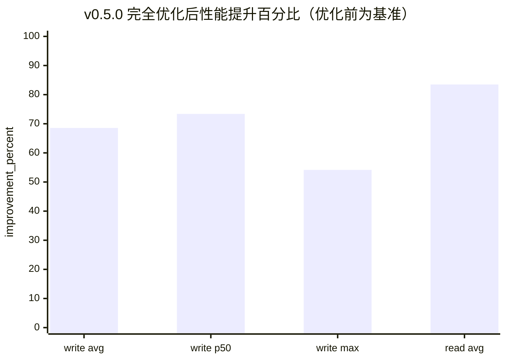

写链路端到端总耗时：

| 线条 | 含义 | 数据点顺序 | 数值 |
| --- | --- | --- | --- |
| 线条 1 | 优化前写链路成功样本 | avg / p50 / max | 2172.994 / 2209.757 / 3246.974 |
| 线条 2 | P0 同进程 preview token 成功样本 | avg / p50 / max | 682.007 / 517.478 / 1725.355 |
| 线条 3 | Bridge close 后同案例跨 CLI 成功样本 | avg / p50 / max | 683.281 / 588.036 / 1488.758 |

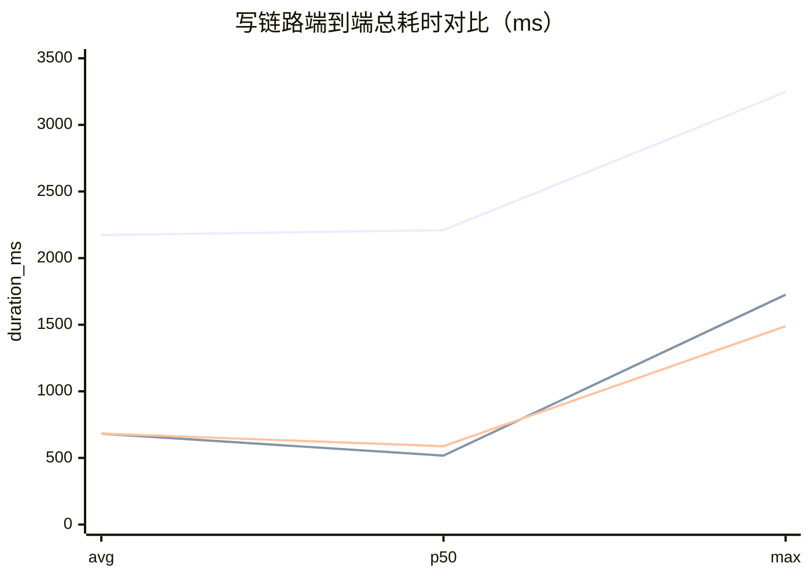

写链路同案例逐 Spec：

| 线条 | 含义 | 数据点顺序 |
| --- | --- | --- |
| 线条 1 | preview wall | 01 / 02 / 03 / 04 / 04b / 06 / 07 / 08 / 09 / 10 / 11 / 12 / 13 / 14a / 14b / 14c |
| 线条 2 | execute wall | 01 / 02 / 03 / 04 / 04b / 06 / 07 / 08 / 09 / 10 / 11 / 12 / 13 / 14a / 14b / 14c |
| 线条 3 | preview+execute workflow wall | 01 / 02 / 03 / 04 / 04b / 06 / 07 / 08 / 09 / 10 / 11 / 12 / 13 / 14a / 14b / 14c |

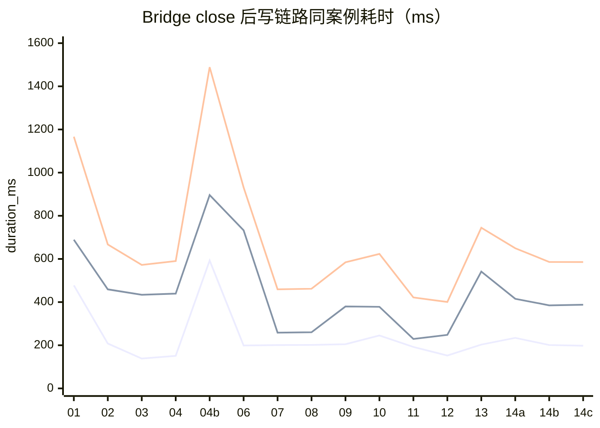

TaskSpec compiler fast path：

| 线条 | 含义 | 数据点顺序 | 数值 |
| --- | --- | --- | --- |
| 线条 1 | `canonical_python` compile-only | min / avg / max | 42.234 / 44.990 / 48.068 |
| 线条 2 | `ts_fast_path` compile-only | min / avg / max | 0.050 / 0.264 / 1.053 |
| 线条 3 | `auto` compile-only | min / avg / max | 0.031 / 0.042 / 0.053 |

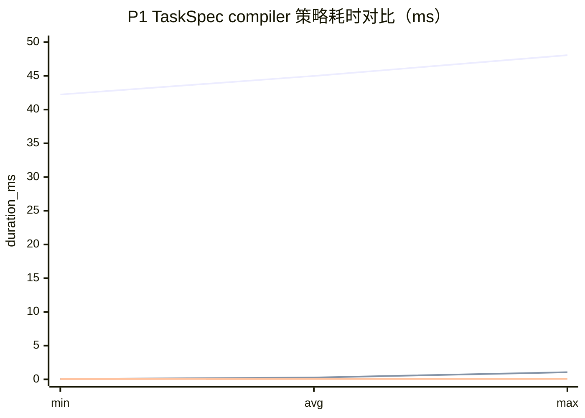

P2 UE execute 阶段拆分：

| 线条 | 含义 | 数据点顺序 | 数值 |
| --- | --- | --- | --- |
| 线条 1 | `01_create_blueprint_actor.json` | pure_prepare / main_thread_commit / post_io / compile / save | 0.026 / 297.096 / 1.672 / 231.899 / 60.276 |
| 线条 2 | `04_edit_blueprint_signatures.json` | pure_prepare / main_thread_commit / post_io / compile / save | 0.034 / 273.102 / 2.271 / 152.938 / 97.317 |
| 线条 3 | `04b_write_function_body.json` | pure_prepare / main_thread_commit / post_io / compile / save | 0.017 / 777.225 / 0.451 / 156.410 / 62.954 |

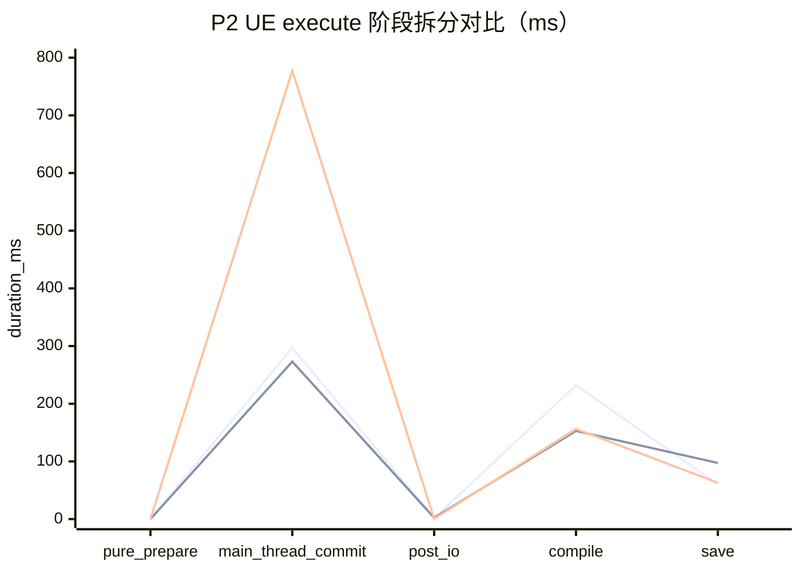

读链路 Bridge close 前后阶段对比：

| 线条 | 含义 | 数据点顺序 |
| --- | --- | --- |
| 线条 1 | 修复前 `median_wall_ms` | 01-11 ReadSpec |
| 线条 2 | 修复后 `median_wall_ms` | 01-11 ReadSpec |
| 线条 3 | 修复后 `slowest_bridge_ms` | 01-11 ReadSpec |
| 线条 4 | 修复后 `slowest_ue_ms` | 01-11 ReadSpec |

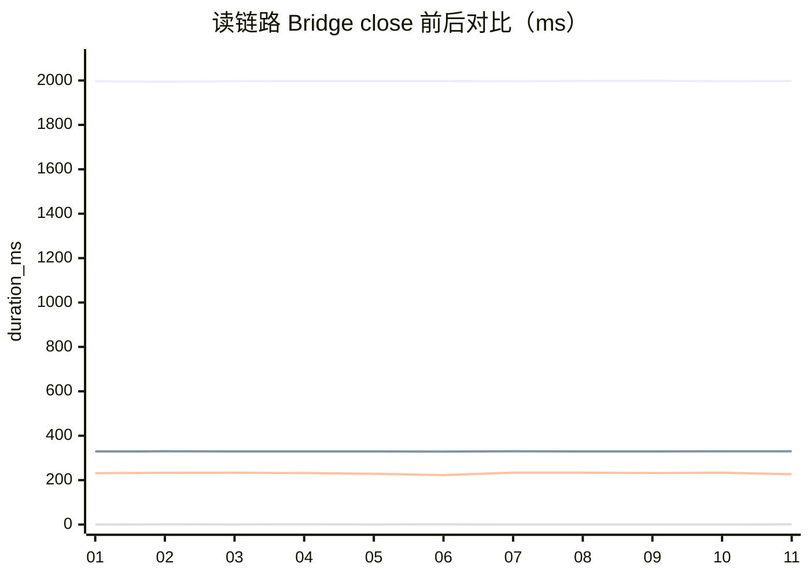

### 同样本阶段优化折线图

样本：`04b_write_function_body.json`

线条说明（按图中折线声明顺序）：

| 线条 | 含义 | 数据点顺序 | 数值 |
| --- | --- | --- | --- |
| 线条 1 | P0 优化前 execute 基线 | compile / preview bridge / execute bridge / execute total | 48.703 / 2063.882 / 1129.964 / 3246.974 |
| 线条 2 | P0 同进程 preview token execute | compile / preview bridge / execute bridge / execute total | 48.551 / 0 / 1088.866 / 1137.813 |

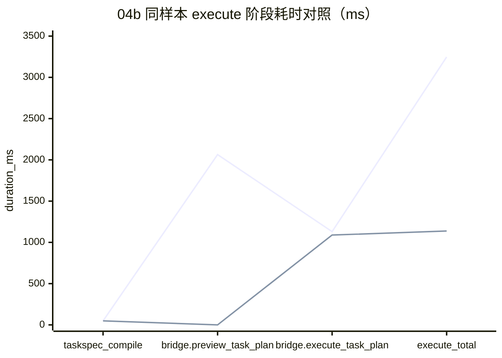

### P0-1 跨 CLI token 链路阶段图

样本：`01_create_blueprint_actor.json`

线条说明：

| 线条 | 含义 | 数据点顺序 | 数值 |
| --- | --- | --- | --- |
| 线条 1 | P0-1 跨 CLI 32 hex token execute | compile / preview bridge / execute bridge / execute total | 0 / 0 / 2148.015 / 2151.839 |

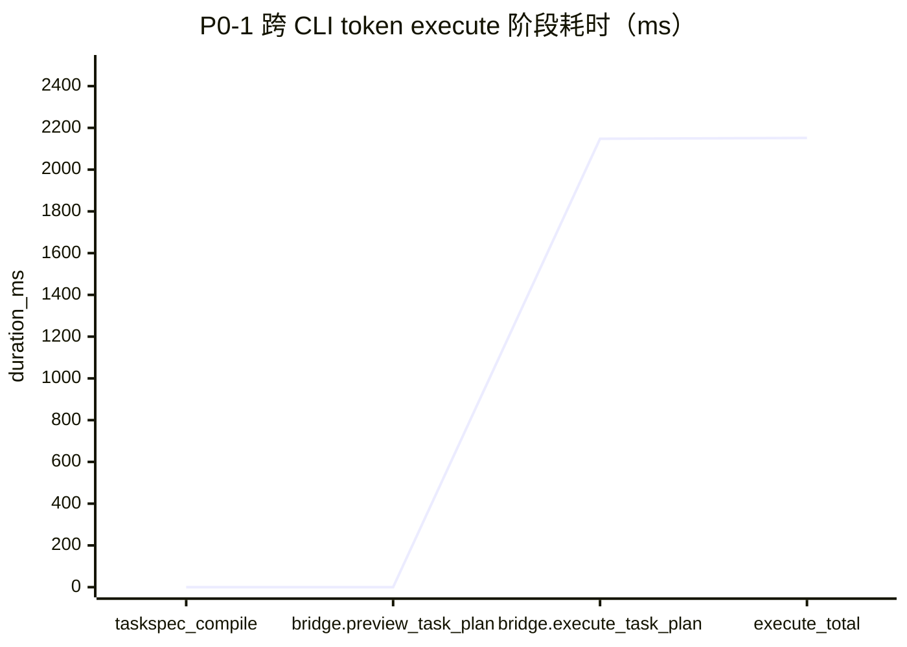
