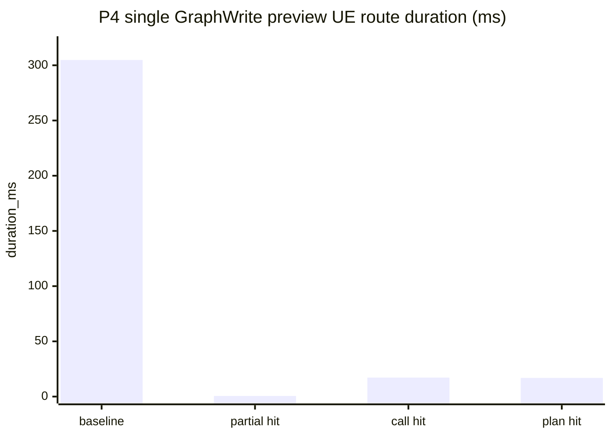
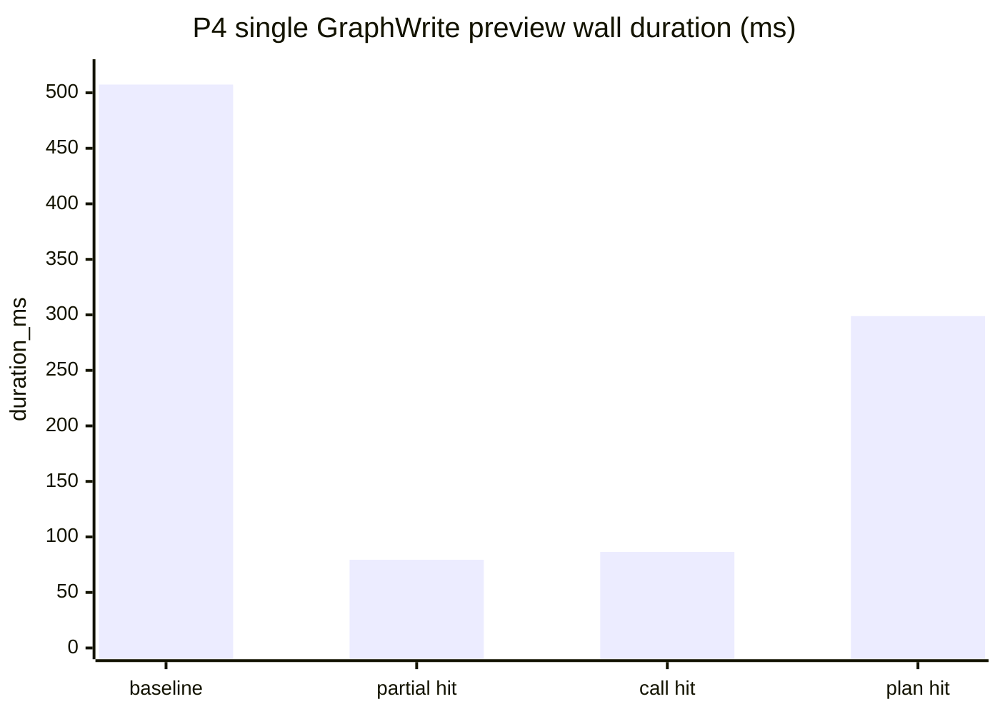
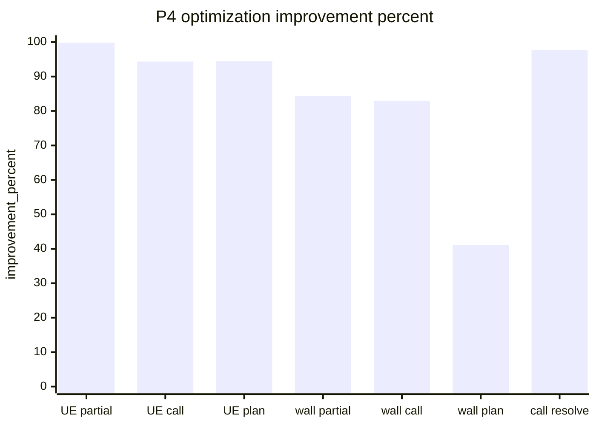

# P4 Preview Partial Reuse And Fine-Grained Cache Implementation Plan

> **For agentic workers:** REQUIRED SUB-SKILL: Use superpowers:subagent-driven-development (recommended) or superpowers:executing-plans to implement this plan task-by-task. Steps use checkbox (`- [ ]`) syntax for tracking.

**Goal:** 在 preview 失败后的短时间重试中复用已通过的安全 dry-run 结果，并为 CallFunction / GraphWrite 细粒度缓存加入统一 TTL、容量和失效边界。

**Architecture:** P4 不改变 execute 安全语义：只有当前这次完整 preview 通过后才能生成可执行 token。跨请求缓存只保存纯 DTO、stable id、hash、diagnostic facts 和 dry-run step result，不保存 `UObject*`、`UEdGraph*`、`UEdGraphNode*`、`UEdGraphPin*`。所有 TTL、容量、字节预算和 prune 行为集中到 `FBlueprintHelperTaskRuntimeCacheConfig`，避免在 service、cache、resolver、GraphWrite handler 中散落硬编码。

**Tech Stack:** UE 5.6 C++、BlueprintHelper TaskRuntime、GraphWrite、CallFunction resolver、AgentFace TaskSpec preview/execute、Node architecture tests、Unreal automation tests、BlueprintHelper CLI `--develop` timing。

**Execution Status (2026-05-20):** 已完成首轮实现、构建、Node 测试、UE 编译和 CLI benchmark。P4 缓存诊断只在 `--develop` / `include_timing=true` 输出；普通 Agent-facing preview 输出不暴露 `cache_diagnostics`。

---

## 0. Scope And Constraints

本计划只覆盖 preview 加速和纯数据缓存，不把 execute 变成“部分跳过校验”的写入路径。

- [x] 不缓存 `UObject*` / `UBlueprint*` / `UEdGraph*` / `UEdGraphNode*` / `UEdGraphPin*` / `FProperty*`。
- [x] 不让 blocked preview token 参与 execute；blocked token 仍只能用于诊断，不能绕过完整 preview。
- [x] `PartialPreviewCache` 只服务下一轮 preview，不服务 execute。
- [x] 缓存命中必须校验 asset state、step payload、dependency closure、execution policy、cache schema version。
- [x] TTL / max entries / max bytes / prune 策略必须集中到配置边界，不能写在调用点。
- [x] C++ 不新增 namespace；新增行为类默认独立 `.h/.cpp`。
- [x] 任务完成后不由 Agent 执行 `git add`、`git commit`、`git push`；只输出建议提交命令。

## 1. Target File Structure

### UE C++

- Create `BlueprintHelper/Source/BlueprintHelper/Private/Runtime/TaskRuntime/BlueprintHelperTaskRuntimeCacheConfig.h`
- Create `BlueprintHelper/Source/BlueprintHelper/Private/Runtime/TaskRuntime/BlueprintHelperTaskRuntimeCacheConfig.cpp`
- Create `BlueprintHelper/Source/BlueprintHelper/Private/Runtime/TaskRuntime/BlueprintHelperTaskRuntimeCacheKeyUtils.h`
- Create `BlueprintHelper/Source/BlueprintHelper/Private/Runtime/TaskRuntime/BlueprintHelperTaskRuntimeCacheKeyUtils.cpp`
- Create `BlueprintHelper/Source/BlueprintHelper/Private/Runtime/TaskRuntime/BlueprintHelperTaskPartialPreviewCache.h`
- Create `BlueprintHelper/Source/BlueprintHelper/Private/Runtime/TaskRuntime/BlueprintHelperTaskPartialPreviewCache.cpp`
- Create `BlueprintHelper/Source/BlueprintHelper/Private/Runtime/TaskRuntime/BlueprintHelperTaskRuntimeCacheDiagnostics.h`
- Create `BlueprintHelper/Source/BlueprintHelper/Private/Runtime/TaskRuntime/BlueprintHelperTaskRuntimeCacheDiagnostics.cpp`
- Create `BlueprintHelper/Source/BlueprintHelper/Private/Runtime/TaskRuntime/BlueprintHelperGraphWritePlanCache.h`
- Create `BlueprintHelper/Source/BlueprintHelper/Private/Runtime/TaskRuntime/BlueprintHelperGraphWritePlanCache.cpp`
- Modify `BlueprintHelper/Source/BlueprintHelper/Private/Runtime/TaskRuntime/BlueprintHelperTaskRuntimeCallFunctionResolutionCache.h`
- Modify `BlueprintHelper/Source/BlueprintHelper/Private/Runtime/TaskRuntime/BlueprintHelperTaskRuntimeCallFunctionResolutionCache.cpp`
- Modify `BlueprintHelper/Source/BlueprintHelper/Public/Runtime/TaskRuntime/BlueprintHelperTaskRuntimeService.h`
- Modify `BlueprintHelper/Source/BlueprintHelper/Private/Runtime/TaskRuntime/BlueprintHelperTaskRuntimeService.cpp`
- Modify `BlueprintHelper/Source/BlueprintHelper/Private/Runtime/TaskRuntime/Utils/BlueprintHelperTaskRuntimeClusterExecutionUtils.h`
- Modify `BlueprintHelper/Source/BlueprintHelper/Private/Runtime/TaskRuntime/Utils/BlueprintHelperTaskRuntimeClusterExecutionUtils.cpp`

### Tests

- Create `BlueprintHelper/Source/BlueprintHelper/Private/Tests/TaskRuntime/BlueprintHelperTaskRuntimeCacheConfigTests.cpp`
- Create `BlueprintHelper/Source/BlueprintHelper/Private/Tests/TaskRuntime/BlueprintHelperTaskPartialPreviewCacheTests.cpp`
- Modify `BlueprintHelper/Source/BlueprintHelper/Private/Tests/TaskRuntime/BlueprintHelperTaskRuntimeCallFunctionResolutionCacheTests.cpp`
- Create `BlueprintHelper/Source/BlueprintHelper/Private/Tests/TaskRuntime/BlueprintHelperGraphWritePlanCacheTests.cpp`
- Modify `AgentFaceService/task-core/src/tests/architecture/architecture-boundaries.test.ts`

### Docs

- Modify `BlueprintHelper/Develop/Plan/BlueprintHelper_v0.5.0_TaskSpecExecution_PerformanceOptimization_20260519_CN.md`
- Modify `BlueprintHelper/Develop/Plan/Optimization/BlueprintHelper_v0.5.0_TaskSpecExecution_PerformanceOptimization_20260519_CN/README.md`
- Modify this document as execution status changes.

## 2. Cache Defaults

P4 的默认值必须先落到 `FBlueprintHelperTaskRuntimeCacheConfig`，实现代码只读取配置，不重复写常量。

| Config field | Default | Purpose |
| --- | ---: | --- |
| `PartialPreviewTtl` | 40s | 用户要求的极短失败重试窗口。 |
| `PartialPreviewMaxGroups` | 64 | 限制 TaskSpec group 数量，避免 Agent 循环制造无限 preview group。 |
| `PartialPreviewMaxStepEntries` | 512 | 限制 step-level dry-run result 条目数。 |
| `PartialPreviewMaxBytes` | 8 MiB | 限制 cached step result / facts 总体积。 |
| `CallFunctionFactTtl` | 180s | Editor 生命周期内短期复用 resolved facts，避免过期过久。 |
| `CallFunctionFactMaxEntries` | 2048 | 限制 resolver facts 数量。 |
| `CallFunctionFactMaxBytes` | 8 MiB | 限制 candidate facts 体积。 |
| `GraphWritePlanTtl` | 90s | 复用短时间内稳定的纯数据 graph mutation plan / pin map。 |
| `GraphWritePlanMaxEntries` | 256 | 限制 graph plan 条目。 |
| `GraphWritePlanMaxBytes` | 16 MiB | 限制 graph plan 和 pin alias map 体积。 |
| `PruneOnAccessMinInterval` | 1s | 避免每次 lookup 都全量 prune。 |

## 3. Task P4-0: Cache Config Boundary

**Files:**
- Create: `BlueprintHelper/Source/BlueprintHelper/Private/Runtime/TaskRuntime/BlueprintHelperTaskRuntimeCacheConfig.h`
- Create: `BlueprintHelper/Source/BlueprintHelper/Private/Runtime/TaskRuntime/BlueprintHelperTaskRuntimeCacheConfig.cpp`
- Create: `BlueprintHelper/Source/BlueprintHelper/Private/Tests/TaskRuntime/BlueprintHelperTaskRuntimeCacheConfigTests.cpp`
- Modify: `AgentFaceService/task-core/src/tests/architecture/architecture-boundaries.test.ts`

- [x] **Step 1: Write failing C++ config defaults test**

Add an automation test that asserts all cache defaults are centralized:

```cpp
#include "Runtime/TaskRuntime/BlueprintHelperTaskRuntimeCacheConfig.h"

#include "Misc/AutomationTest.h"

#if WITH_DEV_AUTOMATION_TESTS

IMPLEMENT_SIMPLE_AUTOMATION_TEST(
	FBlueprintHelperTaskRuntimeCacheConfig_DefaultsAreCentralized,
	"BlueprintHelper.TaskRuntime.CacheConfig.DefaultsAreCentralized",
	EAutomationTestFlags::EditorContext | EAutomationTestFlags::ProductFilter)

bool FBlueprintHelperTaskRuntimeCacheConfig_DefaultsAreCentralized::RunTest(const FString& Parameters)
{
	const FBlueprintHelperTaskRuntimeCacheConfig Config =
		FBlueprintHelperTaskRuntimeCacheConfig::Default();

	TestEqual(TEXT("partial preview ttl seconds"), Config.PartialPreviewTtl.GetTotalSeconds(), 40.0);
	TestEqual(TEXT("partial preview groups"), Config.PartialPreviewMaxGroups, 64);
	TestEqual(TEXT("partial preview step entries"), Config.PartialPreviewMaxStepEntries, 512);
	TestEqual(TEXT("partial preview max bytes"), Config.PartialPreviewMaxBytes, int64(8 * 1024 * 1024));
	TestEqual(TEXT("call function ttl seconds"), Config.CallFunctionFactTtl.GetTotalSeconds(), 180.0);
	TestEqual(TEXT("call function max entries"), Config.CallFunctionFactMaxEntries, 2048);
	TestEqual(TEXT("graph write plan ttl seconds"), Config.GraphWritePlanTtl.GetTotalSeconds(), 90.0);
	TestEqual(TEXT("graph write plan max bytes"), Config.GraphWritePlanMaxBytes, int64(16 * 1024 * 1024));
	return true;
}

#endif
```

- [x] **Step 2: Write failing architecture test for hardcoded cache numbers**

Add a Node architecture test that scans new cache classes and rejects local TTL/capacity literals outside the config file:

```ts
test('TaskRuntime cache TTL and capacity defaults live in the cache config boundary', () => {
  const cacheFiles = [
    'Private/Runtime/TaskRuntime/BlueprintHelperTaskPartialPreviewCache.cpp',
    'Private/Runtime/TaskRuntime/BlueprintHelperTaskRuntimeCallFunctionResolutionCache.cpp',
    'Private/Runtime/TaskRuntime/BlueprintHelperGraphWritePlanCache.cpp',
  ].map((relative) => fs.readFileSync(path.resolve(UE_SOURCE_ROOT, relative), 'utf8'));

  for (const source of cacheFiles) {
    assert.doesNotMatch(source, /FromSeconds\\((40|90|180)\\)/u);
    assert.doesNotMatch(source, /Max(Entries|Bytes|Groups)\\s*=\\s*(64|256|512|2048|8388608|16777216)/u);
  }
});
```

- [x] **Step 3: Implement config struct**

`FBlueprintHelperTaskRuntimeCacheConfig` should expose all defaults and a helper for byte budgets:

```cpp
struct FBlueprintHelperTaskRuntimeCacheConfig
{
	FTimespan PartialPreviewTtl;
	int32 PartialPreviewMaxGroups = 0;
	int32 PartialPreviewMaxStepEntries = 0;
	int64 PartialPreviewMaxBytes = 0;

	FTimespan CallFunctionFactTtl;
	int32 CallFunctionFactMaxEntries = 0;
	int64 CallFunctionFactMaxBytes = 0;

	FTimespan GraphWritePlanTtl;
	int32 GraphWritePlanMaxEntries = 0;
	int64 GraphWritePlanMaxBytes = 0;

	FTimespan PruneOnAccessMinInterval;

	static FBlueprintHelperTaskRuntimeCacheConfig Default();
};
```

- [x] **Step 4: Run config tests**

Run:

```powershell
npm.cmd --prefix .\AgentFaceService\task-core run build
node --test .\AgentFaceService\task-core\build\tests\architecture\architecture-boundaries.test.js
& "E:\UE_5.6\Engine\Build\BatchFiles\Build.bat" TemplateEditor Win64 Development "D:\UEProjects\Template\Template.uproject" -WaitMutex
```

Expected: Node architecture test passes; UE build succeeds. The C++ automation test is compiled and can be run in the Editor automation runner.

## 4. Task P4-1: Shared Cache Key And Diagnostics Utilities

**Files:**
- Create: `BlueprintHelper/Source/BlueprintHelper/Private/Runtime/TaskRuntime/BlueprintHelperTaskRuntimeCacheKeyUtils.h`
- Create: `BlueprintHelper/Source/BlueprintHelper/Private/Runtime/TaskRuntime/BlueprintHelperTaskRuntimeCacheKeyUtils.cpp`
- Create: `BlueprintHelper/Source/BlueprintHelper/Private/Runtime/TaskRuntime/BlueprintHelperTaskRuntimeCacheDiagnostics.h`
- Create: `BlueprintHelper/Source/BlueprintHelper/Private/Runtime/TaskRuntime/BlueprintHelperTaskRuntimeCacheDiagnostics.cpp`
- Create: `BlueprintHelper/Source/BlueprintHelper/Private/Tests/TaskRuntime/BlueprintHelperTaskPartialPreviewCacheTests.cpp`

- [x] **Step 1: Write failing key stability test**

The test must prove that key generation is stable for JSON field order and changes when relevant dependency data changes:

```cpp
IMPLEMENT_SIMPLE_AUTOMATION_TEST(
	FBlueprintHelperTaskRuntimeCacheKeyUtils_StableJsonHash,
	"BlueprintHelper.TaskRuntime.CacheKeyUtils.StableJsonHash",
	EAutomationTestFlags::EditorContext | EAutomationTestFlags::ProductFilter)

bool FBlueprintHelperTaskRuntimeCacheKeyUtils_StableJsonHash::RunTest(const FString& Parameters)
{
	TSharedRef<FJsonObject> First = MakeShared<FJsonObject>();
	First->SetStringField(TEXT("b"), TEXT("2"));
	First->SetStringField(TEXT("a"), TEXT("1"));

	TSharedRef<FJsonObject> Second = MakeShared<FJsonObject>();
	Second->SetStringField(TEXT("a"), TEXT("1"));
	Second->SetStringField(TEXT("b"), TEXT("2"));

	const FString FirstHash = FBlueprintHelperTaskRuntimeCacheKeyUtils::HashStableJson(First);
	const FString SecondHash = FBlueprintHelperTaskRuntimeCacheKeyUtils::HashStableJson(Second);
	TestEqual(TEXT("object field order does not change hash"), FirstHash, SecondHash);

	Second->SetStringField(TEXT("b"), TEXT("3"));
	TestFalse(TEXT("value change changes hash"),
		FirstHash == FBlueprintHelperTaskRuntimeCacheKeyUtils::HashStableJson(Second));
	return true;
}
```

- [x] **Step 2: Implement stable JSON hash and byte estimation**

Implement a utility that recursively serializes object keys in sorted order before hashing. Use it for:

- `step_payload_hash`
- `execution_policy_hash`
- `dependency_closure_hash`
- cached entry byte budget

- [x] **Step 3: Implement diagnostics DTO**

`FBlueprintHelperTaskRuntimeCacheDiagnostics` should include:

- `partial_preview_hits`
- `partial_preview_misses`
- `partial_preview_reused_steps`
- `call_function_fact_hits`
- `call_function_fact_misses`
- `graph_write_plan_hits`
- `graph_write_plan_misses`
- `pruned_expired_entries`
- `pruned_capacity_entries`
- `current_bytes`

The diagnostics object must serialize to `data.cache_diagnostics` only when `include_timing=true` or develop diagnostics are active.

## 5. Task P4-2: Partial Preview Cache

**Files:**
- Create: `BlueprintHelper/Source/BlueprintHelper/Private/Runtime/TaskRuntime/BlueprintHelperTaskPartialPreviewCache.h`
- Create: `BlueprintHelper/Source/BlueprintHelper/Private/Runtime/TaskRuntime/BlueprintHelperTaskPartialPreviewCache.cpp`
- Create/Modify: `BlueprintHelper/Source/BlueprintHelper/Private/Tests/TaskRuntime/BlueprintHelperTaskPartialPreviewCacheTests.cpp`
- Modify: `BlueprintHelper/Source/BlueprintHelper/Public/Runtime/TaskRuntime/BlueprintHelperTaskRuntimeService.h`
- Modify: `BlueprintHelper/Source/BlueprintHelper/Private/Runtime/TaskRuntime/BlueprintHelperTaskRuntimeService.cpp`

- [x] **Step 1: Write failing cache hit/miss tests**

Tests must cover:

- cache hit when group hash, step hash, dependency closure hash, execution policy hash, and asset state hash match
- miss when the failed step is retried with a changed payload
- miss when any dependency step changed
- prune after 40s TTL
- capacity prune by entries and bytes

Example test shape:

```cpp
FBlueprintHelperTaskPartialPreviewCache Cache(FBlueprintHelperTaskRuntimeCacheConfig::Default());
FBlueprintHelperPartialPreviewCacheKey Key;
Key.TaskSpecGroupHash = TEXT("group_a");
Key.StepId = TEXT("step_001");
Key.StepPayloadHash = TEXT("payload_hash");
Key.DependencyClosureHash = TEXT("deps_hash");
Key.ExecutionPolicyHash = TEXT("policy_hash");
Key.AssetStateHash = TEXT("asset_state_hash");

FBlueprintHelperPartialPreviewCacheEntry Entry;
Entry.StepId = Key.StepId;
Entry.bPassed = true;
Entry.Result = FBlueprintHelperToolResultBuilder::DryRun(TEXT("graph_write"), TEXT("trace_cache"));

Cache.Store(Key, Entry, FDateTime::UtcNow());
FBlueprintHelperPartialPreviewCacheEntry Found;
TestTrue(TEXT("matching key hits"), Cache.TryGet(Key, FDateTime::UtcNow(), Found));
```

- [x] **Step 2: Implement cache data model**

Create:

- `FBlueprintHelperPartialPreviewCacheKey`
- `FBlueprintHelperPartialPreviewCacheEntry`
- `FBlueprintHelperPartialPreviewCacheStats`
- `FBlueprintHelperTaskPartialPreviewCache`

The entry stores only cloned `FBlueprintHelperToolResultBase` data and runtime facts; it must not store any UE object pointer.

- [x] **Step 3: Integrate into preview-only step loop**

In `RunTaskPlan(Payload, true)`:

1. Build `TaskSpecGroupHash` from target assets + task type + execution policy, not from the full TaskSpec hash.
2. Build each step key from lowered payload hash, dependency closure hash, execution policy hash, and asset state hash.
3. Before resolving CallFunction and executing dry-run, ask `PartialPreviewCache.TryGet`.
4. If hit and entry passed, append a cloned `StepRecord` and skip that step's dry-run work.
5. If miss or entry failed, run normal preview.
6. After normal preview step passes, store it.
7. If normal preview step fails, do not store it as reusable pass; still keep diagnostics showing failure.

- [x] **Step 4: Preserve execute safety**

Do not allow `execute_task_plan` to consume `PartialPreviewCache` directly. A later `execute` must still require:

- a current successful preview token, or
- normal `dry_run_mode=quick/full` preview before execute.

- [x] **Step 5: Add develop diagnostics**

When `include_timing=true`, preview result should include:

```json
{
  "cache_diagnostics": {
    "partial_preview_hits": 3,
    "partial_preview_misses": 1,
    "partial_preview_reused_steps": ["step_001", "step_002", "step_003"],
    "partial_preview_ttl_seconds": 40
  }
}
```

## 6. Task P4-3: CallFunction Resolved Facts TTL Cache

**Files:**
- Modify: `BlueprintHelper/Source/BlueprintHelper/Private/Runtime/TaskRuntime/BlueprintHelperTaskRuntimeCallFunctionResolutionCache.h`
- Modify: `BlueprintHelper/Source/BlueprintHelper/Private/Runtime/TaskRuntime/BlueprintHelperTaskRuntimeCallFunctionResolutionCache.cpp`
- Modify: `BlueprintHelper/Source/BlueprintHelper/Private/Tests/TaskRuntime/BlueprintHelperTaskRuntimeCallFunctionResolutionCacheTests.cpp`
- Modify: `BlueprintHelper/Source/BlueprintHelper/Public/Runtime/TaskRuntime/BlueprintHelperTaskRuntimeService.h`
- Modify: `BlueprintHelper/Source/BlueprintHelper/Private/Runtime/TaskRuntime/BlueprintHelperTaskRuntimeService.cpp`

- [x] **Step 1: Write failing TTL and asset state tests**

Extend the existing cache tests:

```cpp
FBlueprintHelperTaskRuntimeCallFunctionResolutionCache Cache(FBlueprintHelperTaskRuntimeCacheConfig::Default());
const FString Key = TEXT("call_key");

FBlueprintHelperTaskRuntimeCachedCallFunctionResolution Stored;
Stored.bResolved = true;
Stored.StableId = TEXT("/Script/Engine.KismetSystemLibrary:PrintString");
Stored.AssetStateHash = TEXT("asset_v1");
Cache.Store(Key, Stored, FDateTime::UtcNow());

FBlueprintHelperTaskRuntimeCachedCallFunctionResolution Found;
TestTrue(TEXT("hit before ttl"), Cache.TryGet(Key, TEXT("asset_v1"), FDateTime::UtcNow(), Found));
TestFalse(TEXT("asset hash mismatch misses"), Cache.TryGet(Key, TEXT("asset_v2"), FDateTime::UtcNow(), Found));
TestFalse(TEXT("expired entry misses"),
	Cache.TryGet(Key, TEXT("asset_v1"), FDateTime::UtcNow() + FTimespan::FromSeconds(181), Found));
```

- [x] **Step 2: Add entry metadata**

`FBlueprintHelperTaskRuntimeCachedCallFunctionResolution` should gain:

- `AssetStateHash`
- `ResolverVersion`
- `CreatedAtUtc`
- `ExpiresAtUtc`
- `LastAccessedAtUtc`
- `EstimatedBytes`

- [x] **Step 3: Move cache lifetime from request-local to TaskRuntime service**

Current `RunTaskPlan` creates `FBlueprintHelperTaskRuntimeCallFunctionResolutionCache` as a local variable. P4 should make the cross-request fact cache a `mutable TUniquePtr<FBlueprintHelperTaskRuntimeCallFunctionResolutionCache>` member on `FBlueprintHelperTaskRuntimeService`, while still using per-request stats for diagnostics.

- [x] **Step 4: Validate cached stable id before use**

A cached resolution can skip candidate search only if:

- stable id is present
- asset state hash matches
- resolver version matches
- selected owner/function is still available

If validation fails, treat it as a miss and run normal resolver. Do not return stale facts as failure.

## 7. Task P4-4: GraphWrite Pure Data Plan Cache

**Files:**
- Create: `BlueprintHelper/Source/BlueprintHelper/Private/Runtime/TaskRuntime/BlueprintHelperGraphWritePlanCache.h`
- Create: `BlueprintHelper/Source/BlueprintHelper/Private/Runtime/TaskRuntime/BlueprintHelperGraphWritePlanCache.cpp`
- Create: `BlueprintHelper/Source/BlueprintHelper/Private/Tests/TaskRuntime/BlueprintHelperGraphWritePlanCacheTests.cpp`
- Modify: `BlueprintHelper/Source/BlueprintHelper/Private/Runtime/TaskRuntime/Utils/BlueprintHelperTaskRuntimeClusterExecutionUtils.h`
- Modify: `BlueprintHelper/Source/BlueprintHelper/Private/Runtime/TaskRuntime/Utils/BlueprintHelperTaskRuntimeClusterExecutionUtils.cpp`

- [x] **Step 1: Write failing pure-data cache tests**

Tests must prove:

- cached plan is DTO-only
- cache hit requires payload hash + graph schema hash + asset state hash
- expired entries miss after 90s
- capacity prune respects max entries and max bytes

- [x] **Step 2: Define graph plan cache entry**

The cache entry may store:

- normalized graph name
- ordered op summary
- node id to planned node kind
- pure pin alias map
- resolved call function stable ids
- estimated bytes

It must not store:

- `UEdGraph*`
- `UEdGraphNode*`
- `UEdGraphPin*`
- `UFunction*`
- `UClass*`

- [x] **Step 3: Integrate at pure GraphWrite planning boundary**

Only use `GraphWritePlanCache` for pure data preparation before graph mutation. Do not cache actual spawned nodes, created pins, layout objects, transaction state, or `Modify()` side effects.

- [x] **Step 4: Add timing**

Add timing markers when `include_timing=true`:

- `step.<id>.graph_write_plan_cache_lookup`
- `step.<id>.graph_write_plan_prepare`
- `step.<id>.graph_write_plan_cache_store`

## 8. Task P4-5: Preview Store Interaction And Token Semantics

**Files:**
- Modify: `BlueprintHelper/Source/BlueprintHelper/Private/Runtime/TaskRuntime/BlueprintHelperTaskPreviewStore.h`
- Modify: `BlueprintHelper/Source/BlueprintHelper/Private/Runtime/TaskRuntime/BlueprintHelperTaskPreviewStore.cpp`
- Modify: `BlueprintHelper/Source/BlueprintHelper/Private/Runtime/TaskRuntime/BlueprintHelperTaskRuntimeService.cpp`
- Modify: `AgentFaceService/task-core/src/task/service/task-spec-runner.ts`

- [x] **Step 1: Keep blocked preview token non-executable**

The existing behavior must remain:

- blocked preview may return diagnostics
- blocked preview token is rejected by execute with `task_preview_blocked`
- modified TaskSpec hash rejects old preview token

- [x] **Step 2: Expose partial cache summary only in develop output**

Agent-facing ordinary preview output should not grow. `--develop` / `develop: true` may include:

- `cache_diagnostics.partial_preview_hits`
- `cache_diagnostics.call_function_fact_hits`
- `cache_diagnostics.graph_write_plan_hits`
- TTL and capacity values used

- [x] **Step 3: Add AgentFace tests for no ordinary diagnostic leak**

Test shape:

```ts
test('preview task omits cache diagnostics unless develop timing is enabled', async () => {
  const result = await runner.previewTask(taskSpec);
  assert.equal(JSON.stringify(result.toolResult).includes('cache_diagnostics'), false);
});
```

## 9. Task P4-6: Benchmark And Documentation

**Files:**
- Modify: `BlueprintHelper/Develop/Plan/BlueprintHelper_v0.5.0_TaskSpecExecution_PerformanceOptimization_20260519_CN.md`
- Modify: `BlueprintHelper/Develop/Plan/Optimization/BlueprintHelper_v0.5.0_TaskSpecExecution_PerformanceOptimization_20260519_CN/README.md`
- Modify: this document

- [x] **Step 1: Add two preview retry benchmark samples**

Use one failing multi-step TaskSpec and one single-step GraphWrite TaskSpec:

- first preview fails because one step is invalid
- second preview fixes only the invalid step
- compare first and second preview timing

- [x] **Step 2: Record expected P4 benefit bands**

Document expected outcomes:

| Case | Expected benefit |
| --- | --- |
| Multi-step retry with unchanged passed steps | medium to high; skip passed dry-run steps |
| Single-step GraphWrite retry with changed payload | low from step cache, medium if CallFunction/GraphWrite fine cache hits |
| Agent resubmits unrelated TaskSpec | no hit |
| Asset edited between previews | no hit |

- [x] **Step 3: Update status honestly**

Do not mark P4 complete until:

- cache config defaults test passes
- partial preview cache hit/miss tests pass
- CallFunction TTL tests pass
- GraphWrite plan cache tests pass
- normal preview output does not leak diagnostics
- UE build passes
- targeted preview retry benchmark has results in the main document

## 10. Verification Commands

AgentFace:

```powershell
npm.cmd --prefix .\AgentFaceService\task-core run build
node .\AgentFaceService\task-core\scripts\run-node-tests.mjs
npm.cmd --prefix .\AgentFaceService\cli run build
```

UE compile:

```powershell
& "E:\UE_5.6\Engine\Build\BatchFiles\Build.bat" TemplateEditor Win64 Development "D:\UEProjects\Template\Template.uproject" -WaitMutex
```

Editor lifecycle and CLI benchmark:

```powershell
# Start Editor through MCP lifecycle tools, then run targeted preview retry samples through CLI with --develop.
node .\AgentFaceService\cli\build\cli\index.js blueprinthelper_preview_task --file "<failing-multistep.json>" --develop --format json
node .\AgentFaceService\cli\build\cli\index.js blueprinthelper_preview_task --file "<fixed-multistep.json>" --develop --format json
```

Diff hygiene:

```powershell
git diff --check
```

## 11. Done Definition

- [x] Cache defaults are centralized in `FBlueprintHelperTaskRuntimeCacheConfig`.
- [x] Partial preview cache reuses passed step dry-run results only within TTL and only when all hashes match.
- [x] Blocked preview still cannot be executed through preview token.
- [x] CallFunction resolved facts cache has TTL, capacity, asset-state validation, and stale-hit fallback to normal resolver.
- [x] GraphWrite plan cache stores only pure DTO data and has TTL/capacity pruning.
- [x] Develop diagnostics show hit/miss/ttl/capacity data; ordinary output does not leak diagnostics.
- [x] UE build passes.
- [x] AgentFace build/tests pass.
- [x] Main optimization document records P4 benchmark result and remaining risk.

## 11.1 Verification Results

验证时间：2026-05-20。

| Command | Result |
| --- | --- |
| `npm.cmd --prefix .\AgentFaceService\task-core run build` | pass |
| `node .\AgentFaceService\task-core\build\tests\architecture\architecture-boundaries.test.js` | pass |
| `node .\AgentFaceService\task-core\scripts\run-node-tests.mjs` from `AgentFaceService/task-core` | pass, 147/147 |
| `npm.cmd --prefix .\AgentFaceService\cli run build` | pass |
| `Build.bat TemplateEditor Win64 Development` | pass |
| `task preview --develop` P4 retry samples | pass; results recorded in main optimization document |

Benchmark summary:

| Case | Result | Key evidence |
| --- | --- | --- |
| Multi-step fail -> fixed | fixed preview passed | `partial_preview_hits=1`, reused `step_001`; failed step re-previewed |
| Single-step exact rerun within 40s | passed | `partial_preview_hits=1`, UE preview total `0.536ms` |
| Single-step same call with changed literal | passed | `partial_preview_misses=1`, `call_function_fact_hits=1`, UE preview total `17.198ms` |
| Same changed-literal sample after 45s | passed | partial expired, `call_function_fact_hits=1`, `graph_write_plan_hits=1`, UE preview total `16.955ms` |

Optimization comparison chart:

| Label | Meaning |
| --- | --- |
| `baseline` | First successful single GraphWrite preview; no P4 cache available |
| `partial hit` | Same preview rerun within 40s; partial preview cache hit |
| `call hit` | Literal changed; partial miss, CallFunction facts hit |
| `plan hit` | Rerun after 45s; partial TTL expired, CallFunction facts and GraphWrite plan hit |







Remaining risk:
- Wall time can still be dominated by Bridge / GameThread enqueue phase even when UE route work is small.
- GraphWrite plan cache intentionally stores only pure DTO planning facts; it does not skip real `cluster_execute`.

## 12. Suggested Manual Commit Message

新增内容：
1. 新增 P4 partial preview reuse、CallFunction facts cache、GraphWrite plan cache、cache diagnostics 和缓存配置边界。
2. 新增 C++ cache 单元测试、AgentFace develop-only diagnostics 测试和架构硬编码扫描测试。

修复内容：
1. 将 CallFunction resolution cache 从 request-local 升级为带 TTL、容量、asset-state 校验和 stale fallback 的 Editor 生命周期缓存。

变更需求：
1. preview 失败后 40s 内可复用已通过 step；blocked preview 仍不可 execute。
2. GraphWrite plan cache 只保存纯 DTO，不跳过真实 `cluster_execute` 安全边界。

手动提交命令：

```powershell
git add BlueprintHelper/Source/BlueprintHelper/Private/Runtime/TaskRuntime/BlueprintHelperTaskRuntimeCacheConfig.h `
  BlueprintHelper/Source/BlueprintHelper/Private/Runtime/TaskRuntime/BlueprintHelperTaskRuntimeCacheConfig.cpp `
  BlueprintHelper/Source/BlueprintHelper/Private/Runtime/TaskRuntime/BlueprintHelperTaskRuntimeCacheKeyUtils.h `
  BlueprintHelper/Source/BlueprintHelper/Private/Runtime/TaskRuntime/BlueprintHelperTaskRuntimeCacheKeyUtils.cpp `
  BlueprintHelper/Source/BlueprintHelper/Private/Runtime/TaskRuntime/BlueprintHelperTaskRuntimeCacheDiagnostics.h `
  BlueprintHelper/Source/BlueprintHelper/Private/Runtime/TaskRuntime/BlueprintHelperTaskRuntimeCacheDiagnostics.cpp `
  BlueprintHelper/Source/BlueprintHelper/Private/Runtime/TaskRuntime/BlueprintHelperTaskPartialPreviewCache.h `
  BlueprintHelper/Source/BlueprintHelper/Private/Runtime/TaskRuntime/BlueprintHelperTaskPartialPreviewCache.cpp `
  BlueprintHelper/Source/BlueprintHelper/Private/Runtime/TaskRuntime/BlueprintHelperGraphWritePlanCache.h `
  BlueprintHelper/Source/BlueprintHelper/Private/Runtime/TaskRuntime/BlueprintHelperGraphWritePlanCache.cpp `
  BlueprintHelper/Source/BlueprintHelper/Private/Runtime/TaskRuntime/BlueprintHelperTaskRuntimeCallFunctionResolutionCache.h `
  BlueprintHelper/Source/BlueprintHelper/Private/Runtime/TaskRuntime/BlueprintHelperTaskRuntimeCallFunctionResolutionCache.cpp `
  BlueprintHelper/Source/BlueprintHelper/Public/Runtime/TaskRuntime/BlueprintHelperTaskRuntimeService.h `
  BlueprintHelper/Source/BlueprintHelper/Private/Runtime/TaskRuntime/BlueprintHelperTaskRuntimeService.cpp `
  BlueprintHelper/Source/BlueprintHelper/Private/Tests/BlueprintHelperTaskRuntimeCacheConfigTests.cpp `
  BlueprintHelper/Source/BlueprintHelper/Private/Tests/BlueprintHelperTaskRuntimeCacheKeyUtilsTests.cpp `
  BlueprintHelper/Source/BlueprintHelper/Private/Tests/BlueprintHelperTaskPartialPreviewCacheTests.cpp `
  BlueprintHelper/Source/BlueprintHelper/Private/Tests/BlueprintHelperGraphWritePlanCacheTests.cpp `
  BlueprintHelper/Source/BlueprintHelper/Private/Tests/BlueprintHelperTaskRuntimeCallFunctionResolutionCacheTests.cpp `
  AgentFaceService/task-core/src/task/service/task-spec-runner.ts `
  AgentFaceService/task-core/src/task/service/task-spec-runner.test.ts `
  AgentFaceService/task-core/src/tests/architecture/architecture-boundaries.test.ts `
  BlueprintHelper/Develop/Plan/Optimization/BlueprintHelper_v0.5.0_TaskSpecExecution_PerformanceOptimization_20260519_CN/P4_PreviewPartialReuseAndFineGrainedCache_ImplementationPlan_CN.md `
  BlueprintHelper/Develop/Plan/Optimization/BlueprintHelper_v0.5.0_TaskSpecExecution_PerformanceOptimization_20260519_CN/README.md `
  BlueprintHelper/Develop/Plan/BlueprintHelper_v0.5.0_TaskSpecExecution_PerformanceOptimization_20260519_CN.md `
  BlueprintHelper/Develop/Plan/README.md
git commit -m "变更需求：实现P4预览复用和细粒度缓存"
```
