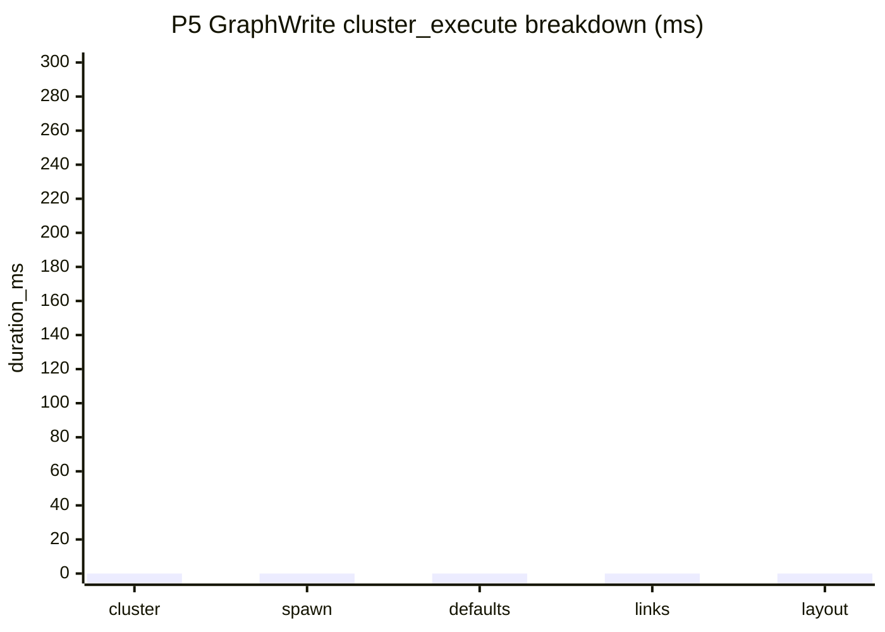

# P5 GraphWrite Cluster Execute Implementation Plan

> **For agentic workers:** REQUIRED SUB-SKILL: Use superpowers:subagent-driven-development (recommended) or superpowers:executing-plans to implement this plan task-by-task. Steps use checkbox (`- [ ]`) syntax for tracking.

**Goal:** 降低 GraphWrite `cluster_execute` 中 node spawn、pin lookup、linking 和 layout record 的成本，并把这些成本拆成可观测的通用阶段。

**Architecture:** P5 不改变 TaskSpec、TaskPlan、preview token、Review v2 或 GraphWrite 语义，只把 GraphWrite 的实际写图执行拆到 request-local context、纯数据 mutation plan、plan executor 和 stats DTO 边界中。`GraphMutationPlan` 只保存纯 DTO；`GraphWriteContext` 只在 MainThreadCommit / GraphWrite execute 期间持有 `UEdGraph`、`UK2Node`、`UEdGraphPin` 指针，并在单次请求结束后销毁。

**Tech Stack:** UE 5.6 C++、BlueprintHelper GraphWrite pipeline、TaskRuntime `--develop` timing、Unreal automation tests、Node architecture tests、BlueprintHelper CLI preview/execute benchmark。

**Execution Status (2026-05-20):** 计划已写，待执行。执行前必须先确认 P4 未提交文件和其他工作区改动，避免提交范围混入无关变更。

---

## 0. Scope And Constraints

P5 只覆盖 GraphWrite `cluster_execute` 的真实执行成本，不修改 compiler fast path、preview token store、partial preview cache、Review IO、compile/save 策略。

- [ ] 不缓存 `UObject*` / `UBlueprint*` / `UEdGraph*` / `UEdGraphNode*` / `UEdGraphPin*` 到 Editor 生命周期 cache。
- [ ] `GraphWriteContext` 是 request-local / graph-local 执行上下文，只允许在 MainThreadCommit 同步路径内使用。
- [ ] `GraphMutationPlan` 是纯数据 DTO，不触碰 `UObject`，可被 P4 `GraphWritePlanCache` 或未来 PurePrepare 复用。
- [ ] 不新增 namespace；新增行为类必须有独立 `.h/.cpp`。
- [ ] 不把长 `if` / `switch` 继续堆进 `BlueprintGraphGenerationPipeline.cpp`；新增策略放到 builder / context / executor / utils 边界。
- [ ] 不新增 legacy GraphWrite fallback；正常 TaskPlan GraphWrite 仍以 `logic_spec/SemanticIR` 为主路径。
- [ ] 普通 CLI/tool 调用不返回 stats；只有 `--develop` / `include_timing=true` 输出 `graph_write_execution_stats`。
- [ ] 任务完成后不由 Agent 执行 `git add`、`git commit`、`git push`；只输出建议提交命令。

## 1. Target File Structure

### UE C++

- Create `BlueprintHelper/Source/BlueprintHelper/Public/Systems/ToolClusters/GraphWrite/Pipeline/BlueprintGraphWriteExecutionStats.h`
- Create `BlueprintHelper/Source/BlueprintHelper/Private/Systems/ToolClusters/GraphWrite/Pipeline/BlueprintGraphWriteExecutionStats.cpp`
- Create `BlueprintHelper/Source/BlueprintHelper/Public/Systems/ToolClusters/GraphWrite/Pipeline/BlueprintGraphWriteContext.h`
- Create `BlueprintHelper/Source/BlueprintHelper/Private/Systems/ToolClusters/GraphWrite/Pipeline/BlueprintGraphWriteContext.cpp`
- Create `BlueprintHelper/Source/BlueprintHelper/Public/Systems/ToolClusters/GraphWrite/Pipeline/BlueprintGraphMutationPlan.h`
- Create `BlueprintHelper/Source/BlueprintHelper/Private/Systems/ToolClusters/GraphWrite/Pipeline/BlueprintGraphMutationPlan.cpp`
- Create `BlueprintHelper/Source/BlueprintHelper/Private/Systems/ToolClusters/GraphWrite/Pipeline/BlueprintGraphMutationPlanBuilder.h`
- Create `BlueprintHelper/Source/BlueprintHelper/Private/Systems/ToolClusters/GraphWrite/Pipeline/BlueprintGraphMutationPlanBuilder.cpp`
- Create `BlueprintHelper/Source/BlueprintHelper/Private/Systems/ToolClusters/GraphWrite/Pipeline/BlueprintGraphMutationPlanExecutor.h`
- Create `BlueprintHelper/Source/BlueprintHelper/Private/Systems/ToolClusters/GraphWrite/Pipeline/BlueprintGraphMutationPlanExecutor.cpp`
- Modify `BlueprintHelper/Source/BlueprintHelper/Public/Systems/ToolClusters/GraphWrite/BlueprintGraphWriteFacade.h`
- Modify `BlueprintHelper/Source/BlueprintHelper/Private/Systems/ToolClusters/GraphWrite/BlueprintGraphWriteFacade.cpp`
- Modify `BlueprintHelper/Source/BlueprintHelper/Public/Systems/ToolClusters/GraphWrite/Pipeline/BlueprintGraphDefaultValueApplier.h`
- Modify `BlueprintHelper/Source/BlueprintHelper/Private/Systems/ToolClusters/GraphWrite/Pipeline/BlueprintGraphDefaultValueApplier.cpp`
- Modify `BlueprintHelper/Source/BlueprintHelper/Public/Systems/ToolClusters/GraphWrite/Pipeline/BlueprintGraphLinker.h`
- Modify `BlueprintHelper/Source/BlueprintHelper/Private/Systems/ToolClusters/GraphWrite/Pipeline/BlueprintGraphLinker.cpp`
- Modify `BlueprintHelper/Source/BlueprintHelper/Public/Systems/ToolClusters/GraphWrite/Pipeline/BlueprintGraphNodeUtility.h`
- Modify `BlueprintHelper/Source/BlueprintHelper/Private/Systems/ToolClusters/GraphWrite/Pipeline/BlueprintGraphNodeUtility.cpp`
- Modify `BlueprintHelper/Source/BlueprintHelper/Public/Systems/ToolClusters/GraphWrite/Pipeline/BlueprintGraphGenerationPipeline.h`
- Modify `BlueprintHelper/Source/BlueprintHelper/Private/Systems/ToolClusters/GraphWrite/Pipeline/BlueprintGraphGenerationPipeline.cpp`
- Modify `BlueprintHelper/Source/BlueprintHelper/Private/Systems/ToolClusters/GraphWrite/BlueprintHelperAppendBlueprintGraphService.cpp`
- Modify `BlueprintHelper/Source/BlueprintHelper/Private/Runtime/TaskRuntime/BlueprintHelperTaskRuntimeService.cpp`

### Tests

- Create `BlueprintHelper/Source/BlueprintHelper/Private/Tests/GraphWrite/BlueprintGraphWriteExecutionStatsTests.cpp`
- Create `BlueprintHelper/Source/BlueprintHelper/Private/Tests/GraphWrite/BlueprintGraphWriteContextTests.cpp`
- Create `BlueprintHelper/Source/BlueprintHelper/Private/Tests/GraphWrite/BlueprintGraphMutationPlanTests.cpp`
- Create `BlueprintHelper/Source/BlueprintHelper/Private/Tests/GraphWrite/BlueprintGraphMutationPlanExecutorTests.cpp`
- Modify `AgentFaceService/task-core/src/tests/architecture/architecture-boundaries.test.ts`

### Docs

- Modify `BlueprintHelper/Develop/Plan/BlueprintHelper_v0.5.0_TaskSpecExecution_PerformanceOptimization_20260519_CN.md`
- Modify `BlueprintHelper/Develop/Plan/Optimization/BlueprintHelper_v0.5.0_TaskSpecExecution_PerformanceOptimization_20260519_CN/README.md`
- Modify this document as execution status changes.

## 2. Current Baseline And Target

基线来自总优化文档当前记录：`04b_write_function_body.json` 的 execute `cluster_execute` 约 `275ms`，属于 GraphWrite 真正写图阶段的主要成本之一。

目标：

| 指标 | 当前参考 | P5 目标 |
| --- | ---: | ---: |
| `step.<id>.cluster_execute` | 约 275ms | 80-150ms |
| pin lookup | 每条 default/link 可能重复扫描 pins | 每个 node 建一次 pin map，后续 O(1) 查询 |
| layout record | service 末尾统一 record，但缺少局部 stats | 记录 layout node 数量和耗时 |
| develop diagnostics | 只有整体 `cluster_execute` | 输出 spawn/default/link/layout 子阶段 stats |

## 3. Task P5-0: GraphWrite Execution Stats Boundary

**Files:**
- Create: `BlueprintHelper/Source/BlueprintHelper/Public/Systems/ToolClusters/GraphWrite/Pipeline/BlueprintGraphWriteExecutionStats.h`
- Create: `BlueprintHelper/Source/BlueprintHelper/Private/Systems/ToolClusters/GraphWrite/Pipeline/BlueprintGraphWriteExecutionStats.cpp`
- Create: `BlueprintHelper/Source/BlueprintHelper/Private/Tests/GraphWrite/BlueprintGraphWriteExecutionStatsTests.cpp`
- Modify: `BlueprintHelper/Source/BlueprintHelper/Public/Systems/ToolClusters/GraphWrite/BlueprintGraphWriteFacade.h`

- [ ] **Step 1: Write failing stats serialization test**

Create `BlueprintGraphWriteExecutionStatsTests.cpp` with this test shape:

```cpp
#if WITH_DEV_AUTOMATION_TESTS

#include "Misc/AutomationTest.h"
#include "Systems/ToolClusters/GraphWrite/Pipeline/BlueprintGraphWriteExecutionStats.h"

IMPLEMENT_SIMPLE_AUTOMATION_TEST(
	FBlueprintGraphWriteExecutionStatsToJsonTest,
	"BlueprintHelper.GraphWrite.ExecutionStats.ToJson",
	EAutomationTestFlags::EditorContext | EAutomationTestFlags::EngineFilter)

bool FBlueprintGraphWriteExecutionStatsToJsonTest::RunTest(const FString&)
{
	FBlueprintGraphWriteExecutionStats Stats;
	Stats.RequestedNodeCount = 3;
	Stats.SpawnedNodeCount = 3;
	Stats.RequestedDefaultValueCount = 2;
	Stats.AppliedDefaultValueCount = 2;
	Stats.RequestedLinkCount = 2;
	Stats.CreatedLinkCount = 2;
	Stats.LayoutRecordNodeCount = 3;
	Stats.SpawnNodesMs = 11.5;
	Stats.ApplyDefaultsMs = 2.25;
	Stats.ConnectLinksMs = 3.75;
	Stats.RecordLayoutMs = 1.0;

	const TSharedRef<FJsonObject> Json = FBlueprintGraphWriteExecutionStatsSerializer::ToJson(Stats);
	TestEqual(TEXT("spawned node count"), Json->GetIntegerField(TEXT("spawned_node_count")), 3);
	TestEqual(TEXT("created link count"), Json->GetIntegerField(TEXT("created_link_count")), 2);
	TestEqual(TEXT("spawn ms"), Json->GetNumberField(TEXT("spawn_nodes_ms")), 11.5);
	return true;
}

#endif
```

- [ ] **Step 2: Run test to verify it fails**

Run compile after adding the test:

```powershell
& "E:\UE_5.6\Engine\Build\BatchFiles\Build.bat" TemplateEditor Win64 Development "D:\UEProjects\Template\Template.uproject" -WaitMutex
```

Expected: compile fails because `BlueprintGraphWriteExecutionStats.h` does not exist.

- [ ] **Step 3: Implement stats DTO and serializer**

Create `BlueprintGraphWriteExecutionStats.h`:

```cpp
#pragma once

#include "CoreMinimal.h"

class FJsonObject;

struct BLUEPRINTHELPER_API FBlueprintGraphWriteExecutionStats
{
	int32 RequestedNodeCount = 0;
	int32 SpawnedNodeCount = 0;
	int32 RequestedDefaultValueCount = 0;
	int32 AppliedDefaultValueCount = 0;
	int32 RequestedLinkCount = 0;
	int32 CreatedLinkCount = 0;
	int32 LayoutRecordNodeCount = 0;
	double BuildContextMs = 0.0;
	double BuildPlanMs = 0.0;
	double SpawnNodesMs = 0.0;
	double ApplyDefaultsMs = 0.0;
	double ConnectLinksMs = 0.0;
	double RecordLayoutMs = 0.0;
};

class BLUEPRINTHELPER_API FBlueprintGraphWriteExecutionStatsSerializer
{
public:
	static TSharedRef<FJsonObject> ToJson(const FBlueprintGraphWriteExecutionStats& Stats);
};
```

Create `BlueprintGraphWriteExecutionStats.cpp`:

```cpp
#include "Systems/ToolClusters/GraphWrite/Pipeline/BlueprintGraphWriteExecutionStats.h"

#include "Dom/JsonObject.h"

TSharedRef<FJsonObject> FBlueprintGraphWriteExecutionStatsSerializer::ToJson(
	const FBlueprintGraphWriteExecutionStats& Stats)
{
	TSharedRef<FJsonObject> Json = MakeShared<FJsonObject>();
	Json->SetIntegerField(TEXT("requested_node_count"), Stats.RequestedNodeCount);
	Json->SetIntegerField(TEXT("spawned_node_count"), Stats.SpawnedNodeCount);
	Json->SetIntegerField(TEXT("requested_default_value_count"), Stats.RequestedDefaultValueCount);
	Json->SetIntegerField(TEXT("applied_default_value_count"), Stats.AppliedDefaultValueCount);
	Json->SetIntegerField(TEXT("requested_link_count"), Stats.RequestedLinkCount);
	Json->SetIntegerField(TEXT("created_link_count"), Stats.CreatedLinkCount);
	Json->SetIntegerField(TEXT("layout_record_node_count"), Stats.LayoutRecordNodeCount);
	Json->SetNumberField(TEXT("build_context_ms"), Stats.BuildContextMs);
	Json->SetNumberField(TEXT("build_plan_ms"), Stats.BuildPlanMs);
	Json->SetNumberField(TEXT("spawn_nodes_ms"), Stats.SpawnNodesMs);
	Json->SetNumberField(TEXT("apply_defaults_ms"), Stats.ApplyDefaultsMs);
	Json->SetNumberField(TEXT("connect_links_ms"), Stats.ConnectLinksMs);
	Json->SetNumberField(TEXT("record_layout_ms"), Stats.RecordLayoutMs);
	return Json;
}
```

Modify `FBlueprintGenerateResult` in `BlueprintGraphWriteFacade.h`:

```cpp
#include "Systems/ToolClusters/GraphWrite/Pipeline/BlueprintGraphWriteExecutionStats.h"

struct FBlueprintGenerateResult
{
	bool bSucceed = false;
	int32 GeneratedNodeCount = 0;
	int32 RequestedDefaultValueCount = 0;
	int32 AppliedDefaultValueCount = 0;
	TArray<FBlueprintGeneratorDiagnostic> DefaultValueDiagnostics;
	int32 RequestedConnectionCount = 0;
	int32 CreatedConnectionCount = 0;
	TArray<FBlueprintGeneratorDiagnostic> ConnectionDiagnostics;
	int32 UnresolvedNodeCount = 0;
	FString Message;
	FBlueprintGraphWriteExecutionStats ExecutionStats;
};
```

- [ ] **Step 4: Run stats test to verify it passes**

Run:

```powershell
& "E:\UE_5.6\Engine\Build\BatchFiles\Build.bat" TemplateEditor Win64 Development "D:\UEProjects\Template\Template.uproject" -WaitMutex
```

Expected: compile succeeds. The automation test is available under `BlueprintHelper.GraphWrite.ExecutionStats.ToJson`.

## 4. Task P5-1: Request-Local GraphWriteContext

**Files:**
- Create: `BlueprintHelper/Source/BlueprintHelper/Public/Systems/ToolClusters/GraphWrite/Pipeline/BlueprintGraphWriteContext.h`
- Create: `BlueprintHelper/Source/BlueprintHelper/Private/Systems/ToolClusters/GraphWrite/Pipeline/BlueprintGraphWriteContext.cpp`
- Create: `BlueprintHelper/Source/BlueprintHelper/Private/Tests/GraphWrite/BlueprintGraphWriteContextTests.cpp`
- Modify: `BlueprintHelper/Source/BlueprintHelper/Public/Systems/ToolClusters/GraphWrite/Pipeline/BlueprintGraphNodeUtility.h`
- Modify: `BlueprintHelper/Source/BlueprintHelper/Private/Systems/ToolClusters/GraphWrite/Pipeline/BlueprintGraphNodeUtility.cpp`

- [ ] **Step 1: Write failing context pin index test**

Create an automation test that uses a lightweight null-safe path first:

```cpp
#if WITH_DEV_AUTOMATION_TESTS

#include "Misc/AutomationTest.h"
#include "Systems/ToolClusters/GraphWrite/Pipeline/BlueprintGraphWriteContext.h"

IMPLEMENT_SIMPLE_AUTOMATION_TEST(
	FBlueprintGraphWriteContextNullSafeTest,
	"BlueprintHelper.GraphWrite.Context.NullSafe",
	EAutomationTestFlags::EditorContext | EAutomationTestFlags::EngineFilter)

bool FBlueprintGraphWriteContextNullSafeTest::RunTest(const FString&)
{
	FBlueprintGraphWriteContext Context;
	Context.Initialize(nullptr);

	TestFalse(TEXT("invalid graph context"), Context.IsValid());
	TestNull(TEXT("null node lookup"), Context.FindNode(TEXT("missing")));
	TestNull(TEXT("null pin lookup"), Context.FindPinByAlias(TEXT("missing"), TEXT("execute")));
	TestEqual(TEXT("generated node count"), Context.GetGeneratedNodes().Num(), 0);
	return true;
}

#endif
```

- [ ] **Step 2: Run test to verify it fails**

Run UE build. Expected: compile fails because `FBlueprintGraphWriteContext` does not exist.

- [ ] **Step 3: Implement context class**

Create `BlueprintGraphWriteContext.h`:

```cpp
#pragma once

#include "CoreMinimal.h"

class UEdGraph;
class UEdGraphPin;
class UEdGraphNode;
class UK2Node;

class BLUEPRINTHELPER_API FBlueprintGraphWriteContext
{
public:
	void Initialize(UEdGraph* InGraph);
	bool IsValid() const;
	UEdGraph* GetGraph() const;

	void RegisterNode(const FString& NodeId, UK2Node* Node, bool bGenerated);
	UK2Node* FindNode(const FString& NodeId) const;
	UEdGraphPin* FindPinByAlias(const FString& NodeId, const FString& RequestedPinName);

	const TArray<UEdGraphNode*>& GetGeneratedNodes() const;

private:
	void BuildPinIndex(UK2Node* Node);
	static FString MakePinLookupKey(UK2Node* Node);

	UEdGraph* Graph = nullptr;
	TMap<FString, UK2Node*> IdToNode;
	TMap<FString, TMap<FString, UEdGraphPin*>> PinIndexByNodeKey;
	TArray<UEdGraphNode*> GeneratedNodes;
};
```

Create `BlueprintGraphWriteContext.cpp`:

```cpp
#include "Systems/ToolClusters/GraphWrite/Pipeline/BlueprintGraphWriteContext.h"

#include "EdGraph/EdGraph.h"
#include "EdGraph/EdGraphNode.h"
#include "EdGraph/EdGraphPin.h"
#include "K2Node.h"
#include "Systems/ToolClusters/GraphWrite/Pipeline/BlueprintGraphNodeUtility.h"

void FBlueprintGraphWriteContext::Initialize(UEdGraph* InGraph)
{
	Graph = InGraph;
	IdToNode.Empty();
	PinIndexByNodeKey.Empty();
	GeneratedNodes.Empty();
}

bool FBlueprintGraphWriteContext::IsValid() const
{
	return Graph != nullptr;
}

UEdGraph* FBlueprintGraphWriteContext::GetGraph() const
{
	return Graph;
}

void FBlueprintGraphWriteContext::RegisterNode(const FString& NodeId, UK2Node* Node, bool bGenerated)
{
	if (NodeId.IsEmpty() || !Node)
	{
		return;
	}
	IdToNode.FindOrAdd(NodeId, Node);
	if (bGenerated)
	{
		GeneratedNodes.AddUnique(Node);
	}
	BuildPinIndex(Node);
}

UK2Node* FBlueprintGraphWriteContext::FindNode(const FString& NodeId) const
{
	if (const UK2Node* const* Found = IdToNode.Find(NodeId))
	{
		return const_cast<UK2Node*>(*Found);
	}
	return nullptr;
}

UEdGraphPin* FBlueprintGraphWriteContext::FindPinByAlias(const FString& NodeId, const FString& RequestedPinName)
{
	UK2Node* Node = FindNode(NodeId);
	if (!Node)
	{
		return nullptr;
	}

	const FString NodeKey = MakePinLookupKey(Node);
	if (!PinIndexByNodeKey.Contains(NodeKey))
	{
		BuildPinIndex(Node);
	}

	const FString NormalizedPin = FBlueprintGraphNodeUtility::NormalizePinKey(RequestedPinName);
	if (TMap<FString, UEdGraphPin*>* PinIndex = PinIndexByNodeKey.Find(NodeKey))
	{
		if (UEdGraphPin** FoundPin = PinIndex->Find(NormalizedPin))
		{
			return *FoundPin;
		}
	}
	return FBlueprintGraphNodeUtility::FindPinByAlias(Node, RequestedPinName);
}

const TArray<UEdGraphNode*>& FBlueprintGraphWriteContext::GetGeneratedNodes() const
{
	return GeneratedNodes;
}

void FBlueprintGraphWriteContext::BuildPinIndex(UK2Node* Node)
{
	if (!Node)
	{
		return;
	}

	TMap<FString, UEdGraphPin*> PinIndex;
	for (UEdGraphPin* Pin : Node->Pins)
	{
		if (!Pin)
		{
			continue;
		}
		PinIndex.FindOrAdd(FBlueprintGraphNodeUtility::NormalizePinKey(Pin->PinName.ToString()), Pin);
		PinIndex.FindOrAdd(FBlueprintGraphNodeUtility::NormalizePinKey(Pin->GetDisplayName().ToString()), Pin);
	}
	PinIndexByNodeKey.Add(MakePinLookupKey(Node), MoveTemp(PinIndex));
}

FString FBlueprintGraphWriteContext::MakePinLookupKey(UK2Node* Node)
{
	return Node ? Node->NodeGuid.ToString(EGuidFormats::Digits) : TEXT("");
}
```

- [ ] **Step 4: Run context test to verify it passes**

Run UE build. Expected: compile succeeds and null-safe context test is available.

## 5. Task P5-2: Move Default And Link Pin Lookup To Context

**Files:**
- Modify: `BlueprintHelper/Source/BlueprintHelper/Public/Systems/ToolClusters/GraphWrite/Pipeline/BlueprintGraphDefaultValueApplier.h`
- Modify: `BlueprintHelper/Source/BlueprintHelper/Private/Systems/ToolClusters/GraphWrite/Pipeline/BlueprintGraphDefaultValueApplier.cpp`
- Modify: `BlueprintHelper/Source/BlueprintHelper/Public/Systems/ToolClusters/GraphWrite/Pipeline/BlueprintGraphLinker.h`
- Modify: `BlueprintHelper/Source/BlueprintHelper/Private/Systems/ToolClusters/GraphWrite/Pipeline/BlueprintGraphLinker.cpp`
- Modify: `AgentFaceService/task-core/src/tests/architecture/architecture-boundaries.test.ts`

- [ ] **Step 1: Add architecture test for context-based lookup**

Add this test to `architecture-boundaries.test.ts`:

```ts
test('GraphWrite linker and default applier use GraphWriteContext pin lookup', () => {
  const linker = fs.readFileSync(
    path.resolve(UE_SOURCE_ROOT, 'Private', 'Systems', 'ToolClusters', 'GraphWrite', 'Pipeline', 'BlueprintGraphLinker.cpp'),
    'utf8',
  );
  const defaultApplier = fs.readFileSync(
    path.resolve(UE_SOURCE_ROOT, 'Private', 'Systems', 'ToolClusters', 'GraphWrite', 'Pipeline', 'BlueprintGraphDefaultValueApplier.cpp'),
    'utf8',
  );

  assert.match(linker, /FBlueprintGraphWriteContext/u);
  assert.match(defaultApplier, /FBlueprintGraphWriteContext/u);
  assert.doesNotMatch(linker, /FBlueprintGraphNodeUtility::FindPinByAlias/u);
  assert.doesNotMatch(defaultApplier, /FBlueprintGraphNodeUtility::FindPinByAlias/u);
});
```

- [ ] **Step 2: Run architecture test to verify it fails**

Run:

```powershell
npm.cmd --prefix .\AgentFaceService\task-core run build
node .\AgentFaceService\task-core\build\tests\architecture\architecture-boundaries.test.js
```

Expected: the new test fails until linker/default applier accept `FBlueprintGraphWriteContext`.

- [ ] **Step 3: Add context overloads**

Update `BlueprintGraphDefaultValueApplier.h`:

```cpp
class FBlueprintGraphWriteContext;

class BLUEPRINTHELPER_API FBlueprintGraphDefaultValueApplier
{
public:
	static bool ApplyPinDefaultValue(UEdGraphPin* TargetPin, const FString& InValue, FString& OutDiagnosticCode, FString& OutMessage);
	static TArray<FBlueprintGeneratorDiagnostic> ApplyDefaultValues(FBlueprintGraphWriteContext& Context, const FString& NodeId, const TMap<FString, FString>& DefaultValues);
	static TArray<FBlueprintGeneratorDiagnostic> ApplyDefaultValues(UK2Node* TargetNode, const TMap<FString, FString>& DefaultValues, const FString& NodeId = TEXT(""));
};
```

Update the new overload implementation:

```cpp
TArray<FBlueprintGeneratorDiagnostic> FBlueprintGraphDefaultValueApplier::ApplyDefaultValues(
	FBlueprintGraphWriteContext& Context,
	const FString& NodeId,
	const TMap<FString, FString>& DefaultValues)
{
	TArray<FBlueprintGeneratorDiagnostic> Diagnostics;
	for (const TPair<FString, FString>& Pair : DefaultValues)
	{
		UEdGraphPin* Pin = Context.FindPinByAlias(NodeId, Pair.Key);
		if (!Pin)
		{
			Diagnostics.Add(FBlueprintGraphNodeUtility::MakeGeneratorDiagnostic(
				TEXT("default_value_pin_not_found"),
				NodeId,
				Pair.Key,
				FString::Printf(TEXT("Default value target pin not found: %s.%s."), *NodeId, *Pair.Key)));
			continue;
		}

		FString DiagnosticCode;
		FString DiagnosticMessage;
		if (!ApplyPinDefaultValue(Pin, Pair.Value, DiagnosticCode, DiagnosticMessage))
		{
			Diagnostics.Add(FBlueprintGraphNodeUtility::MakeGeneratorDiagnostic(DiagnosticCode, NodeId, Pair.Key, DiagnosticMessage));
		}
	}
	return Diagnostics;
}
```

Update `BlueprintGraphLinker.h`:

```cpp
class FBlueprintGraphWriteContext;

class BLUEPRINTHELPER_API FBlueprintGraphLinker
{
public:
	static int32 ConnectComposerExecChain(UEdGraph* TargetGraph, const TArray<FParsedLink>& ParsedLinks, const TArray<FBlueprintHelperNodeFragment>& GeneratedFragments, TArray<FBlueprintGeneratorDiagnostic>& ConnectionDiagnostics);
	static int32 ConnectExplicitLinks(FBlueprintGraphWriteContext& Context, const TArray<FParsedLink>& ParsedLinks, TArray<FBlueprintGeneratorDiagnostic>& ConnectionDiagnostics);
	static int32 ConnectExplicitLinks(UEdGraph* TargetGraph, const TArray<FParsedLink>& ParsedLinks, const TMap<FString, UK2Node*>& IdToSpawnedNode, TArray<FBlueprintGeneratorDiagnostic>& ConnectionDiagnostics);
	static int32 ConnectFragmentDataEdges(UEdGraph* TargetGraph, const TArray<FBlueprintHelperNodeFragment>& GeneratedFragments, const TArray<FBlueprintHelperGraphFragmentDataEdge>& DataEdges, TArray<FBlueprintGeneratorDiagnostic>& ConnectionDiagnostics);
};
```

Implement context-based linker:

```cpp
int32 FBlueprintGraphLinker::ConnectExplicitLinks(
	FBlueprintGraphWriteContext& Context,
	const TArray<FParsedLink>& ParsedLinks,
	TArray<FBlueprintGeneratorDiagnostic>& ConnectionDiagnostics)
{
	const UEdGraphSchema_K2* Schema = GetDefault<UEdGraphSchema_K2>();
	int32 CreatedConnectionCount = 0;
	for (const FParsedLink& ParsedLink : ParsedLinks)
	{
		UK2Node* FromNode = Context.FindNode(ParsedLink.FromId);
		UK2Node* ToNode = Context.FindNode(ParsedLink.ToId);
		UEdGraphPin* FromPin = Context.FindPinByAlias(ParsedLink.FromId, ParsedLink.FromPin);
		UEdGraphPin* ToPin = Context.FindPinByAlias(ParsedLink.ToId, ParsedLink.ToPin);
		if (!Schema || !FromNode || !ToNode || !FromPin || !ToPin)
		{
			ConnectionDiagnostics.Add(FBlueprintGraphNodeUtility::MakeGeneratorDiagnostic(
				TEXT("link_pin_not_found"),
				ParsedLink.FromId,
				ParsedLink.FromPin,
				FString::Printf(TEXT("Unable to resolve link endpoint: %s.%s -> %s.%s."), *ParsedLink.FromId, *ParsedLink.FromPin, *ParsedLink.ToId, *ParsedLink.ToPin)));
			continue;
		}
		const FPinConnectionResponse ConnectionResponse = Schema->CanCreateConnection(FromPin, ToPin);
		if (Schema->TryCreateConnection(FromPin, ToPin))
		{
			++CreatedConnectionCount;
		}
		else
		{
			ConnectionDiagnostics.Add(FBlueprintGraphNodeUtility::MakeGeneratorDiagnostic(
				TEXT("link_connection_rejected"),
				ParsedLink.FromId,
				ParsedLink.FromPin,
				ConnectionResponse.Message.IsEmpty() ? TEXT("Schema rejected link.") : ConnectionResponse.Message.ToString()));
		}
	}
	return CreatedConnectionCount;
}
```

- [ ] **Step 4: Run architecture test and UE build**

Run:

```powershell
npm.cmd --prefix .\AgentFaceService\task-core run build
node .\AgentFaceService\task-core\build\tests\architecture\architecture-boundaries.test.js
& "E:\UE_5.6\Engine\Build\BatchFiles\Build.bat" TemplateEditor Win64 Development "D:\UEProjects\Template\Template.uproject" -WaitMutex
```

Expected: Node architecture tests pass and UE build succeeds.

## 6. Task P5-3: Pure GraphMutationPlan DTO

**Files:**
- Create: `BlueprintHelper/Source/BlueprintHelper/Public/Systems/ToolClusters/GraphWrite/Pipeline/BlueprintGraphMutationPlan.h`
- Create: `BlueprintHelper/Source/BlueprintHelper/Private/Systems/ToolClusters/GraphWrite/Pipeline/BlueprintGraphMutationPlan.cpp`
- Create: `BlueprintHelper/Source/BlueprintHelper/Private/Tests/GraphWrite/BlueprintGraphMutationPlanTests.cpp`

- [ ] **Step 1: Write failing pure DTO test**

Create a test proving the DTO can describe node/default/link/layout work without holding UE pointers:

```cpp
#if WITH_DEV_AUTOMATION_TESTS

#include "Misc/AutomationTest.h"
#include "Systems/ToolClusters/GraphWrite/Pipeline/BlueprintGraphMutationPlan.h"

IMPLEMENT_SIMPLE_AUTOMATION_TEST(
	FBlueprintGraphMutationPlanPureDtoTest,
	"BlueprintHelper.GraphWrite.MutationPlan.PureDto",
	EAutomationTestFlags::EditorContext | EAutomationTestFlags::EngineFilter)

bool FBlueprintGraphMutationPlanPureDtoTest::RunTest(const FString&)
{
	FBlueprintGraphMutationPlan Plan;
	Plan.GraphName = TEXT("EventGraph");

	FBlueprintGraphMutationNodePlan NodePlan;
	NodePlan.NodeId = TEXT("print_001");
	NodePlan.NodeType = EParsedBlueprintNodeType::CallFunction;
	NodePlan.FunctionName = TEXT("PrintString");
	NodePlan.DefaultValues.Add(TEXT("InString"), TEXT("Hello"));
	Plan.Nodes.Add(NodePlan);

	FBlueprintGraphMutationLinkPlan LinkPlan;
	LinkPlan.FromId = TEXT("entry");
	LinkPlan.FromPin = TEXT("then");
	LinkPlan.ToId = TEXT("print_001");
	LinkPlan.ToPin = TEXT("execute");
	Plan.Links.Add(LinkPlan);

	TestTrue(TEXT("valid plan"), Plan.IsValid());
	TestEqual(TEXT("requested nodes"), Plan.CountRequestedNodes(), 1);
	TestEqual(TEXT("requested defaults"), Plan.CountRequestedDefaultValues(), 1);
	TestEqual(TEXT("requested links"), Plan.CountRequestedLinks(), 1);
	return true;
}

#endif
```

- [ ] **Step 2: Run test to verify it fails**

Run UE build. Expected: compile fails because `BlueprintGraphMutationPlan.h` does not exist.

- [ ] **Step 3: Implement pure plan DTO**

Create `BlueprintGraphMutationPlan.h`:

```cpp
#pragma once

#include "CoreMinimal.h"
#include "Systems/ToolClusters/GraphWrite/BlueprintGraphWriteFacade.h"

struct BLUEPRINTHELPER_API FBlueprintGraphMutationNodePlan
{
	FString NodeId;
	EParsedBlueprintNodeType NodeType = EParsedBlueprintNodeType::Unknown;
	FString FunctionName;
	FString ResolvedCallFunctionStableId;
	FParsedNode ParsedNode;
	TMap<FString, FString> DefaultValues;
};

struct BLUEPRINTHELPER_API FBlueprintGraphMutationLinkPlan
{
	FString FromId;
	FString FromPin;
	FString ToId;
	FString ToPin;
};

struct BLUEPRINTHELPER_API FBlueprintGraphMutationLayoutPlan
{
	FString NodeId;
	float X = 0.0f;
	float Y = 0.0f;
};

struct BLUEPRINTHELPER_API FBlueprintGraphMutationPlan
{
	FString GraphName;
	TArray<FBlueprintGraphMutationNodePlan> Nodes;
	TArray<FBlueprintGraphMutationLinkPlan> Links;
	TArray<FBlueprintGraphMutationLayoutPlan> Layouts;

	bool IsValid() const;
	int32 CountRequestedNodes() const;
	int32 CountRequestedDefaultValues() const;
	int32 CountRequestedLinks() const;
};
```

Create `BlueprintGraphMutationPlan.cpp`:

```cpp
#include "Systems/ToolClusters/GraphWrite/Pipeline/BlueprintGraphMutationPlan.h"

bool FBlueprintGraphMutationPlan::IsValid() const
{
	return !GraphName.IsEmpty() && Nodes.Num() > 0;
}

int32 FBlueprintGraphMutationPlan::CountRequestedNodes() const
{
	return Nodes.Num();
}

int32 FBlueprintGraphMutationPlan::CountRequestedDefaultValues() const
{
	int32 Count = 0;
	for (const FBlueprintGraphMutationNodePlan& Node : Nodes)
	{
		Count += Node.DefaultValues.Num();
	}
	return Count;
}

int32 FBlueprintGraphMutationPlan::CountRequestedLinks() const
{
	return Links.Num();
}
```

- [ ] **Step 4: Run pure DTO test**

Run UE build. Expected: compile succeeds and pure DTO test is available.

## 7. Task P5-4: GraphMutationPlanBuilder

**Files:**
- Create: `BlueprintHelper/Source/BlueprintHelper/Private/Systems/ToolClusters/GraphWrite/Pipeline/BlueprintGraphMutationPlanBuilder.h`
- Create: `BlueprintHelper/Source/BlueprintHelper/Private/Systems/ToolClusters/GraphWrite/Pipeline/BlueprintGraphMutationPlanBuilder.cpp`
- Create: `BlueprintHelper/Source/BlueprintHelper/Private/Tests/GraphWrite/BlueprintGraphMutationPlanBuilderTests.cpp`
- Modify: `BlueprintHelper/Source/BlueprintHelper/Private/Systems/ToolClusters/GraphWrite/Pipeline/BlueprintGraphGenerationPipeline.cpp`

- [ ] **Step 1: Write failing builder test for explicit node JSON**

Even though normal TaskPlan GraphWrite uses `logic_spec`, this builder test uses explicit nodes/links as a pure DTO fixture so plan construction can be tested without spawning UE nodes:

```cpp
#if WITH_DEV_AUTOMATION_TESTS

#include "Misc/AutomationTest.h"
#include "Serialization/JsonReader.h"
#include "Serialization/JsonSerializer.h"
#include "Systems/ToolClusters/GraphWrite/Pipeline/BlueprintGraphMutationPlanBuilder.h"

IMPLEMENT_SIMPLE_AUTOMATION_TEST(
	FBlueprintGraphMutationPlanBuilderExplicitJsonTest,
	"BlueprintHelper.GraphWrite.MutationPlanBuilder.ExplicitJson",
	EAutomationTestFlags::EditorContext | EAutomationTestFlags::EngineFilter)

bool FBlueprintGraphMutationPlanBuilderExplicitJsonTest::RunTest(const FString&)
{
	const FString JsonText = TEXT(R"({"graph_name":"EventGraph","nodes":[{"id":"print_001","type":"CallFunction","function":"PrintString","defaults":{"InString":"Hello"}}],"links":[{"from":"entry","from_pin":"then","to":"print_001","to_pin":"execute"}]})");
	TSharedPtr<FJsonObject> Json;
	TSharedRef<TJsonReader<>> Reader = TJsonReaderFactory<>::Create(JsonText);
	TestTrue(TEXT("json parse"), FJsonSerializer::Deserialize(Reader, Json));

	FBlueprintGraphMutationPlan Plan;
	TArray<FBlueprintGeneratorDiagnostic> Diagnostics;
	TestTrue(TEXT("build plan"), FBlueprintGraphMutationPlanBuilder::BuildFromGraphJson(Json, Plan, Diagnostics));
	TestEqual(TEXT("nodes"), Plan.CountRequestedNodes(), 1);
	TestEqual(TEXT("defaults"), Plan.CountRequestedDefaultValues(), 1);
	TestEqual(TEXT("links"), Plan.CountRequestedLinks(), 1);
	TestEqual(TEXT("diagnostics"), Diagnostics.Num(), 0);
	return true;
}

#endif
```

- [ ] **Step 2: Run test to verify it fails**

Run UE build. Expected: compile fails because `FBlueprintGraphMutationPlanBuilder` does not exist.

- [ ] **Step 3: Implement builder for pure JSON and SemanticIR handoff**

Create `BlueprintGraphMutationPlanBuilder.h`:

```cpp
#pragma once

#include "CoreMinimal.h"
#include "Systems/ToolClusters/GraphWrite/Pipeline/BlueprintGraphMutationPlan.h"

class FJsonObject;

class FBlueprintGraphMutationPlanBuilder
{
public:
	static bool BuildFromGraphJson(
		const TSharedPtr<FJsonObject>& GraphJsonObject,
		FBlueprintGraphMutationPlan& OutPlan,
		TArray<FBlueprintGeneratorDiagnostic>& OutDiagnostics);

	static FBlueprintGraphMutationNodePlan MakeNodePlanFromParsedNode(const FParsedNode& ParsedNode);
	static FBlueprintGraphMutationLinkPlan MakeLinkPlanFromParsedLink(const FParsedLink& ParsedLink);
};
```

Create `BlueprintGraphMutationPlanBuilder.cpp` with exact JSON parsing behavior:

```cpp
#include "Systems/ToolClusters/GraphWrite/Pipeline/BlueprintGraphMutationPlanBuilder.h"

#include "Dom/JsonObject.h"
#include "Dom/JsonValue.h"
#include "Systems/ToolClusters/GraphWrite/Pipeline/BlueprintGraphJsonParser.h"
#include "Systems/ToolClusters/GraphWrite/Pipeline/BlueprintGraphNodeUtility.h"

bool FBlueprintGraphMutationPlanBuilder::BuildFromGraphJson(
	const TSharedPtr<FJsonObject>& GraphJsonObject,
	FBlueprintGraphMutationPlan& OutPlan,
	TArray<FBlueprintGeneratorDiagnostic>& OutDiagnostics)
{
	OutPlan = FBlueprintGraphMutationPlan();
	OutDiagnostics.Empty();
	if (!GraphJsonObject.IsValid())
	{
		OutDiagnostics.Add(FBlueprintGraphNodeUtility::MakeGeneratorDiagnostic(TEXT("graph_json_invalid"), TEXT("graph"), TEXT(""), TEXT("Graph JSON object is invalid.")));
		return false;
	}

	GraphJsonObject->TryGetStringField(TEXT("graph_name"), OutPlan.GraphName);
	if (OutPlan.GraphName.IsEmpty())
	{
		OutPlan.GraphName = TEXT("EventGraph");
	}

	const TArray<TSharedPtr<FJsonValue>>* NodeValues = nullptr;
	if (GraphJsonObject->TryGetArrayField(TEXT("nodes"), NodeValues) && NodeValues)
	{
		for (const TSharedPtr<FJsonValue>& NodeValue : *NodeValues)
		{
			FParsedNode ParsedNode = FBlueprintGraphJsonParser::ParseNode(NodeValue->AsObject());
			OutPlan.Nodes.Add(MakeNodePlanFromParsedNode(ParsedNode));
		}
	}

	const TArray<TSharedPtr<FJsonValue>>* LinkValues = nullptr;
	if (GraphJsonObject->TryGetArrayField(TEXT("links"), LinkValues) && LinkValues)
	{
		for (const TSharedPtr<FJsonValue>& LinkValue : *LinkValues)
		{
			FParsedLink ParsedLink = FBlueprintGraphJsonParser::ParseLink(LinkValue->AsObject());
			OutPlan.Links.Add(MakeLinkPlanFromParsedLink(ParsedLink));
		}
	}

	return OutPlan.IsValid() || OutPlan.Links.Num() > 0;
}

FBlueprintGraphMutationNodePlan FBlueprintGraphMutationPlanBuilder::MakeNodePlanFromParsedNode(const FParsedNode& ParsedNode)
{
	FBlueprintGraphMutationNodePlan Plan;
	Plan.NodeId = ParsedNode.Id;
	Plan.NodeType = ParsedNode.NodeType;
	Plan.FunctionName = ParsedNode.FunctionName;
	Plan.ResolvedCallFunctionStableId = ParsedNode.ResolvedCallFunctionStableId;
	Plan.ParsedNode = ParsedNode;
	Plan.DefaultValues = ParsedNode.DefaultValues;
	return Plan;
}

FBlueprintGraphMutationLinkPlan FBlueprintGraphMutationPlanBuilder::MakeLinkPlanFromParsedLink(const FParsedLink& ParsedLink)
{
	FBlueprintGraphMutationLinkPlan Plan;
	Plan.FromId = ParsedLink.FromId;
	Plan.FromPin = ParsedLink.FromPin;
	Plan.ToId = ParsedLink.ToId;
	Plan.ToPin = ParsedLink.ToPin;
	return Plan;
}
```

- [ ] **Step 4: Run builder test**

Run UE build. Expected: compile succeeds and builder fixture test is available.

## 8. Task P5-5: GraphMutationPlanExecutor And Pipeline Integration

**Files:**
- Create: `BlueprintHelper/Source/BlueprintHelper/Private/Systems/ToolClusters/GraphWrite/Pipeline/BlueprintGraphMutationPlanExecutor.h`
- Create: `BlueprintHelper/Source/BlueprintHelper/Private/Systems/ToolClusters/GraphWrite/Pipeline/BlueprintGraphMutationPlanExecutor.cpp`
- Modify: `BlueprintHelper/Source/BlueprintHelper/Private/Systems/ToolClusters/GraphWrite/Pipeline/BlueprintGraphGenerationPipeline.cpp`
- Modify: `BlueprintHelper/Source/BlueprintHelper/Private/Systems/ToolClusters/GraphWrite/BlueprintHelperAppendBlueprintGraphService.cpp`
- Create: `BlueprintHelper/Source/BlueprintHelper/Private/Tests/GraphWrite/BlueprintGraphMutationPlanExecutorTests.cpp`

- [ ] **Step 1: Write failing executor null-safe test**

Create an executor test that proves invalid context fails with diagnostics instead of crashing:

```cpp
#if WITH_DEV_AUTOMATION_TESTS

#include "Misc/AutomationTest.h"
#include "Systems/ToolClusters/GraphWrite/Pipeline/BlueprintGraphMutationPlanExecutor.h"

IMPLEMENT_SIMPLE_AUTOMATION_TEST(
	FBlueprintGraphMutationPlanExecutorNullContextTest,
	"BlueprintHelper.GraphWrite.MutationPlanExecutor.NullContext",
	EAutomationTestFlags::EditorContext | EAutomationTestFlags::EngineFilter)

bool FBlueprintGraphMutationPlanExecutorNullContextTest::RunTest(const FString&)
{
	FBlueprintGraphWriteContext Context;
	FBlueprintGraphMutationPlan Plan;
	Plan.GraphName = TEXT("EventGraph");

	FBlueprintGenerateResult Result = FBlueprintGraphMutationPlanExecutor::Execute(Context, Plan);
	TestFalse(TEXT("execute fails"), Result.bSucceed);
	TestTrue(TEXT("message describes invalid context"), Result.Message.Contains(TEXT("GraphWrite context is invalid")));
	return true;
}

#endif
```

- [ ] **Step 2: Run test to verify it fails**

Run UE build. Expected: compile fails because executor does not exist.

- [ ] **Step 3: Implement executor phases**

Create `BlueprintGraphMutationPlanExecutor.h`:

```cpp
#pragma once

#include "CoreMinimal.h"
#include "Systems/ToolClusters/GraphWrite/BlueprintGraphWriteFacade.h"
#include "Systems/ToolClusters/GraphWrite/Pipeline/BlueprintGraphMutationPlan.h"
#include "Systems/ToolClusters/GraphWrite/Pipeline/BlueprintGraphWriteContext.h"

class FBlueprintGraphMutationPlanExecutor
{
public:
	static FBlueprintGenerateResult Execute(FBlueprintGraphWriteContext& Context, const FBlueprintGraphMutationPlan& Plan);

private:
	static void SpawnNodes(FBlueprintGraphWriteContext& Context, const FBlueprintGraphMutationPlan& Plan, FBlueprintGenerateResult& Result);
	static void ApplyDefaults(FBlueprintGraphWriteContext& Context, const FBlueprintGraphMutationPlan& Plan, FBlueprintGenerateResult& Result);
	static void ConnectLinks(FBlueprintGraphWriteContext& Context, const FBlueprintGraphMutationPlan& Plan, FBlueprintGenerateResult& Result);
};
```

Create `BlueprintGraphMutationPlanExecutor.cpp`:

```cpp
#include "Systems/ToolClusters/GraphWrite/Pipeline/BlueprintGraphMutationPlanExecutor.h"

#include "Systems/ToolClusters/GraphWrite/NodeHandlers/BlueprintNodeHandler.h"
#include "Systems/ToolClusters/GraphWrite/Pipeline/BlueprintGraphDefaultValueApplier.h"
#include "Systems/ToolClusters/GraphWrite/Pipeline/BlueprintGraphLinker.h"

FBlueprintGenerateResult FBlueprintGraphMutationPlanExecutor::Execute(
	FBlueprintGraphWriteContext& Context,
	const FBlueprintGraphMutationPlan& Plan)
{
	FBlueprintGenerateResult Result;
	Result.Message = TEXT("Graph mutation plan execution failed.");
	if (!Context.IsValid())
	{
		Result.Message = TEXT("GraphWrite context is invalid.");
		return Result;
	}

	SpawnNodes(Context, Plan, Result);
	ApplyDefaults(Context, Plan, Result);
	ConnectLinks(Context, Plan, Result);

	Result.GeneratedNodeCount = Result.ExecutionStats.SpawnedNodeCount;
	Result.RequestedDefaultValueCount = Result.ExecutionStats.RequestedDefaultValueCount;
	Result.AppliedDefaultValueCount = Result.ExecutionStats.AppliedDefaultValueCount;
	Result.RequestedConnectionCount = Result.ExecutionStats.RequestedLinkCount;
	Result.CreatedConnectionCount = Result.ExecutionStats.CreatedLinkCount;
	Result.UnresolvedNodeCount = 0;
	Result.bSucceed = Result.GeneratedNodeCount > 0 && Result.ConnectionDiagnostics.Num() == 0;
	Result.Message = Result.bSucceed
		? FString::Printf(TEXT("Graph mutation plan executed: %d nodes, %d links."), Result.GeneratedNodeCount, Result.CreatedConnectionCount)
		: TEXT("Graph mutation plan executed with diagnostics.");
	return Result;
}

void FBlueprintGraphMutationPlanExecutor::SpawnNodes(
	FBlueprintGraphWriteContext& Context,
	const FBlueprintGraphMutationPlan& Plan,
	FBlueprintGenerateResult& Result)
{
	Result.ExecutionStats.RequestedNodeCount = Plan.CountRequestedNodes();
	for (const FBlueprintGraphMutationNodePlan& NodePlan : Plan.Nodes)
	{
		FString Error;
		IBlueprintNodeHandler* Handler = FBlueprintNodeHandlerRegistry::Get().FindHandler(NodePlan.NodeType);
		UK2Node* Node = Handler ? Handler->Spawn(Context.GetGraph(), NodePlan.ParsedNode, Error) : nullptr;
		if (!Node)
		{
			Result.ConnectionDiagnostics.Add(FBlueprintGraphNodeUtility::MakeGeneratorDiagnostic(TEXT("node_spawn_failed"), NodePlan.NodeId, TEXT(""), Error));
			continue;
		}
		Context.RegisterNode(NodePlan.NodeId, Node, true);
		++Result.ExecutionStats.SpawnedNodeCount;
	}
}

void FBlueprintGraphMutationPlanExecutor::ApplyDefaults(
	FBlueprintGraphWriteContext& Context,
	const FBlueprintGraphMutationPlan& Plan,
	FBlueprintGenerateResult& Result)
{
	Result.ExecutionStats.RequestedDefaultValueCount = Plan.CountRequestedDefaultValues();
	for (const FBlueprintGraphMutationNodePlan& NodePlan : Plan.Nodes)
	{
		const TArray<FBlueprintGeneratorDiagnostic> Diagnostics =
			FBlueprintGraphDefaultValueApplier::ApplyDefaultValues(Context, NodePlan.NodeId, NodePlan.DefaultValues);
		Result.DefaultValueDiagnostics.Append(Diagnostics);
		Result.ExecutionStats.AppliedDefaultValueCount += NodePlan.DefaultValues.Num() - Diagnostics.FilterByPredicate(
			[](const FBlueprintGeneratorDiagnostic& Diagnostic)
			{
				return Diagnostic.IsError();
			}).Num();
	}
}

void FBlueprintGraphMutationPlanExecutor::ConnectLinks(
	FBlueprintGraphWriteContext& Context,
	const FBlueprintGraphMutationPlan& Plan,
	FBlueprintGenerateResult& Result)
{
	TArray<FParsedLink> ParsedLinks;
	for (const FBlueprintGraphMutationLinkPlan& LinkPlan : Plan.Links)
	{
		FParsedLink ParsedLink;
		ParsedLink.FromId = LinkPlan.FromId;
		ParsedLink.FromPin = LinkPlan.FromPin;
		ParsedLink.ToId = LinkPlan.ToId;
		ParsedLink.ToPin = LinkPlan.ToPin;
		ParsedLinks.Add(ParsedLink);
	}

	Result.ExecutionStats.RequestedLinkCount = ParsedLinks.Num();
	Result.ExecutionStats.CreatedLinkCount =
		FBlueprintGraphLinker::ConnectExplicitLinks(Context, ParsedLinks, Result.ConnectionDiagnostics);
}
```

- [ ] **Step 4: Integrate executor without removing existing semantic path**

In `BlueprintGraphGenerationPipeline.cpp`, use `FBlueprintGraphWriteContext` at the start of `GenerateSemanticGraphFromJsonObject`:

```cpp
FBlueprintGraphWriteContext Context;
const double BuildContextStart = FPlatformTime::Seconds();
Context.Initialize(TargetGraph);
Result.ExecutionStats.BuildContextMs = (FPlatformTime::Seconds() - BuildContextStart) * 1000.0;
```

When existing semantic generation creates each `FBlueprintHelperNodeFragment`, register its primary node:

```cpp
if (Fragment.PrimaryNode)
{
	Context.RegisterNode(Fragment.FragmentId, Fragment.PrimaryNode, true);
}
```

For the first P5 execution pass, keep existing semantic generation logic but route explicit defaults and explicit links through context-backed overloads. Do not remove existing `FBlueprintHelperGraphComposer` data-edge behavior until a benchmark confirms parity.

- [ ] **Step 5: Run UE build**

Run:

```powershell
& "E:\UE_5.6\Engine\Build\BatchFiles\Build.bat" TemplateEditor Win64 Development "D:\UEProjects\Template\Template.uproject" -WaitMutex
```

Expected: compile succeeds.

## 9. Task P5-6: Attach Develop Diagnostics And Timing

**Files:**
- Modify: `BlueprintHelper/Source/BlueprintHelper/Private/Systems/ToolClusters/GraphWrite/BlueprintHelperAppendBlueprintGraphService.cpp`
- Modify: `BlueprintHelper/Source/BlueprintHelper/Private/Runtime/TaskRuntime/BlueprintHelperTaskRuntimeService.cpp`
- Modify: `AgentFaceService/task-core/src/task/service/task-spec-runner.ts`
- Modify: `AgentFaceService/task-core/src/task/service/task-spec-runner.test.ts`

- [ ] **Step 1: Attach graph write stats to result data**

In `FBlueprintHelperAppendBlueprintGraphService::ExecuteWrite`, after `FBlueprintHelperGraphFragmentDebugData::AttachToData`, attach stats only when the request payload has `include_timing=true`:

```cpp
bool bIncludeTiming = false;
Payload->TryGetBoolField(TEXT("include_timing"), bIncludeTiming);
if (bIncludeTiming)
{
	SuccessResult.Data->SetObjectField(
		TEXT("graph_write_execution_stats"),
		FBlueprintGraphWriteExecutionStatsSerializer::ToJson(GenerateResult.ExecutionStats));
}
```

- [ ] **Step 2: Preserve normal output**

Add or update a task-core test:

```ts
test('preview task omits graph write execution stats unless develop timing is enabled', async () => {
  const result = await runner.previewTask(taskSpecWithoutTiming);
  assert.equal(JSON.stringify(result.toolResult).includes('graph_write_execution_stats'), false);
});
```

- [ ] **Step 3: Expose stats in develop diagnostics**

In `task-spec-runner.ts`, keep `graph_write_execution_stats` only inside develop diagnostics extraction. Do not add it to ordinary `data`.

- [ ] **Step 4: Run AgentFace tests**

Run:

```powershell
npm.cmd --prefix .\AgentFaceService\task-core run build
node .\AgentFaceService\task-core\scripts\run-node-tests.mjs
```

Expected: task-core build succeeds and Node tests pass.

## 10. Task P5-7: Benchmark And Documentation

**Files:**
- Modify: `BlueprintHelper/Develop/Plan/BlueprintHelper_v0.5.0_TaskSpecExecution_PerformanceOptimization_20260519_CN.md`
- Modify: this document

- [ ] **Step 1: Start Editor through MCP**

Use MCP lifecycle tools only:

```text
mcp__blueprint_helper__blueprint_open_editor("D:\\UEProjects\\Template\\Template.uproject")
```

Expected: Bridge available.

- [ ] **Step 2: Run baseline-compatible sample**

Use the same slow write sample:

```powershell
node .\AgentFaceService\cli\build\cli\index.js task preview `
  --file "BlueprintHelper/Develop/v0.4.3/ArchivedReference/RetiredReviewDebugDocs_20260518/PlanArtifacts/ReviewPanel_UI_Test_TaskSpecs_20260518/04b_write_function_body.json" `
  --develop --format json
```

Then execute with the returned preview token:

```powershell
node .\AgentFaceService\cli\build\cli\index.js task execute `
  --file "BlueprintHelper/Develop/v0.4.3/ArchivedReference/RetiredReviewDebugDocs_20260518/PlanArtifacts/ReviewPanel_UI_Test_TaskSpecs_20260518/04b_write_function_body.json" `
  --preview-token "<token>" --develop --format json
```

Expected: success result or a concrete Review baseline blocker. Tool invocation errors caused by shell syntax or stale local assets must not be recorded as performance data.

- [ ] **Step 3: Record stage table**

Add a P5 table to the main document:

| 样本 | phase | cluster_execute | spawn_nodes_ms | apply_defaults_ms | connect_links_ms | record_layout_ms | wall_ms |
| --- | --- | ---: | ---: | ---: | ---: | ---: | ---: |
| `04b_write_function_body.json` | P4 baseline | value from previous doc | empty | empty | empty | empty | value from previous doc |
| `04b_write_function_body.json` | P5 | measured | measured | measured | measured | measured | measured |

- [ ] **Step 4: Add comparison chart**

Add a Mermaid chart to the main document:



Replace the zero values with measured values from the successful P5 run.

- [ ] **Step 5: Close Editor through MCP**

Use MCP lifecycle tools:

```text
mcp__blueprint_helper__blueprint_close_editor(save_all=true)
```

If Bridge is already unreachable, verify no `UnrealEditor` process remains with:

```powershell
Get-Process | Where-Object { $_.ProcessName -like '*UnrealEditor*' } | Select-Object ProcessName,Id,MainWindowTitle
```

Expected: no running editor process after closure.

## 11. Verification Commands

Run these before marking P5 complete:

```powershell
npm.cmd --prefix .\AgentFaceService\task-core run build
node .\AgentFaceService\task-core\build\tests\architecture\architecture-boundaries.test.js
node .\AgentFaceService\task-core\scripts\run-node-tests.mjs
npm.cmd --prefix .\AgentFaceService\cli run build
& "E:\UE_5.6\Engine\Build\BatchFiles\Build.bat" TemplateEditor Win64 Development "D:\UEProjects\Template\Template.uproject" -WaitMutex
git diff --check
```

## 12. Done Definition

Do not mark P5 complete until:

- [ ] `GraphWriteContext` builds node and pin lookup maps once per request-local graph execution.
- [ ] Default value application and explicit link creation use context-backed pin lookup.
- [ ] `GraphMutationPlan` exists as a pure DTO and does not hold UE object pointers.
- [ ] `GraphMutationPlanExecutor` exists as a separate execution boundary.
- [ ] `graph_write_execution_stats` is returned only under `--develop` / `include_timing=true`.
- [ ] `cluster_execute` stats expose spawn/default/link/layout counts and durations.
- [ ] Node architecture tests pass.
- [ ] UE build passes.
- [ ] P5 benchmark result is written to the main optimization document.
- [ ] Remaining risk is recorded honestly if `cluster_execute` does not reach the 80-150ms target.

## 13. Suggested Manual Commit Message

新增内容：
1. 新增 P5 GraphWrite cluster execute 降成本实施计划。
2. 规划 GraphMutationPlan、GraphWriteContext、GraphMutationPlanExecutor 和 execution stats 边界。

手动提交命令：

```powershell
git add BlueprintHelper/Develop/Plan/Optimization/BlueprintHelper_v0.5.0_TaskSpecExecution_PerformanceOptimization_20260519_CN/P5_GraphWriteClusterExecute_ImplementationPlan_CN.md `
  BlueprintHelper/Develop/Plan/Optimization/BlueprintHelper_v0.5.0_TaskSpecExecution_PerformanceOptimization_20260519_CN/README.md `
  BlueprintHelper/Develop/Plan/BlueprintHelper_v0.5.0_TaskSpecExecution_PerformanceOptimization_20260519_CN.md `
  BlueprintHelper/Develop/Plan/README.md
git commit -m "新增内容：新增P5GraphWriteClusterExecute阶段计划"
```
