# P6 Compile Save Post Operation Planner Implementation Plan

> **For agentic workers:** REQUIRED SUB-SKILL: Use superpowers:subagent-driven-development (recommended) or superpowers:executing-plans to implement this plan task-by-task. Steps use checkbox (`- [ ]`) syntax for tracking.

**Goal:** 降低 TaskRuntime execute 后段 compile/save 固定成本，避免同一 TaskRun 内重复 compile/save，并在 `--develop` 下输出可诊断的 per-asset post operation 结果。

**Architecture:** P6 不改变 TaskSpec、TaskPlan、Review v2、preview token 或默认 execute 成功语义。新增纯数据 `PostOperationPlan` 负责决策，MainThread-only executor 负责触碰 package / compile / save，`FBlueprintHelperTaskRuntimeService` 只编排 planner 与 executor，不再内联 compile/save 循环。

**Tech Stack:** UE 5.6 C++、BlueprintHelper TaskRuntime、Automation tests、Node architecture tests、BlueprintHelper CLI `task preview/execute --develop` benchmark。

**Execution Status (2026-05-20):** 已完成实现、UE 编译、AgentFace 回归、架构边界测试和代表性 CLI benchmark。

---

## 0. Scope And Constraints

- [ ] 不新增 namespace；新增 C++ 类必须有独立 `.h/.cpp`。
- [ ] 不把 compile/save 策略继续堆在 `BlueprintHelperTaskRuntimeService.cpp` 的长分支里。
- [ ] `PostOperationPlan` 是纯数据 DTO，不持有 `UObject*` / `UPackage*` / `UBlueprint*`。
- [ ] 触碰 `UPackage::IsDirty()`、`StaticLoadObject`、compile、save 的逻辑只能在 MainThreadCommit 阶段的 executor / asset state service 中执行。
- [ ] 默认 execute 仍保持 immediate compile/save 语义；P6 只跳过明确无效的操作，例如 duplicate compile/save 和 clean package save。
- [ ] 不实现 deferred post operation 模式；只为未来模式保留显式字段和诊断，不改变当前同步完成语义。
- [ ] 普通 CLI/tool 输出不返回额外 develop-only 诊断；只有 `--develop` / `include_timing=true` 输出 detailed plan / per-asset timing。
- [ ] 任务完成后不由 Agent 执行 `git add`、`git commit`、`git push`；最终只输出建议提交命令。

## 1. Target File Structure

### UE C++

- Create `BlueprintHelper/Source/BlueprintHelper/Private/Runtime/TaskRuntime/PostOperations/BlueprintHelperTaskRuntimePostOperationTypes.h`
- Create `BlueprintHelper/Source/BlueprintHelper/Private/Runtime/TaskRuntime/PostOperations/BlueprintHelperTaskRuntimePostOperationTypes.cpp`
- Create `BlueprintHelper/Source/BlueprintHelper/Private/Runtime/TaskRuntime/PostOperations/BlueprintHelperTaskRuntimeAssetStateService.h`
- Create `BlueprintHelper/Source/BlueprintHelper/Private/Runtime/TaskRuntime/PostOperations/BlueprintHelperTaskRuntimeAssetStateService.cpp`
- Create `BlueprintHelper/Source/BlueprintHelper/Private/Runtime/TaskRuntime/PostOperations/BlueprintHelperTaskRuntimePostOperationPlanner.h`
- Create `BlueprintHelper/Source/BlueprintHelper/Private/Runtime/TaskRuntime/PostOperations/BlueprintHelperTaskRuntimePostOperationPlanner.cpp`
- Create `BlueprintHelper/Source/BlueprintHelper/Private/Runtime/TaskRuntime/PostOperations/BlueprintHelperTaskRuntimePostOperationExecutor.h`
- Create `BlueprintHelper/Source/BlueprintHelper/Private/Runtime/TaskRuntime/PostOperations/BlueprintHelperTaskRuntimePostOperationExecutor.cpp`
- Modify `BlueprintHelper/Source/BlueprintHelper/Public/Runtime/TaskRuntime/BlueprintHelperTaskRuntimeTypes.h`
- Modify `BlueprintHelper/Source/BlueprintHelper/Private/Runtime/TaskRuntime/BlueprintHelperTaskRuntimeCommitService.h`
- Modify `BlueprintHelper/Source/BlueprintHelper/Private/Runtime/TaskRuntime/BlueprintHelperTaskRuntimeCommitService.cpp`
- Modify `BlueprintHelper/Source/BlueprintHelper/Private/Runtime/TaskRuntime/BlueprintHelperTaskRuntimeService.cpp`

### Tests

- Create `BlueprintHelper/Source/BlueprintHelper/Private/Tests/TaskRuntime/BlueprintHelperTaskRuntimePostOperationTypesTests.cpp`
- Create `BlueprintHelper/Source/BlueprintHelper/Private/Tests/TaskRuntime/BlueprintHelperTaskRuntimePostOperationPlannerTests.cpp`
- Create `BlueprintHelper/Source/BlueprintHelper/Private/Tests/TaskRuntime/BlueprintHelperTaskRuntimePostOperationExecutorTests.cpp`
- Modify `AgentFaceService/task-core/src/tests/architecture/architecture-boundaries.test.ts`

### Docs

- Modify `BlueprintHelper/Develop/Plan/BlueprintHelper_v0.5.0_TaskSpecExecution_PerformanceOptimization_20260519_CN.md`
- Modify `BlueprintHelper/Develop/Plan/Optimization/BlueprintHelper_v0.5.0_TaskSpecExecution_PerformanceOptimization_20260519_CN/README.md`
- Modify this document as execution status changes.

## 2. Current Baseline And Target

当前 `BlueprintHelperTaskRuntimeService.cpp` 在 step 全部执行成功后直接读取 `execution_policy.should_compile` / `should_save`，然后对 `target_assets` 逐个调用 `CommitService.CompileAsset()` 和 `CommitService.SaveAsset()`。问题：

- 同一 `target_assets` 中重复 asset 会重复 post operation。
- `should_save=true` 时没有先判断 package dirty，clean package 仍进入 save service。
- compile/save 只有 aggregate timing：`main_thread_commit.compile`、`main_thread_commit.save`，没有 per-asset executed/skipped/failed 诊断。
- post operation 决策和执行混在 `RunTaskPlan` 主流程里，后续扩展 deferred / batch / conditional policy 会继续拉长函数。

P6 target：

| 指标 | 当前状态 | P6 目标 |
| --- | --- | --- |
| post operation 边界 | TaskRuntimeService 内联循环 | planner + executor 独立边界 |
| target asset 去重 | 无专用去重 DTO | 同一 TaskRun 内每 asset 每 operation 最多一次 |
| clean save | 仍调用 save service | package clean 时返回 skipped 记录 |
| compile/save timing | aggregate only | aggregate + per-asset develop diagnostics |
| ordinary output | 当前已有 post operation result | 保持不暴露 timing / debug-only 字段 |

## 3. Task P6-0: Post Operation DTO And Serialization

**Files:**
- Create: `BlueprintHelper/Source/BlueprintHelper/Private/Runtime/TaskRuntime/PostOperations/BlueprintHelperTaskRuntimePostOperationTypes.h`
- Create: `BlueprintHelper/Source/BlueprintHelper/Private/Runtime/TaskRuntime/PostOperations/BlueprintHelperTaskRuntimePostOperationTypes.cpp`
- Create: `BlueprintHelper/Source/BlueprintHelper/Private/Tests/TaskRuntime/BlueprintHelperTaskRuntimePostOperationTypesTests.cpp`
- Modify: `BlueprintHelper/Source/BlueprintHelper/Public/Runtime/TaskRuntime/BlueprintHelperTaskRuntimeTypes.h`

- [ ] **Step 1: Write failing DTO serialization test**

Create `BlueprintHelperTaskRuntimePostOperationTypesTests.cpp`:

```cpp
#if WITH_DEV_AUTOMATION_TESTS

#include "Misc/AutomationTest.h"
#include "Runtime/TaskRuntime/PostOperations/BlueprintHelperTaskRuntimePostOperationTypes.h"

IMPLEMENT_SIMPLE_AUTOMATION_TEST(
	FBlueprintHelperTaskRuntimePostOperationTypes_ToJson,
	"BlueprintHelper.TaskRuntime.PostOperation.TypesToJson",
	EAutomationTestFlags::EditorContext | EAutomationTestFlags::EngineFilter)

bool FBlueprintHelperTaskRuntimePostOperationTypes_ToJson::RunTest(const FString&)
{
	FBlueprintHelperTaskRuntimePostOperationRecordEx Record;
	Record.Operation = TEXT("save_asset");
	Record.AssetPath = TEXT("/Game/Test/BP_Test");
	Record.Status = EBlueprintHelperTaskRuntimePostOperationStatus::Skipped;
	Record.Reason = TEXT("package_clean");
	Record.DurationMs = 0.25;

	const TSharedRef<FJsonObject> Json = FBlueprintHelperTaskRuntimePostOperationJson::RecordToJson(Record);
	TestEqual(TEXT("operation"), Json->GetStringField(TEXT("operation")), FString(TEXT("save_asset")));
	TestEqual(TEXT("asset_path"), Json->GetStringField(TEXT("asset_path")), FString(TEXT("/Game/Test/BP_Test")));
	TestEqual(TEXT("status"), Json->GetStringField(TEXT("status")), FString(TEXT("skipped")));
	TestEqual(TEXT("reason"), Json->GetStringField(TEXT("reason")), FString(TEXT("package_clean")));
	TestEqual(TEXT("duration"), Json->GetNumberField(TEXT("duration_ms")), 0.25);
	return true;
}

#endif
```

- [ ] **Step 2: Run test to verify it fails**

Run:

```powershell
& "E:\UE_5.6\Engine\Build\BatchFiles\Build.bat" TemplateEditor Win64 Development "D:\UEProjects\Template\Template.uproject" -WaitMutex
```

Expected: compile fails because `BlueprintHelperTaskRuntimePostOperationTypes.h` does not exist.

- [ ] **Step 3: Implement DTOs**

Create `BlueprintHelperTaskRuntimePostOperationTypes.h` with these pure data types:

```cpp
#pragma once

#include "CoreMinimal.h"
#include "Shared/BlueprintHelperToolResultTypes.h"

class FJsonObject;

enum class EBlueprintHelperTaskRuntimePostOperationKind : uint8
{
	Compile,
	Save
};

enum class EBlueprintHelperTaskRuntimePostOperationStatus : uint8
{
	Planned,
	Executed,
	Skipped,
	Failed
};

struct FBlueprintHelperTaskRuntimePostOperationPlanItem
{
	EBlueprintHelperTaskRuntimePostOperationKind Kind = EBlueprintHelperTaskRuntimePostOperationKind::Compile;
	FString Operation;
	FString AssetPath;
	FString Reason;
};

struct FBlueprintHelperTaskRuntimePostOperationPlan
{
	TArray<FBlueprintHelperTaskRuntimePostOperationPlanItem> Items;
	bool bRequestedCompile = false;
	bool bRequestedSave = false;
	bool bHasTargetAssets = true;
	FString MissingTargetAssetsReason;
};

struct FBlueprintHelperTaskRuntimePostOperationRecordEx
{
	EBlueprintHelperTaskRuntimePostOperationKind Kind = EBlueprintHelperTaskRuntimePostOperationKind::Compile;
	FString Operation;
	FString AssetPath;
	EBlueprintHelperTaskRuntimePostOperationStatus Status = EBlueprintHelperTaskRuntimePostOperationStatus::Planned;
	FString Reason;
	double DurationMs = 0.0;
	FBlueprintHelperToolResultBase Result;
};

class FBlueprintHelperTaskRuntimePostOperationJson
{
public:
	static const TCHAR* KindToString(EBlueprintHelperTaskRuntimePostOperationKind Kind);
	static const TCHAR* StatusToString(EBlueprintHelperTaskRuntimePostOperationStatus Status);
	static TSharedRef<FJsonObject> RecordToJson(const FBlueprintHelperTaskRuntimePostOperationRecordEx& Record);
	static TSharedRef<FJsonObject> PlanToJson(const FBlueprintHelperTaskRuntimePostOperationPlan& Plan);
};
```

Create `.cpp` with table-style conversion functions. Do not add `namespace`; use private file-scope helper classes only if needed.

- [ ] **Step 4: Extend existing post operation record without breaking callers**

Modify `FBlueprintHelperTaskRuntimePostOperationRecord` in `BlueprintHelperTaskRuntimeTypes.h`:

```cpp
struct BLUEPRINTHELPER_API FBlueprintHelperTaskRuntimePostOperationRecord
{
	FString Operation;
	FBlueprintHelperToolResultBase Result;
	FString AssetPath;
	FString Status;
	FString Reason;
	double DurationMs = 0.0;
};
```

Existing call sites that construct `{Operation, Result}` must still compile because new fields have defaults.

- [ ] **Step 5: Run DTO test**

Run UE build again.

Expected: compile succeeds and the automation test is available under `BlueprintHelper.TaskRuntime.PostOperation.TypesToJson`.

## 4. Task P6-1: Pure PostOperationPlanner

**Files:**
- Create: `BlueprintHelper/Source/BlueprintHelper/Private/Runtime/TaskRuntime/PostOperations/BlueprintHelperTaskRuntimePostOperationPlanner.h`
- Create: `BlueprintHelper/Source/BlueprintHelper/Private/Runtime/TaskRuntime/PostOperations/BlueprintHelperTaskRuntimePostOperationPlanner.cpp`
- Create: `BlueprintHelper/Source/BlueprintHelper/Private/Tests/TaskRuntime/BlueprintHelperTaskRuntimePostOperationPlannerTests.cpp`

- [ ] **Step 1: Write failing dedupe planner test**

Create test:

```cpp
#if WITH_DEV_AUTOMATION_TESTS

#include "Misc/AutomationTest.h"
#include "Runtime/TaskRuntime/PostOperations/BlueprintHelperTaskRuntimePostOperationPlanner.h"

IMPLEMENT_SIMPLE_AUTOMATION_TEST(
	FBlueprintHelperTaskRuntimePostOperationPlanner_DedupesTargetAssets,
	"BlueprintHelper.TaskRuntime.PostOperation.PlannerDedupesTargetAssets",
	EAutomationTestFlags::EditorContext | EAutomationTestFlags::EngineFilter)

bool FBlueprintHelperTaskRuntimePostOperationPlanner_DedupesTargetAssets::RunTest(const FString&)
{
	TSharedRef<FJsonObject> TaskPlan = MakeShared<FJsonObject>();
	TSharedRef<FJsonObject> ExecutionPolicy = MakeShared<FJsonObject>();
	ExecutionPolicy->SetBoolField(TEXT("should_compile"), true);
	ExecutionPolicy->SetBoolField(TEXT("should_save"), true);
	TaskPlan->SetObjectField(TEXT("execution_policy"), ExecutionPolicy);

	TArray<TSharedPtr<FJsonValue>> TargetAssets;
	TargetAssets.Add(MakeShared<FJsonValueString>(TEXT("/Game/Test/BP_A")));
	TargetAssets.Add(MakeShared<FJsonValueString>(TEXT("/Game/Test/BP_A.BP_A")));
	TargetAssets.Add(MakeShared<FJsonValueString>(TEXT("/Game/Test/BP_B")));
	TaskPlan->SetArrayField(TEXT("target_assets"), TargetAssets);

	const FBlueprintHelperTaskRuntimePostOperationPlan Plan =
		FBlueprintHelperTaskRuntimePostOperationPlanner::BuildPlan(TaskPlan, false);

	TestEqual(TEXT("deduped compile/save count"), Plan.Items.Num(), 4);
	TestEqual(TEXT("first compile op"), Plan.Items[0].Operation, FString(TEXT("compile_blueprint_asset")));
	TestEqual(TEXT("first normalized asset"), Plan.Items[0].AssetPath, FString(TEXT("/Game/Test/BP_A")));
	TestEqual(TEXT("second compile asset"), Plan.Items[1].AssetPath, FString(TEXT("/Game/Test/BP_B")));
	TestEqual(TEXT("first save op"), Plan.Items[2].Operation, FString(TEXT("save_asset")));
	return true;
}

#endif
```

- [ ] **Step 2: Run test to verify it fails**

Run UE build. Expected: missing planner header.

- [ ] **Step 3: Implement planner**

Planner contract:

```cpp
class FBlueprintHelperTaskRuntimePostOperationPlanner
{
public:
	static FBlueprintHelperTaskRuntimePostOperationPlan BuildPlan(
		const TSharedPtr<FJsonObject>& TaskPlan,
		bool bDryRun);

	static FString NormalizeAssetPath(const FString& AssetPath);
	static TArray<FString> ReadUniqueTargetAssets(const TSharedPtr<FJsonObject>& TaskPlan);
};
```

Rules:
- If `bDryRun=true`, return an empty plan with `Reason="dry_run"`.
- Read only `TaskPlan.execution_policy.should_compile` and `should_save` for execution authorization.
- Normalize `/Game/A/BP.BP` to `/Game/A/BP`.
- Preserve first-seen target order after dedupe.
- If compile/save requested and target list is empty, set `bHasTargetAssets=false` and `MissingTargetAssetsReason="missing_target_assets_for_post_operation"`.
- Plan order is all compile operations first, then all save operations.

- [ ] **Step 4: Add policy edge tests**

Add tests in the same file:

```cpp
IMPLEMENT_SIMPLE_AUTOMATION_TEST(
	FBlueprintHelperTaskRuntimePostOperationPlanner_DryRunReturnsNoItems,
	"BlueprintHelper.TaskRuntime.PostOperation.PlannerDryRunReturnsNoItems",
	EAutomationTestFlags::EditorContext | EAutomationTestFlags::EngineFilter)

bool FBlueprintHelperTaskRuntimePostOperationPlanner_DryRunReturnsNoItems::RunTest(const FString&)
{
	TSharedRef<FJsonObject> TaskPlan = MakeShared<FJsonObject>();
	TSharedRef<FJsonObject> ExecutionPolicy = MakeShared<FJsonObject>();
	ExecutionPolicy->SetBoolField(TEXT("should_compile"), true);
	ExecutionPolicy->SetBoolField(TEXT("should_save"), true);
	TaskPlan->SetObjectField(TEXT("execution_policy"), ExecutionPolicy);

	const FBlueprintHelperTaskRuntimePostOperationPlan Plan =
		FBlueprintHelperTaskRuntimePostOperationPlanner::BuildPlan(TaskPlan, true);

	TestEqual(TEXT("dry run has no post ops"), Plan.Items.Num(), 0);
	return true;
}
```

Run UE build. Expected: compile succeeds.

## 5. Task P6-2: Asset State Service For Dirty And Type Checks

**Files:**
- Create: `BlueprintHelper/Source/BlueprintHelper/Private/Runtime/TaskRuntime/PostOperations/BlueprintHelperTaskRuntimeAssetStateService.h`
- Create: `BlueprintHelper/Source/BlueprintHelper/Private/Runtime/TaskRuntime/PostOperations/BlueprintHelperTaskRuntimeAssetStateService.cpp`
- Create: `BlueprintHelper/Source/BlueprintHelper/Private/Tests/TaskRuntime/BlueprintHelperTaskRuntimePostOperationExecutorTests.cpp`

- [ ] **Step 1: Write failing asset path state test**

Add this test:

```cpp
#if WITH_DEV_AUTOMATION_TESTS

#include "Misc/AutomationTest.h"
#include "Runtime/TaskRuntime/PostOperations/BlueprintHelperTaskRuntimeAssetStateService.h"

IMPLEMENT_SIMPLE_AUTOMATION_TEST(
	FBlueprintHelperTaskRuntimeAssetStateService_NormalizesPackageNames,
	"BlueprintHelper.TaskRuntime.PostOperation.AssetStateNormalizesPackageNames",
	EAutomationTestFlags::EditorContext | EAutomationTestFlags::EngineFilter)

bool FBlueprintHelperTaskRuntimeAssetStateService_NormalizesPackageNames::RunTest(const FString&)
{
	TestEqual(TEXT("package from object path"),
		FBlueprintHelperTaskRuntimeAssetStateService::NormalizePackageName(TEXT("/Game/Test/BP_A.BP_A")),
		FString(TEXT("/Game/Test/BP_A")));
	TestEqual(TEXT("package from package path"),
		FBlueprintHelperTaskRuntimeAssetStateService::NormalizePackageName(TEXT("/Game/Test/BP_A")),
		FString(TEXT("/Game/Test/BP_A")));
	return true;
}

#endif
```

- [ ] **Step 2: Run test to verify it fails**

Run UE build. Expected: missing asset state service.

- [ ] **Step 3: Implement asset state service**

Header contract:

```cpp
struct FBlueprintHelperTaskRuntimeAssetState
{
	FString AssetPath;
	FString PackageName;
	bool bPackageLoaded = false;
	bool bPackageDirty = false;
	bool bAssetLoaded = false;
	bool bIsBlueprint = false;
};

class FBlueprintHelperTaskRuntimeAssetStateService
{
public:
	static FString NormalizePackageName(const FString& AssetPath);
	static FBlueprintHelperTaskRuntimeAssetState ReadState(const FString& AssetPath);
};
```

Implementation rules:
- Use `FindPackage(nullptr, *PackageName)` to check loaded package.
- Use `Package->IsDirty()` only when package is loaded.
- Use `StaticLoadObject(UObject::StaticClass(), nullptr, *AssetPath)` only in executor paths that are already MainThread-bound.
- `bIsBlueprint` is true when loaded asset is `UBlueprint`.
- This service must not cache `UObject*` or `UPackage*`.

- [ ] **Step 4: Run asset state tests**

Run UE build. Expected: compile succeeds.

## 6. Task P6-3: PostOperationExecutor

**Files:**
- Create: `BlueprintHelper/Source/BlueprintHelper/Private/Runtime/TaskRuntime/PostOperations/BlueprintHelperTaskRuntimePostOperationExecutor.h`
- Create: `BlueprintHelper/Source/BlueprintHelper/Private/Runtime/TaskRuntime/PostOperations/BlueprintHelperTaskRuntimePostOperationExecutor.cpp`
- Modify: `BlueprintHelper/Source/BlueprintHelper/Private/Runtime/TaskRuntime/BlueprintHelperTaskRuntimeCommitService.h`
- Modify: `BlueprintHelper/Source/BlueprintHelper/Private/Runtime/TaskRuntime/BlueprintHelperTaskRuntimeCommitService.cpp`
- Modify: `BlueprintHelper/Source/BlueprintHelper/Private/Tests/TaskRuntime/BlueprintHelperTaskRuntimePostOperationExecutorTests.cpp`

- [ ] **Step 1: Write failing executor skip-save test**

Add a null-safe executor test that does not require a real package:

```cpp
IMPLEMENT_SIMPLE_AUTOMATION_TEST(
	FBlueprintHelperTaskRuntimePostOperationExecutor_SkipsSaveWhenPackageClean,
	"BlueprintHelper.TaskRuntime.PostOperation.ExecutorSkipsCleanSave",
	EAutomationTestFlags::EditorContext | EAutomationTestFlags::EngineFilter)

bool FBlueprintHelperTaskRuntimePostOperationExecutor_SkipsSaveWhenPackageClean::RunTest(const FString&)
{
	FBlueprintHelperTaskRuntimePostOperationPlan Plan;
	FBlueprintHelperTaskRuntimePostOperationPlanItem Item;
	Item.Kind = EBlueprintHelperTaskRuntimePostOperationKind::Save;
	Item.Operation = TEXT("save_asset");
	Item.AssetPath = TEXT("/Game/BlueprintHelperMissing/P6_CleanPackage");
	Plan.Items.Add(Item);

	FBlueprintHelperTaskRuntimePostOperationExecutor Executor;
	const FBlueprintHelperTaskRuntimePostOperationExecutionResult Result =
		Executor.Execute(Plan, nullptr);

	TestTrue(TEXT("executor result ok"), Result.bOk);
	TestEqual(TEXT("one record"), Result.Records.Num(), 1);
	TestEqual(TEXT("save skipped"), Result.Records[0].Status, EBlueprintHelperTaskRuntimePostOperationStatus::Skipped);
	TestEqual(TEXT("skip reason"), Result.Records[0].Reason, FString(TEXT("package_not_loaded_or_clean")));
	return true;
}
```

- [ ] **Step 2: Run test to verify it fails**

Run UE build. Expected: missing executor types.

- [ ] **Step 3: Implement executor result and class**

Header contract:

```cpp
struct FBlueprintHelperTaskRuntimePostOperationExecutionResult
{
	bool bOk = true;
	TArray<FBlueprintHelperTaskRuntimePostOperationRecordEx> Records;
	TOptional<FBlueprintHelperToolError> FirstError;
};

class FBlueprintHelperTaskRuntimePostOperationExecutor
{
public:
	FBlueprintHelperTaskRuntimePostOperationExecutionResult Execute(
		const FBlueprintHelperTaskRuntimePostOperationPlan& Plan,
		const FBlueprintHelperTaskRuntimeCommitService* CommitService) const;
};
```

Execution rules:
- Compile item:
  - If `CommitService == nullptr`, return a skipped record with `Reason="commit_service_unavailable"`.
  - If asset is not a Blueprint, skip with `Reason="asset_not_blueprint"`.
  - Otherwise call `CommitService->CompileAsset(AssetPath)`.
- Save item:
  - Read state before saving.
  - If package is not loaded or not dirty, skip with `Reason="package_not_loaded_or_clean"`.
  - Otherwise call `CommitService->SaveAsset(AssetPath)`.
- Failed compile/save sets `bOk=false`, stores `FirstError`, and stops executing later post operations.
- Every record includes `Operation`, `AssetPath`, `Status`, `Reason`, `DurationMs`, and `Result` when a tool call was executed.

- [ ] **Step 4: Add CommitService helper for skipped post operation result**

Add to `FBlueprintHelperTaskRuntimeCommitService`:

```cpp
FBlueprintHelperToolResultBase MakeSkippedPostOperationResult(
	const FString& Operation,
	const FString& AssetPath,
	const FString& Reason) const;
```

Implementation returns `bOk=true`, `Status=Skipped` if the local status enum supports it; if `Skipped` is not available in `EBlueprintHelperToolStatus`, use completed result with `Data.skipped=true` and `Data.skip_reason=Reason`. The executor record remains the source of truth for skipped/executed/failed.

- [ ] **Step 5: Run executor tests**

Run UE build. Expected: compile succeeds.

## 7. Task P6-4: Integrate Planner And Executor Into TaskRuntimeService

**Files:**
- Modify: `BlueprintHelper/Source/BlueprintHelper/Private/Runtime/TaskRuntime/BlueprintHelperTaskRuntimeService.cpp`
- Modify: `BlueprintHelper/Source/BlueprintHelper/Public/Runtime/TaskRuntime/BlueprintHelperTaskRuntimeTypes.h`
- Modify: `BlueprintHelper/Source/BlueprintHelper/Private/Tests/BlueprintHelperObjectFirstContractTests.cpp`

- [ ] **Step 1: Write failing runtime data test for detailed post operation records**

Extend `FBlueprintHelperContractTaskRuntimeRecordsCompileSavePostOperationsTest` so it asserts asset/status fields:

```cpp
TestTrue(TEXT("compile post op has asset path"), RuntimeCompile->HasField(TEXT("asset_path")));
TestTrue(TEXT("compile post op has post status"), RuntimeCompile->HasField(TEXT("post_status")));
TestTrue(TEXT("save post op has asset path"), RuntimeSave->HasField(TEXT("asset_path")));
TestTrue(TEXT("save post op has reason field"), RuntimeSave->HasField(TEXT("reason")));
```

Run UE build. Expected: test compile passes only after `MakePostOperationResultJson` is extended; assertion fails before runtime JSON changes if run in automation.

- [ ] **Step 2: Convert executor records to existing runtime records**

In `BlueprintHelperTaskRuntimeService.cpp`, add a local conversion helper near existing runtime data helpers:

```cpp
static FBlueprintHelperTaskRuntimePostOperationRecord MakeRuntimePostOperationRecord(
	const FBlueprintHelperTaskRuntimePostOperationRecordEx& Record)
{
	FBlueprintHelperTaskRuntimePostOperationRecord RuntimeRecord;
	RuntimeRecord.Operation = Record.Operation;
	RuntimeRecord.Result = Record.Result;
	RuntimeRecord.AssetPath = Record.AssetPath;
	RuntimeRecord.Status = FBlueprintHelperTaskRuntimePostOperationJson::StatusToString(Record.Status);
	RuntimeRecord.Reason = Record.Reason;
	RuntimeRecord.DurationMs = Record.DurationMs;
	return RuntimeRecord;
}
```

- [ ] **Step 3: Replace inline compile/save loops**

Replace the block that starts with:

```cpp
bool bShouldCompile = false;
bool bShouldSave = false;
const bool bHasCompilePolicy = ...
```

with:

```cpp
const double PostOperationPlanStageStart = FBlueprintHelperTaskRuntimeTimingUtils::StartStage(TimingTrace);
const FBlueprintHelperTaskRuntimePostOperationPlan PostOperationPlan =
	FBlueprintHelperTaskRuntimePostOperationPlanner::BuildPlan(*TaskPlanPtr, bDryRun);
FBlueprintHelperTaskRuntimeTimingUtils::FinishStage(TimingTrace, TEXT("main_thread_commit.post_operation_plan"), PostOperationPlanStageStart);

if (!PostOperationPlan.bHasTargetAssets)
{
	return BuildFailureResult(FBlueprintHelperTaskRuntimeServiceLocalUtils::MakeTaskRuntimeError(
		TEXT("missing_target_assets_for_post_operation"),
		EBlueprintHelperToolStage::ParseInput,
		TEXT("TaskPlan execution_policy compile/save requires target_assets."),
		TEXT("task_plan.target_assets")));
}

FBlueprintHelperTaskRuntimePostOperationExecutor PostOperationExecutor;
const FBlueprintHelperTaskRuntimePostOperationExecutionResult PostOperationResult =
	PostOperationExecutor.Execute(PostOperationPlan, &CommitService);

for (const FBlueprintHelperTaskRuntimePostOperationRecordEx& Record : PostOperationResult.Records)
{
	PostOperationRecords.Add(MakeRuntimePostOperationRecord(Record));
}

if (!PostOperationResult.bOk)
{
	return BuildFailureResult(
		PostOperationResult.FirstError.IsSet()
			? *PostOperationResult.FirstError
			: FBlueprintHelperTaskRuntimeServiceLocalUtils::MakeTaskRuntimeError(
				TEXT("task_post_operation_failed"),
				EBlueprintHelperToolStage::Execute,
				TEXT("TaskPlan post operation failed.")));
}
```

Keep `graph_layout_flush` before post operations.

- [ ] **Step 4: Preserve aggregate timing names**

Executor must emit or be wrapped by aggregate timing stages named exactly:

- `main_thread_commit.compile`
- `main_thread_commit.save`

Add per-asset develop diagnostics through runtime data instead of asset-path stage names. This avoids leaking asset paths into timing key names and keeps chart compatibility.

- [ ] **Step 5: Extend post operation JSON**

Modify `MakePostOperationResultJson`:

```cpp
PostJson->SetStringField(TEXT("operation"), PostOperation.Operation);
PostJson->SetStringField(TEXT("status"), ToolStatusToString(PostOperation.Result.Status));
if (!PostOperation.AssetPath.IsEmpty())
{
	PostJson->SetStringField(TEXT("asset_path"), PostOperation.AssetPath);
}
if (!PostOperation.Status.IsEmpty())
{
	PostJson->SetStringField(TEXT("post_status"), PostOperation.Status);
}
if (!PostOperation.Reason.IsEmpty())
{
	PostJson->SetStringField(TEXT("reason"), PostOperation.Reason);
}
PostJson->SetNumberField(TEXT("duration_ms"), PostOperation.DurationMs);
PostJson->SetObjectField(TEXT("result"), PostOperation.Result.ToJson());
```

- [ ] **Step 6: Run UE build**

Run:

```powershell
& "E:\UE_5.6\Engine\Build\BatchFiles\Build.bat" TemplateEditor Win64 Development "D:\UEProjects\Template\Template.uproject" -WaitMutex
```

Expected: compile succeeds.

## 8. Task P6-5: Architecture Boundary Test

**Files:**
- Modify: `AgentFaceService/task-core/src/tests/architecture/architecture-boundaries.test.ts`

- [ ] **Step 1: Add failing architecture test**

Add a test that scans `BlueprintHelperTaskRuntimeService.cpp` and requires planner/executor boundaries:

```ts
test('TaskRuntime post operations use planner and executor boundaries', async () => {
  const servicePath = path.join(
    repoRoot,
    'BlueprintHelper/Source/BlueprintHelper/Private/Runtime/TaskRuntime/BlueprintHelperTaskRuntimeService.cpp',
  );
  const source = await fs.readFile(servicePath, 'utf8');
  assert.match(source, /FBlueprintHelperTaskRuntimePostOperationPlanner::BuildPlan/);
  assert.match(source, /FBlueprintHelperTaskRuntimePostOperationExecutor/);
  assert.doesNotMatch(source, /for\s*\(\s*const\s+FString&\s+AssetPath\s*:\s*TargetAssets\s*\)\s*\{\s*FBlueprintHelperToolResultBase\s+CompileResult/s);
  assert.doesNotMatch(source, /for\s*\(\s*const\s+FString&\s+AssetPath\s*:\s*TargetAssets\s*\)\s*\{\s*FBlueprintHelperToolResultBase\s+SaveResult/s);
});
```

- [ ] **Step 2: Run test to verify it fails before integration**

Run:

```powershell
node .\AgentFaceService\task-core\build\tests\architecture\architecture-boundaries.test.js
```

Expected before Task P6-4 integration: fail because the service still contains inline loops.

- [ ] **Step 3: Run architecture test after integration**

After Task P6-4, rebuild task-core and run:

```powershell
npm.cmd --prefix .\AgentFaceService\task-core run build
node .\AgentFaceService\task-core\build\tests\architecture\architecture-boundaries.test.js
```

Expected: pass.

## 9. Task P6-6: Develop Diagnostics And CLI Benchmark

**Files:**
- Modify: `AgentFaceService/task-core/src/task/service/task-spec-runner.ts` only if UE root data adds a new top-level develop diagnostic not already included in `ue_execute_result`.
- Modify: `AgentFaceService/task-core/src/task/service/task-spec-runner.test.ts` only if explicit Agent-facing top-level `post_operation_summary` is added.
- Modify docs listed in Section 1.

- [ ] **Step 1: Decide diagnostic surface**

Preferred surface:
- Keep ordinary `execute_task` data compatible.
- In develop mode, rely on existing `ue_execute_result` raw passthrough to expose `post_operations`.
- Add top-level `post_operation_summary` only if the UE result stores it under `data.post_operation_summary`.

- [ ] **Step 2: If adding top-level summary, update extractor**

In `extractDevelopExecuteDiagnostics`, extend:

```ts
for (const key of ['graph_write_execution_stats', 'post_operation_summary']) {
  if (data && Object.hasOwn(data, key)) {
    diagnostics[key] = data[key];
  }
}
```

- [x] **Step 3: Run AgentFace tests**

Run:

```powershell
npm.cmd --prefix .\AgentFaceService\task-core run build
node .\scripts\run-node-tests.mjs
npm.cmd --prefix .\AgentFaceService\cli run build
```

Expected: all pass.

- [x] **Step 4: Benchmark representative samples**

Use MCP to start editor, then run at least these cases with `--develop`:

| Sample | Purpose |
| --- | --- |
| `04b_write_function_body.json` or P5 isolated equivalent | GraphWrite compile-heavy case |
| `07_create_data_table.json` | non-Blueprint asset save path |
| `14c_edit_widget_tree_property.json` | UMG save/compile path |

Record:
- CLI total
- `bridge.execute_task_plan`
- nested `ue.execute_task_plan`
- `main_thread_commit.post_operation_plan`
- `main_thread_commit.compile`
- `main_thread_commit.save`
- post operation records: asset, operation, `post_status`, reason, duration

- [x] **Step 5: Close editor through MCP**

Use:

```text
mcp__blueprint_helper__blueprint_close_editor(save_all=false)
```

If benchmark intentionally writes saved assets, use `save_all=false` after CLI execute because the tool-level save already ran.

## 10. Documentation Updates

**Files:**
- Modify: `BlueprintHelper/Develop/Plan/BlueprintHelper_v0.5.0_TaskSpecExecution_PerformanceOptimization_20260519_CN.md`
- Modify: `BlueprintHelper/Develop/Plan/Optimization/BlueprintHelper_v0.5.0_TaskSpecExecution_PerformanceOptimization_20260519_CN/README.md`
- Modify: this document

- [x] **Step 1: Update main document P6 section**

Record:
- implementation status
- benchmark table
- per-asset post operation example
- comparison chart
- risks

Use this table:

| Sample | compile before | compile after | save before | save after | skipped saves | conclusion |
| --- | ---: | ---: | ---: | ---: | ---: | --- |
| `04b_write_function_body.json` | baseline ms | measured ms | baseline ms | measured ms | count | text |

- [x] **Step 2: Add Mermaid chart**

```mermaid
xychart
    title "P6 compile/save post operation cost (ms)"
    x-axis ["compile", "save"]
    y-axis "duration_ms" 0 --> 300
    bar [0, 0]
    bar [0, 0]
```



Replace zeros with measured baseline and P6 values.

- [x] **Step 3: Update optimization README**

Change P6 status from plan-only to implementation status. Keep P0-P5 rows unchanged.

- [x] **Step 4: Mark this document honestly**

Only mark checklist complete after the verification command output confirms it. If any case still saves clean packages or duplicate assets, leave the relevant item unchecked and record the gap in Section 12.

## 11. Verification Commands

Run these before marking P6 complete:

```powershell
npm.cmd --prefix .\AgentFaceService\task-core run build
node .\AgentFaceService\task-core\build\tests\architecture\architecture-boundaries.test.js
node .\scripts\run-node-tests.mjs
npm.cmd --prefix .\AgentFaceService\cli run build
& "E:\UE_5.6\Engine\Build\BatchFiles\Build.bat" TemplateEditor Win64 Development "D:\UEProjects\Template\Template.uproject" -WaitMutex
git diff --check
```

For `run-node-tests.mjs`, run from `D:\UEProjects\Template\Plugins\BlueprintHelper\AgentFaceService\task-core`.

## 12. Done Definition

Do not mark P6 complete until:

- [x] compile/save decision code is out of `BlueprintHelperTaskRuntimeService.cpp` inline loops and lives in planner/executor boundaries.
- [x] `PostOperationPlan` is pure DTO and does not touch UE objects.
- [x] executor touches package/compile/save only in MainThreadCommit flow.
- [x] duplicate target assets execute at most one compile and one save per TaskRun.
- [x] clean package save returns a skipped record and does not call save service.
- [x] compile is skipped for non-Blueprint assets with a clear reason.
- [x] ordinary CLI output remains compatible; develop output contains enough diagnostics to explain executed/skipped/failed post operations.
- [x] architecture tests pass.
- [x] UE build passes.
- [x] benchmark result is written to the main optimization document.

## 14. Execution Result 2026-05-20

Implemented boundaries:
- Added pure post-operation DTOs and JSON serialization under `Runtime/TaskRuntime/PostOperations`.
- Added `FBlueprintHelperTaskRuntimePostOperationPlanner` for policy read, normalized target-asset dedupe, and compile/save plan construction.
- Added `FBlueprintHelperTaskRuntimeAssetStateService` for MainThread package dirty and Blueprint type checks without caching UObject pointers.
- Added `FBlueprintHelperTaskRuntimePostOperationExecutor` for per-asset compile/save execute/skip/fail records.
- Moved TaskRuntime compile/save decision loops out of `BlueprintHelperTaskRuntimeService.cpp`; the service now only plans, partitions by operation kind for aggregate timing, executes, and records results.
- Added architecture coverage to prevent the old inline compile/save loops from returning.

Representative benchmark:

| Sample | cli total | bridge.execute_task_plan | nested ue.execute_task_plan | post_operation_plan | compile | save | post ops |
| --- | ---: | ---: | ---: | ---: | ---: | ---: | --- |
| `04b_write_function_body.json` | 596.270ms | 591.847ms | 298.434ms | 0.004ms | 150.474ms | 0.016ms | compile executed; save skipped `package_not_loaded_or_clean` |
| `07_create_data_table.json` | 342.219ms | 338.107ms | 107.965ms | 0.003ms | - | 81.609ms | save executed |
| `14c_edit_widget_tree_property.json` | 393.783ms | 389.463ms | 164.192ms | 0.003ms | 158.040ms | 0.018ms | compile executed; save skipped `package_not_loaded_or_clean` |

Verification:
- `npm.cmd --prefix .\AgentFaceService\task-core run build` passed.
- `node .\AgentFaceService\task-core\build\tests\architecture\architecture-boundaries.test.js` passed, 8/8.
- `node .\scripts\run-node-tests.mjs` from `AgentFaceService\task-core` passed, 149/149.
- `npm.cmd --prefix .\AgentFaceService\cli run build` passed.
- `& "E:\UE_5.6\Engine\Build\BatchFiles\Build.bat" TemplateEditor Win64 Development "D:\UEProjects\Template\Template.uproject" -WaitMutex` passed.
- `git diff --check` passed with only line-ending warnings.

Notes:
- Individual red-test compile-failure checkpoints in this plan were not run as separate failing builds; tests were added and verified through the final UE build.
- Editor was started and closed through MCP lifecycle tools. Benchmark close used `save_all=false`.

## 15. Suggested Manual Commit Message

Updated suggestion after implementation:

新增内容：
1. 新增 P6 compile/save PostOperationPlanner、AssetStateService 和 PostOperationExecutor。
2. 新增 per-asset post operation diagnostics 和架构边界测试。

变更需求：
1. TaskRuntimeService 不再内联 compile/save 循环，改为 planner/executor 编排。
2. clean package save 返回 skipped record，非 Blueprint 资产不规划 compile。

手动提交命令见最终任务输出；下方保留原计划阶段建议作为历史记录。

新增内容：
1. 新增 P6 compile/save PostOperationPlanner 可执行计划。
2. 规划 PostOperationPlan、AssetStateService、PostOperationExecutor 和 per-asset diagnostics 边界。

手动提交命令：

```powershell
git add BlueprintHelper/Develop/Plan/Optimization/BlueprintHelper_v0.5.0_TaskSpecExecution_PerformanceOptimization_20260519_CN/P6_CompileSavePostOperationPlanner_ImplementationPlan_CN.md `
  BlueprintHelper/Develop/Plan/Optimization/BlueprintHelper_v0.5.0_TaskSpecExecution_PerformanceOptimization_20260519_CN/README.md `
  BlueprintHelper/Develop/Plan/BlueprintHelper_v0.5.0_TaskSpecExecution_PerformanceOptimization_20260519_CN.md
git commit -m "新增内容：新增P6 compile save post operation planner计划"
```
