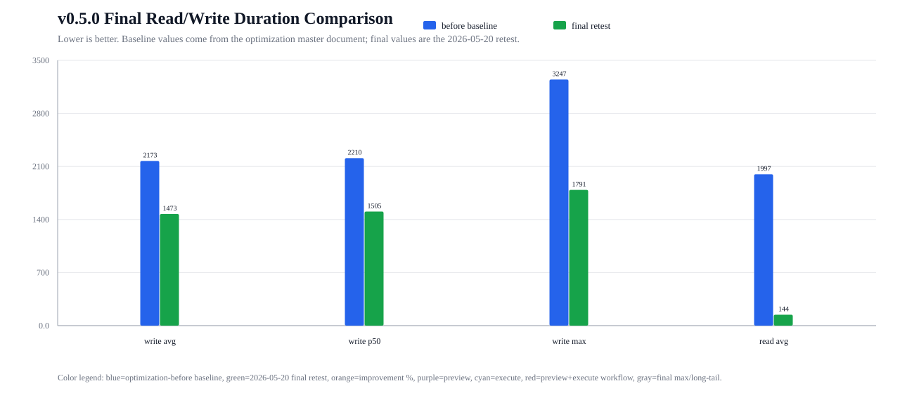
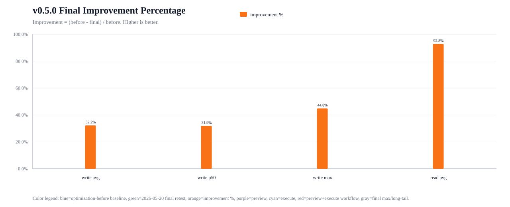
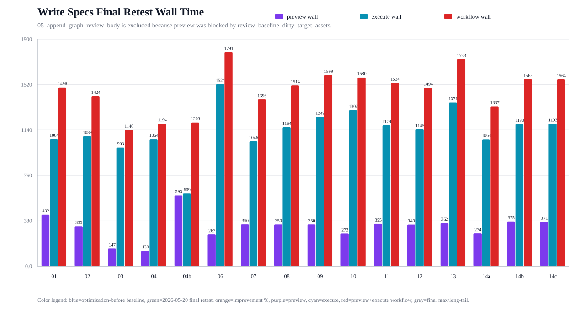
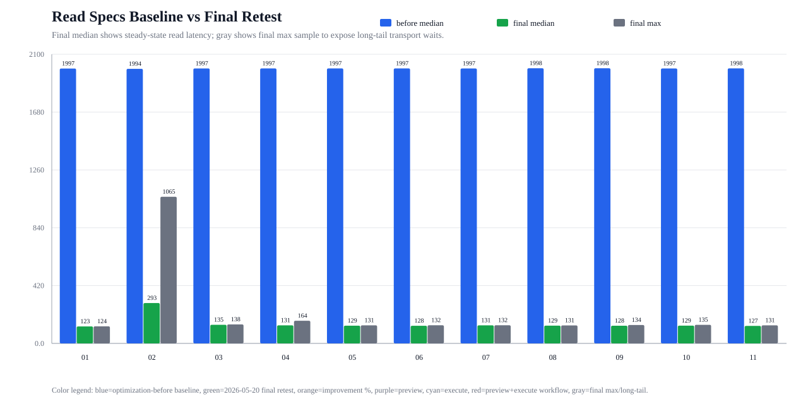
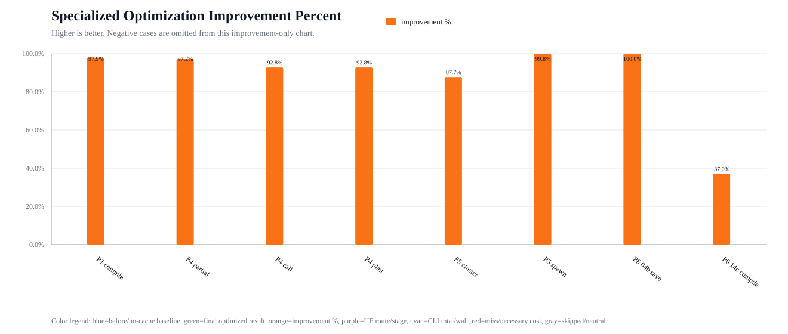
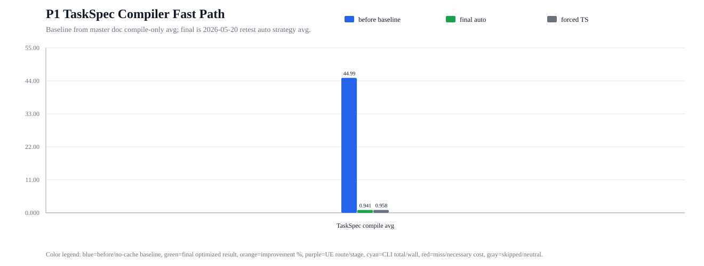
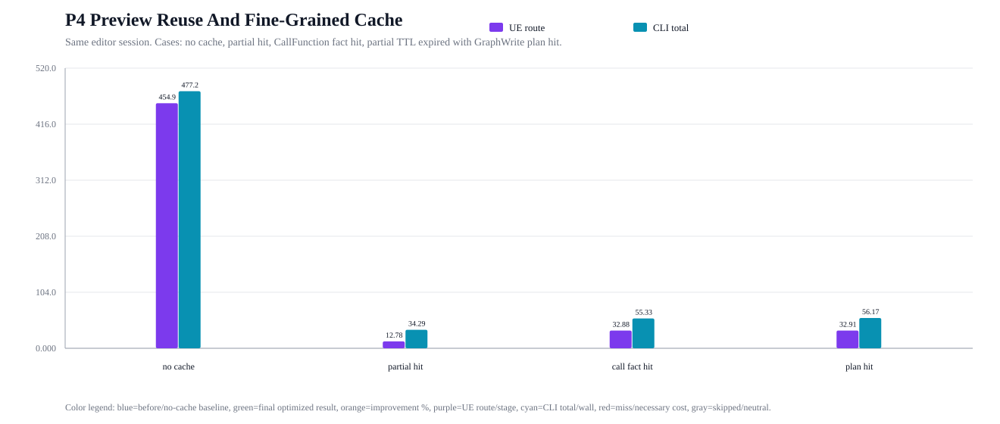
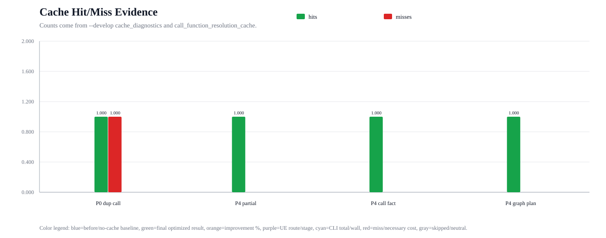
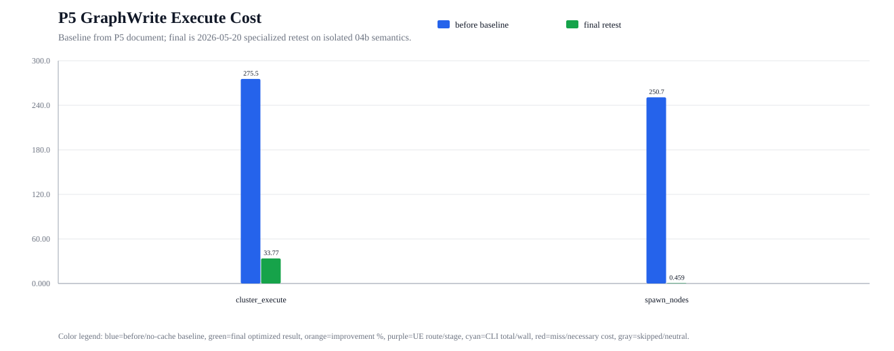
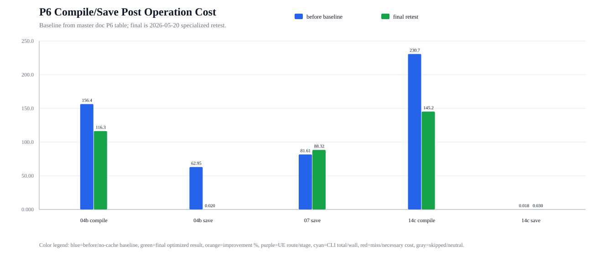

# BlueprintHelper v0.5.0 最终读写性能复测报告（2026-05-20）

## 测试口径

- 测试时间：2026-05-20。
- Editor 启动方式：MCP `blueprint_open_editor`，确认 Bridge 可用后执行。
- CLI：`AgentFaceService/cli/build/cli/index.js`，所有命令附带 `--develop`。
- 读链路 Spec：`BlueprintHelper/Develop/v0.4.4/ReadSpecs/BP_ThirdPersonCharacter_20260519`，11 个 Spec，每个 1 次 warmup + 5 次正式样本。
- 写链路 Spec：`BlueprintHelper/Develop/v0.4.3/ArchivedReference/RetiredReviewDebugDocs_20260518/PlanArtifacts/ReviewPanel_UI_Test_TaskSpecs_20260518`，复制到临时目录并替换独立根路径 `/Game/BlueprintHelperCliSmoke/FinalPerf_20260520105745` 后执行 preview -> execute。
- 写链路统计只纳入完整 preview -> execute 成功样本。`05_append_graph_review_body.json` 被 `review_baseline_dirty_target_assets` 语义拦截，未纳入耗时均值。
- 原始测试产物：
  - 读：`D:\UEProjects\Template\Plugins\BlueprintHelper\.tmp\final_perf_20260520\read\read_timing_20260520_185631`
  - 写：`D:\UEProjects\Template\Plugins\BlueprintHelper\.tmp\final_perf_20260520\write\write_timing_20260520105745`

## 颜色与图例

| 颜色 | 含义 |
| --- | --- |
| 蓝色 `#2563EB` | 总文档中的优化前基线 |
| 绿色 `#16A34A` | 2026-05-20 最终复测结果 |
| 橙色 `#F97316` | 相对优化前基线的提升百分比 |
| 紫色 `#7C3AED` | 写链路 preview wall time |
| 青色 `#0891B2` | 写链路 execute wall time |
| 红色 `#DC2626` | 写链路 preview + execute workflow wall time |
| 灰色 `#6B7280` | 读链路最终复测最大样本，用于展示长尾 |

## 总览对比

| 场景 | 优化前基线 ms | 最终复测 ms | 提升 |
| --- | ---: | ---: | ---: |
| 写链路 workflow avg | 2172.994 | 1472.806 | 32.222% |
| 写链路 workflow p50 | 2209.757 | 1505.115 | 31.888% |
| 写链路 workflow max | 3246.974 | 1790.832 | 44.846% |
| 读链路 11 Spec median wall avg | 1997.088 | 144.029 | 92.788% |

## 写链路结果

| 指标 | preview wall ms | execute wall ms | workflow wall ms |
| --- | ---: | ---: | ---: |
| min | 129.577 | 609.324 | 1140.402 |
| p50 | 349.854 | 1154.474 | 1505.115 |
| avg | 332.034 | 1140.773 | 1472.806 |
| max | 593.449 | 1524.325 | 1790.832 |

| Spec | preview wall ms | execute wall ms | workflow wall ms | execute UE total ms |
| --- | ---: | ---: | ---: | ---: |
| 01_create_blueprint_actor.json | 431.928 | 1064.380 | 1496.308 | 744.824 |
| 02_edit_blueprint_components.json | 334.665 | 1088.939 | 1423.604 | 654.211 |
| 03_edit_blueprint_variables.json | 147.211 | 993.191 | 1140.402 | 765.622 |
| 04_edit_blueprint_signatures.json | 129.577 | 1064.212 | 1193.789 | 746.284 |
| 04b_write_function_body.json | 593.449 | 609.324 | 1202.773 | 277.005 |
| 06_create_structure_row.json | 266.507 | 1524.325 | 1790.832 | 1204.459 |
| 07_create_data_table.json | 350.422 | 1045.620 | 1396.042 | 724.354 |
| 08_edit_data_table_rows.json | 349.806 | 1164.116 | 1513.922 | 841.666 |
| 09_create_data_asset_class.json | 349.902 | 1249.385 | 1599.287 | 928.800 |
| 10_edit_data_asset_class_variables.json | 273.089 | 1306.754 | 1579.843 | 885.447 |
| 11_create_data_asset_instance.json | 355.055 | 1179.303 | 1534.358 | 859.615 |
| 12_edit_data_asset_properties.json | 348.777 | 1144.832 | 1493.609 | 823.008 |
| 13_create_widget_blueprint.json | 361.585 | 1371.447 | 1733.032 | 1051.879 |
| 14a_edit_widget_tree_root.json | 274.313 | 1063.131 | 1337.444 | 944.212 |
| 14b_edit_widget_tree_child.json | 374.808 | 1190.492 | 1565.300 | 870.846 |
| 14c_edit_widget_tree_property.json | 371.443 | 1192.915 | 1564.358 | 873.386 |

写链路最终大头仍在 execute 阶段，尤其是 UE execute 内部的 `main_thread_commit`、`post_io`、compile/save 或资产创建相关工作。`04b_write_function_body.json` 的 workflow wall 为 1202.773ms，较总文档优化前代表性最慢样本 3246.974ms 明显下降，但本次新根路径冷资产复测下，完整写 workflow 仍不是百毫秒级。

## 读链路结果

| 指标 | 数值 |
| --- | ---: |
| sample_count | 55 |
| success | 55 |
| failure | 0 |
| 11 Spec median wall avg | 144.029ms |
| 11 Spec median wall p50 | 129.117ms |
| 11 Spec median wall max | 293.101ms |
| avg p95 | 219.621ms |
| max sample | 1065.008ms |

| Spec | 优化前 median ms | 最终 median ms | 最终 max ms |
| --- | ---: | ---: | ---: |
| 01_asset_context.json | 1996.511 | 123.227 | 123.925 |
| 02_blueprint_logic_json.json | 1994.332 | 293.101 | 1065.008 |
| 03_blueprint_logic_md.json | 1997.072 | 135.123 | 137.814 |
| 04_eventgraph_logic_json.json | 1997.176 | 131.228 | 164.335 |
| 05_eventgraph_logic_md.json | 1997.291 | 128.742 | 131.120 |
| 06_eventgraph_context_json.json | 1997.269 | 127.963 | 131.625 |
| 07_components_context.json | 1996.882 | 131.119 | 131.686 |
| 08_variables_context.json | 1998.409 | 129.117 | 130.644 |
| 09_event_dispatchers_context.json | 1998.450 | 128.460 | 133.679 |
| 10_object_properties_context.json | 1996.921 | 129.118 | 134.877 |
| 11_blueprint_logic_flow.json | 1997.659 | 127.116 | 131.122 |

`02_blueprint_logic_json.json` 出现一次 1065.008ms 长尾样本；该样本 `bridge_send_receive_ms=962.643`，`ue_total_ms=0.448`，说明本次长尾主要来自 Bridge/transport 等待，不是 UE 读 route 执行本身。

## 专项优化最终复测

测试时间：2026-05-20。测试根路径：`/Game/BlueprintHelperCliSmoke/FinalSpecialized_20260520111651`。原始产物：`D:\UEProjects\Template\Plugins\BlueprintHelper\.tmp\final_perf_specialized_20260520\specialized_20260520111651`。

### 专项图表颜色说明

| 颜色 | 含义 |
| --- | --- |
| 蓝色 `#2563EB` | 优化前基线或无缓存基线 |
| 绿色 `#16A34A` | 本次最终专项复测的优化后结果或 cache hit |
| 橙色 `#F97316` | 相对基线的提升百分比 |
| 紫色 `#7C3AED` | UE route / UE stage duration |
| 青色 `#0891B2` | CLI total / wall duration |
| 红色 `#DC2626` | cache miss 或仍需执行的必要成本 |
| 灰色 `#6B7280` | 中性对照项，例如 forced TS 或接近 0 的 skipped/neutral 成本 |

### P1 TaskSpec Compiler Fast Path

| Case | 优化前/对照 ms | 本次最终 ms | 提升 |
| --- | ---: | ---: | ---: |
| 总文档 compile-only baseline -> auto strategy avg | 44.990 | 0.941 | 97.909% |
| 本次 forced canonical_python avg -> forced ts_fast_path avg | 51.994 | 0.958 | 98.157% |

### P0/P4 Preview 与缓存专项

| Case | 含义 | CLI total ms | UE route ms | 命中证据 |
| --- | --- | ---: | ---: | --- |
| P0 duplicate CallFunction quick | 同一 TaskPlan 内重复 `PrintString` 查询 | 327.596 | 305.394 | request-level CallFunction cache `hits=1, misses=1` |
| P4 no cache baseline | 首次成功 preview，无 P4 cache 可用 | 477.165 | 454.932 | partial `0/1`，CallFunction fact `0/1`，GraphWrite plan `0/1` |
| P4 partial hit | 40s 内相同 preview 重跑 | 34.292 | 12.783 | partial preview `hits=1, misses=0`，复用 `step_001` |
| P4 CallFunction fact hit | 只改 literal，step cache miss | 55.326 | 32.878 | CallFunction fact `hits=1, misses=0` |
| P4 plan hit after TTL | 等待 45s，partial TTL 过期 | 56.172 | 32.911 | GraphWrite plan `hits=1, misses=0`，CallFunction fact `hits=1` |
| P4 fail -> fixed | 失败 preview 后修正 | 361.638 | 341.627 | partial preview `hits=1, misses=1`，通过项复用 `step_001` |

### P5 GraphWrite Cluster Execute

| Metric | 优化前基线 ms | 本次最终 ms | 提升 |
| --- | ---: | ---: | ---: |
| `step.step_001.cluster_execute` | 275.529 | 33.771 | 87.742% |
| `spawn_nodes_ms` | 250.717 | 0.459 | 99.817% |

本次 `graph_write_execution_stats`：`requested_node_count=2`，`spawned_node_count=1`，`connect_links_ms=0.000`，`record_layout_ms=0.003`。

### P6 Compile/Save PostOperationPlanner

| Case | 优化前 ms | 本次最终 ms | 状态 |
| --- | ---: | ---: | --- |
| `04b_write_function_body` compile | 156.410 | 116.290 | compile executed |
| `04b_write_function_body` save | 62.954 | 0.020 | save skipped: `package_not_loaded_or_clean` |
| `07_create_data_table` save | 81.615 | 88.321 | necessary save executed |
| `14c_edit_widget_tree_property` compile | 230.670 | 145.242 | compile executed |
| `14c_edit_widget_tree_property` save | 0.018 | 0.030 | save skipped: `package_not_loaded_or_clean` |

`07_create_data_table` 的 save 本次略高于优化前参考值，因为 DataTable 是非 Blueprint 资产且仍需要真实 save；这不是 P6 的目标跳过项。P6 的确定性收益主要体现在 clean package save skipped record，以及 compile/save 决策移出 TaskRuntime 主流程后的 per-asset 可诊断性。

## 结论

- 读链路最终复测达成 55/55 成功，11 个典型 ReadSpec 的 median wall 平均值为 144.029ms，相对总文档优化前基线提升 92.788%。
- 写链路最终复测达成 16 个完整 preview -> execute 成功样本，workflow avg 为 1472.806ms，相对优化前基线提升 32.222%；本次唯一未纳入样本是 Review baseline 语义拦截。
- 若以“所有工具延迟都降低到百毫秒内”作为定档标准，读链路 median 已接近但仍有长尾，写链路完整 preview -> execute workflow 尚未达到；继续优化重点应放在 execute 阶段的 UE 工作、post_io、compile/save 条件化，以及 Bridge/transport 长尾。
